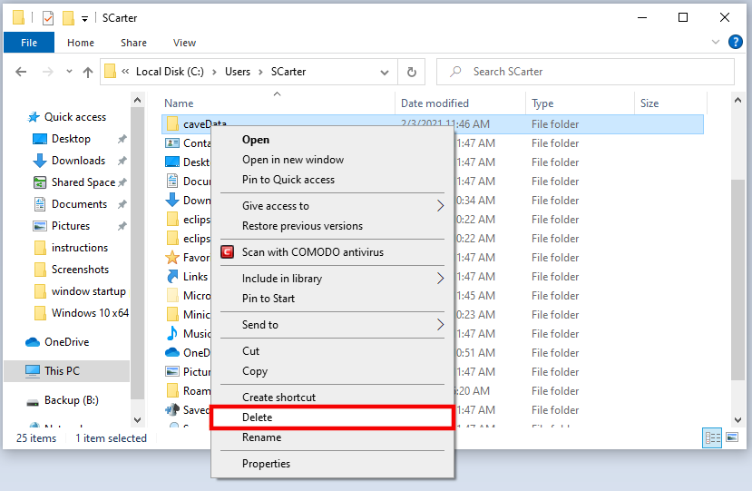
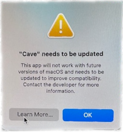
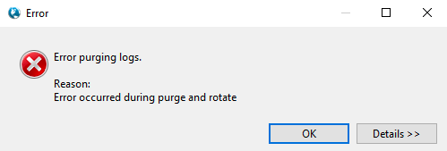
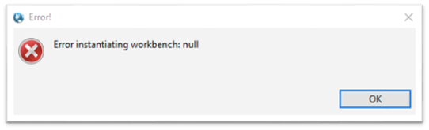
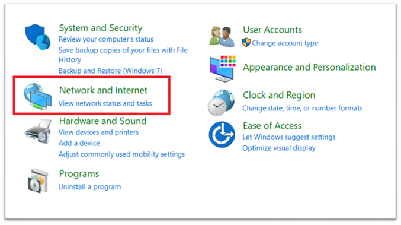
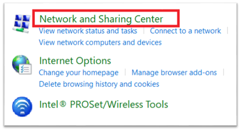
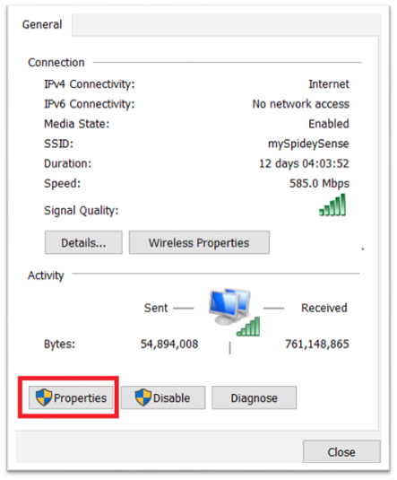
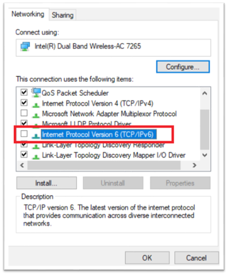
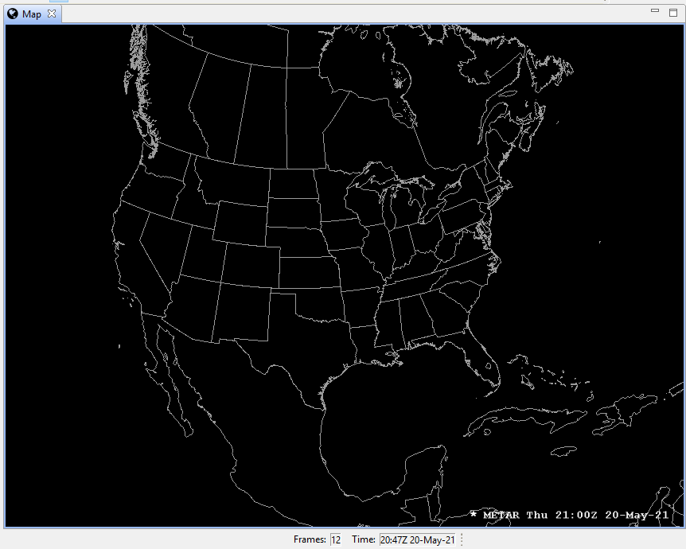

# Common Problems

## Removing caveData

Removing caveData (flushing the local cache) should be one of the first troubleshooting steps to take when experiencing weird behavior in CAVE.  The cache lives in a folder called **caveData**, hence why this process is also referred to as removing or deleting caveData.

### Linux

For Linux users, the easiest way is to open a new terminal and run the following command:

    rm -rf ~/caveData 

### Windows 

For Windows users, simply delete the caveData folder in your home user directory:



### Mac

For Mac users, the easiest way is to open a new terminal and run the following command:

    rm -rf ~/Library/caveData


---

## Disappearing Configurations

If you ever notice some of the following settings you've configured/saved disappear from CAVE:

- Saved Displays or Procedures
- NSHARP settings (line thickness, etc)
- Colormap settings
- StyleRule settings

!!! note "This is not a fully exhaustive list, so if something else has dissappeared it might be the same underlying issue still."

Then it is likely we have recently changed our production EDEX server.
There is a good chance we can recover your settings.  To do so, please send a short email to [support-awips@unidata.ucar.edu](mailto:support-awips@unidata.ucar.edu) with the topic "Missing Configurations", and include the username(s) of the computer(s) you use to run CAVE.

---

## Monterey CAVE Warning

If you are running MacOS Monterey, you may see the following message when starting CAVE:



This message can be ignored, and will hopefully go away when we release version 20+ of AWIPS.

---

## Remotely Connecting to CAVE

Since the pandemic began, many users have asked if they can use X11 forwarding or ssh tunneling to remotely connect to CAVE machines.  **This is not recommended or supported**, and CAVE crashes in many different ways and expresses strange behavior as well.

We highly recommend you [download the appropriate CAVE installer](install-cave.md) on your local machine, if that is an option.

If that is not an option, then the only remote access we recommend is using some type of VNC.
[**RealVNC**](https://www.realvnc.com/en/) and [**nomachine**](https://www.nomachine.com) are two options that are in use with positive outcomes.  [**UltraVNC**](https://www.uvnc.com) may be another option, but may have quite a delay.  There *may* also be other free or paid software available that we are not aware of.
!!! warning "It is likely that any VNC option you choose will also require some software or configuration to be set on the remote machine, and this will likely require administrative privileges."

---

## Windows CAVE Start Up Error

One common error some users are seeing manifests itself just after selecting an EDEX server to connect to.  The following error dialogs may show up:

- *Error purging logs*  


- *Error instantiating workbench: null*  


These errors are actually happening because the Windows machine is using IPv6, which is not compatible with AWIPS at this time.

**To fix the issue simply follow these steps:**
>**Note**: These screenshots may vary from your system.

**1. Close all error windows and any open windows associated with CAVE.**

**2. In the Windows 10 search field, search for "control panel".**


**3. Once in the Control Panel, look for "Network and Sharing Center".**




**4. Select the adapter for your current connection (should be either "Ethernet" or "Wi-Fi").**


**5. Click on "Properties".**



**6. Uncheck "Internet Protocol Version 6 (TCP/IPv6)" and select OK.**



!!! note "You may need to restart your machine for this to take effect"

**7. Restart CAVE.**

---

## Products Not Loading Properly

This problem is most commonly seen with the direct Windows installation.  It can also manifest in the Mac installation, and the root of the problem is not having Python installed properly for CAVE to use the packages.

If the [Windows installation](install-cave.md#download-and-installation-instructions_2) was not completed properly, it is possible to see incorrect behavior when loading certain products.  These are derived products which use the local machine to create and render the data.  This creation is dependent upon python and its required packages working correctly.

The dataset will be available in the menus and product browser, but when loaded, no data is drawn on the editor, but an entry is added to the legend.


You may see an error that mentions the python package, **jep**.

Known datasets this can affect (this is not a comprehensive list):

  - Model Winds
  - Metars Winds
  - METAR Station Plot
  - GFS Precip Type

To correct this issue on Windows:

  - Uninstall all related software (C++ Build Tools, Miniconda, Python, CAVE, pip, numpy, jep, etc)
  - Redo all necessary [installation instructions in **steps 1 through 6**](install-cave.md#download-and-installation-instructions_2)

To correct this issue on Mac:

 - Install the [awips-python.pkg package found on **step 1**](https://unidata.github.io/awips2/install/install-cave/#download-and-installation-instructions_3)

---

## Troubleshooting Uninstalling EDEX (Linux)

Sometimes yum can get in a weird state and not know what AWIPS groups have been installed. For example if you are trying to remove AWIPS you may see an error:

```
yum groupremove "AWIPS EDEX Server"

    Loaded plugins: fastestmirror, langpacks
    Loading mirror speeds from cached hostfile
    * base: mirror.dal.nexril.net
    * elrepo: ftp.osuosl.org
    * epel: mirrors.xmission.com
    * extras: mirrors.cat.pdx.edu
    * updates: mirror.mobap.edu

    No environment named AWIPS EDEX Server exists
    Maybe run: yum groups mark remove (see man yum)
    No packages to remove from groups
```

To solve this issue, mark the group you want to remove and then try removing it again:
```
yum groups mark remove "AWIPS EDEX Server"
yum groupremove "AWIPS EDEX Server"
```
