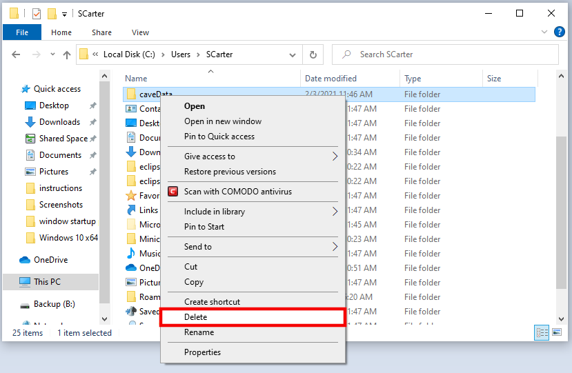
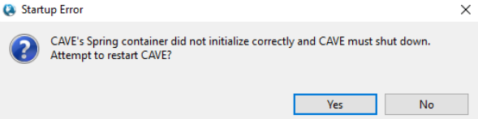
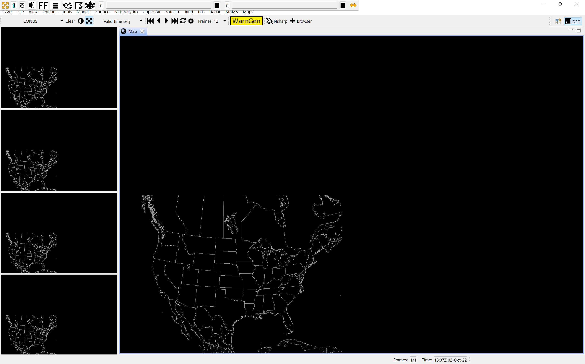
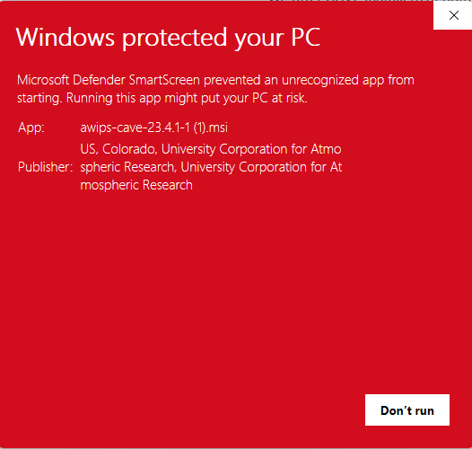
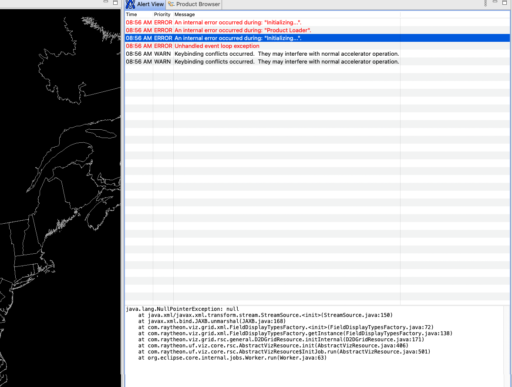
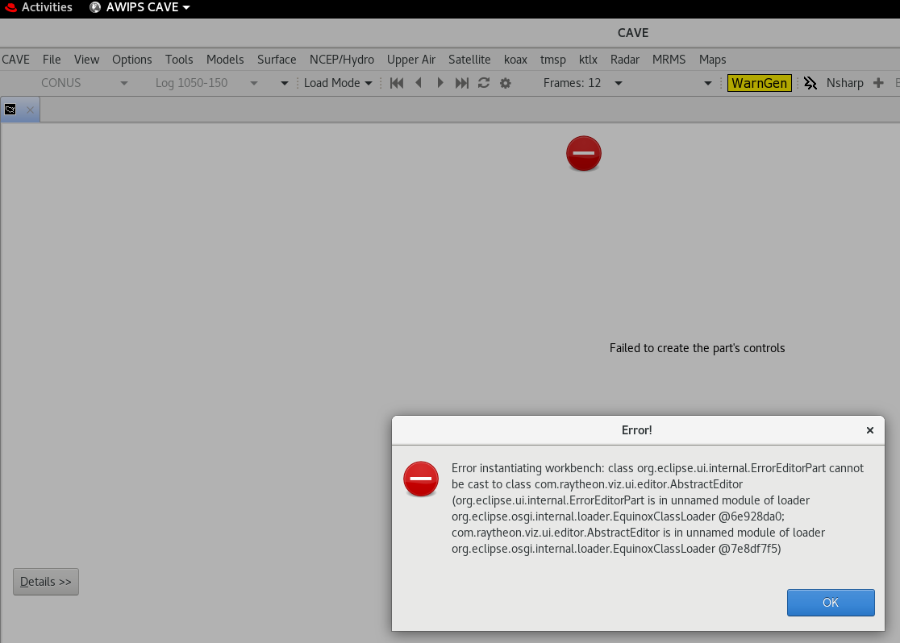
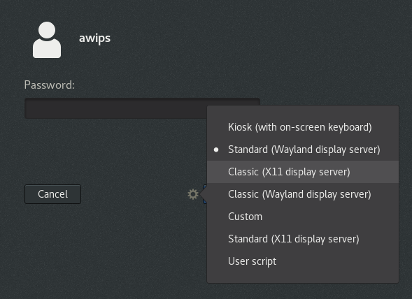

# Common Problems

## All Operating Systems

### Removing caveData

Removing caveData (flushing the local cache) should be one of the first troubleshooting steps to take when experiencing weird behavior in CAVE.  The cache lives in a folder called **caveData**, hence why this process is also referred to as removing or deleting caveData.

#### Linux

For Linux users, the easiest way is to open a new terminal and run the following command:

    rm -rf ~/caveData 

#### Windows 

For Windows users, simply delete the caveData folder in your home user directory:



#### Mac

For Mac users, the easiest way is to open a new terminal and run the following command:

    rm -rf ~/caveData
    rm -rf ~/Library/caveData

---

### Disappearing Configurations

If you ever notice some of the following settings you've configured/saved disappear from CAVE:

- Saved Displays or Procedures
- NSHARP settings (line thickness, etc)
- Colormap settings
- StyleRule settings

!!! note "This is not a fully exhaustive list, so if something else has disappeared it might be the same underlying issue still."

Then it is likely we have recently changed our production EDEX server.
There is a good chance we can recover your settings.  To do so, please send a short email to [support-awips@unidata.ucar.edu](mailto:support-awips@unidata.ucar.edu) with the topic "Missing Configurations", and include the username(s) of the computer(s) you use to run CAVE.

---

### Remotely Connecting to CAVE

Since the pandemic began, many users have asked if they can use X11 forwarding or ssh tunneling to remotely connect to CAVE machines.  **This is not recommended or supported**, and CAVE crashes in many different ways and expresses strange behavior as well.

We highly recommend you [download the appropriate CAVE installer](install-cave.md) on your local machine, if that is an option.

If that is not an option, then the only remote access we recommend is using some type of VNC.
[**RealVNC**](https://www.realvnc.com/en/) and [**nomachine**](https://www.nomachine.com) are two options that are in use with positive outcomes.  [**UltraVNC**](https://www.uvnc.com) may be another option, but may have quite a delay.  There *may* also be other free or paid software available that we are not aware of.
!!! warning "It is likely that any VNC option you choose will also require some software or configuration to be set on the remote machine, and this will likely require administrative privileges."

---

### CAVE Spring Start Up Error

If you encounter the error below, please see one of our solution methods for resolving:
```
CAVE's Spring container did not initialize correctly and CAVE must shut down.
```


We have found the reason for this failure is because the host machine is set to use a language other than English (ie. Spanish, French, etc).

To resolve this issue, either:

- Switch your system to English, when using CAVE

or

- Use our [Virtual Machine option](../install/install-cave/#method-2-linux-virtual-machine). This option allows your actual machine to stay in whichever language you choose, while allowing you to run CAVE in an environment set to English.  Although we list this installation under the Windows OS, this can also be done on Linux.

!!! warning "The VM option has one notable drawback at the moment -- it cannot render RGB satellite products."

---

## Windows

### CAVE Map Display in Lower Left Quadrant - Windows

If you start up CAVE in Windows and notice the map is showing up only in the bottom left quadrant of your display, you will just need to tweak a few display settings.



Try following these steps to fix your issue:

- Right-click on the `no_env.exe`, select Properties
!!! note "This is not the batch file (CAVE.bat) that gets installed as the CAVE shortcut on the Desktop, the no_env.exe is located in `C:\Users\[your_username]\AppData\Roaming\UCAR Unidata\AWIPS CAVE\no_env.exe`."
- Select the Compatibility tab
- Click "Change High DPI Settings"
- At the bottom enable "Override High DPI scaling behavior"
- Change the dropdown from Application to System

---

### Windows Install Error

If you are trying to install CAVE on windows, and go to install it and get a pop-up like this:



That means your Windows settings is blocking it, but you can work around that.

- Right click on the `awips-cave-23.4.1-1.msi` application, select Properties
- Check the "Unblock" checkbox
- Click OK
- Now double click on the application and you should be able to install it

---

## macOS

### Model Data Not Rendering

This behavior has appeared with MacOS Sonoma (v14) -- model data is no longer loading and you see the following errors on the screen or in the AlertView:
> ERROR: An internal error occured during: "Initializing...".
> 
> ERROR: An internal error occured during: "Product Loader".
> 
> ERROR: An internal error occured during "Initializing...".

  
  
If you encounter this behavior, please close CAVE, [clear caveData as described above](#mac), then restart CAVE and try to load the data again.

If you still experience issues, please let us know at support-awips@unidata.ucar.edu

---

## Linux

### Issue Starting CAVE (Rocky/RHEL8)

If you are running CAVE on RHEL or Rocky 8 and are getting an error when CAVE starts up: `Error instantiating workbench` or if you look in `~/caveData/cave_*_console.log` and see an error: `org.eclipse.swt.SWTException: Unsupported color depth` then you may need to change your display from "Wayland" to "X11".



To change your default display, you can edit the `/etc/gdm/custom.conf` and uncomment the `WaylandEnable` line like below and reboot.

```
# GDM configuration storage

[daemon]
# Uncomment the line below to force the login screen to use Xorg
WaylandEnable=false

[security]

[xdmcp]

[chooser]

[debug]
# Uncomment the line below to turn on debugging
#Enable=true
```
To temporarily change your display, logout of your user. Before logging in, select your user and click on the gear/settings icon and select an `X11 display`.




### Troubleshooting Uninstalling EDEX

Sometimes yum can get in a weird state and not know what AWIPS groups have been installed. For example if you are trying to remove AWIPS you may see an error:

```
yum groupremove "AWIPS EDEX Server"

    Loaded plugins: fastestmirror, langpacks
    Loading mirror speeds from cached hostfile
    * base: mirror.dal.nexril.net
    * elrepo: ftp.osuosl.org
    * epel: mirrors.xmission.com
    * extras: mirrors.cat.pdx.edu
    * updates: mirror.mobap.edu

    No environment named AWIPS EDEX Server exists
    Maybe run: yum groups mark remove (see man yum)
    No packages to remove from groups
```

To solve this issue, mark the group you want to remove and then try removing it again:
```
yum groups mark remove "AWIPS EDEX Server"
yum groupremove "AWIPS EDEX Server"
```
!!! note "Check to make sure your `/etc/yum.repos.d/awips2.repo` file has `enabled=1`."
