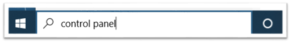
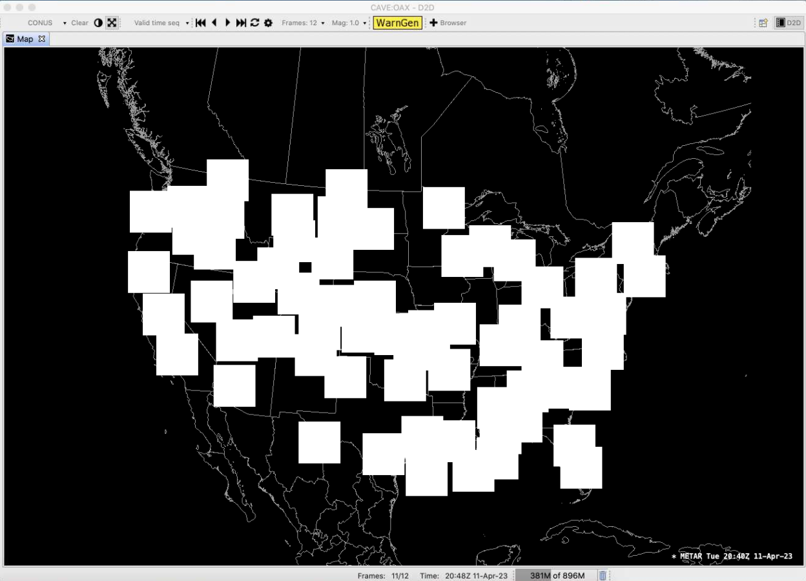

!!! warning "EDEX Outage [as of 4/17/24]: Our public EDEX is currently unavailable because of unexpected outages from our cloud provider after scheduled maintenance. We are standing by, ready to bring them back online as soon as the issues are resolved by our cloud provider. We apologize for this inconvenience."

# Common Problems

## All Operating Systems

### Removing caveData

Removing caveData (flushing the local cache) should be one of the first troubleshooting steps to take when experiencing weird behavior in CAVE.  The cache lives in a folder called **caveData**, hence why this process is also referred to as removing or deleting caveData.

#### Linux

For Linux users, the easiest way is to open a new terminal and run the following command:

    rm -rf ~/caveData 

#### Windows 

For Windows users, simply delete the caveData folder in your home user directory:


#### Mac

For Mac users, the easiest way is to open a new terminal and run the following command:

    rm -rf ~/Library/caveData

---

### Disappearing Configurations

If you ever notice some of the following settings you've configured/saved disappear from CAVE:

- Saved Displays or Procedures
- NSHARP settings (line thickness, etc)
- Colormap settings
- StyleRule settings

!!! note "This is not a fully exhaustive list, so if something else has disappeared it might be the same underlying issue still."

Then it is likely we have recently changed our production EDEX server.
There is a good chance we can recover your settings.  To do so, please send a short email to [support-awips@unidata.ucar.edu](mailto:support-awips@unidata.ucar.edu) with the topic "Missing Configurations", and include the username(s) of the computer(s) you use to run CAVE.

---

### Remotely Connecting to CAVE

Since the pandemic began, many users have asked if they can use X11 forwarding or ssh tunneling to remotely connect to CAVE machines.  **This is not recommended or supported**, and CAVE crashes in many different ways and expresses strange behavior as well.

We highly recommend you [download the appropriate CAVE installer](install-cave.md) on your local machine, if that is an option.

If that is not an option, then the only remote access we recommend is using some type of VNC.
[**RealVNC**](https://www.realvnc.com/en/) and [**nomachine**](https://www.nomachine.com) are two options that are in use with positive outcomes.  [**UltraVNC**](https://www.uvnc.com) may be another option, but may have quite a delay.  There *may* also be other free or paid software available that we are not aware of.
!!! warning "It is likely that any VNC option you choose will also require some software or configuration to be set on the remote machine, and this will likely require administrative privileges."

---

### CAVE Spring Start Up Error

If you encounter the error below, please see one of our solution methods for resolving:
```
CAVE's Spring container did not initialize correctly and CAVE must shut down.
```


We have found the reason for this failure is because the host machine is set to use a language other than English (ie. Spanish, French, etc).

To resolve this issue, either:

- Switch your system to English, when using CAVE

or

- Use our [Virtual Machine option](../install/install-cave/#method-2-linux-virtual-machine). This option allows your actual machine to stay in whichever language you choose, while allowing you to run CAVE in an environment set to English.  Although we list this installation under the Windows OS, this can also be done on Linux.

!!! warning "The VM option has one notable drawback at the moment -- it cannot render RGB satellite products."

---

### Products Not Loading Properly

This problem is most commonly seen with the direct Windows installation.  It can also manifest in the Mac installation (and is possible on Linux), and the root of the problem is not having Python installed properly for CAVE to use the packages.

There are derived products which use the local machine to create and render the data.  This creation is dependent upon python and its required packages working correctly.  The dataset will be available in the menus and product browser, but when loaded, no data is drawn on the editor, but an entry is added to the legend.


You may see an error that mentions the python package, **jep**.

Known datasets this can affect (this is not a comprehensive list):

  - Model Winds
  - Metars Winds
  - METAR Station Plot
  - GFS Precip Type

#### Windows

To correct this issue on Windows:

  - Make sure you only have the latest version of [CAVE installed](https://unidata.github.io/awips2/install/install-cave/#method-1-direct-windows-install) (which now fully bundles the proper version of Python with the application)
  - If you have ever previously added `PYTHONHOME`, `PYTHONPATH`, or `JAVA_HOME` to your user or system variables, please delete those.
    - Open the Environment Variables window by typing "env" in the start bar

#### Mac

To correct this issue on Mac:

 - Make sure you have the latest verison of [CAVE installed](https://unidata.github.io/awips2/install/install-cave/#macos) (which now fully bundles the proper version of Python with the application)

#### Linux

To correct this issue on Linux:

- When running `which python` from a terminal, make sure `/awips2/python/` is returned, if not, reset that environment variable, or re-run the [**awips_install.sh** script from our installation instructions](install-cave.md#download-and-installation-instructions)

---

## Windows

### CAVE Map Display in Lower Left Quadrant - Windows

If you start up CAVE in Windows and notice the map is showing up only in the bottom left quadrant of your display, you will just need to tweak a few display settings.


Try following these steps to fix your issue:

- Right-click on the CAVE.exe, select Properties
!!! note "This is not the batch file (CAVE.bat) that gets installed as the CAVE shortcut on the Desktop, the CAVE.exe is located in `C:\Users\[your_username]\AppData\Roaming\UCAR Unidata\AWIPS CAVE\CAVE.exe`."
- Select the Compatibility tab
- Click "Change High DPI Settings"
- At the bottom enable "Override High DPI scaling behavior"
- Change the dropdown from Application to System

---

### Windows CAVE Start Up Error

!!! Note "This should no longer be an issue for our v20 release of AWIPS."

One common error some users are seeing manifests itself just after selecting an EDEX server to connect to.  The following error dialogs may show up:

- *Error purging logs*  


- *Error instantiating workbench: null*  


These errors are actually happening because the Windows machine is using IPv6, which is not compatible with AWIPS at this time.

**To fix the issue simply follow these steps:**
!!! note  "These screenshots may vary from your system."

!!! warning "These instructions are <i>per connection</i>, so if you use multiple connections or switch between wired and wireless connections, you'll need to do the following for each of those connections so that CAVE will always run properly."


**1. Close all error windows and any open windows associated with CAVE.**

**2. In the Windows search field, search for "control panel".**



**3. Once in the Control Panel, look for "Network and Sharing Center".**


**4. Select the adapter for your current connection (should be either "Ethernet" or "Wi-Fi").**


**5. Click on "Properties".**


**6. Uncheck "Internet Protocol Version 6 (TCP/IPv6)" and select OK.**


!!! note "You may need to restart your machine for this to take effect"

**7. Restart CAVE.**

---

## macOS

### Monterey CAVE Warning

If you are running MacOS Monterey, you may see the following message when starting CAVE:


Monterey versions 12.3 or newer will not support our production (v18) CAVE.

!!! note "Please [download and install our beta v20 CAVE](../install/install-cave-beta-v20.md#macos) for newer MacOS Versions to avoid this issue."

---

### White Boxes for Surface Resources

If you do not have an NVIDIA graphics card and driver, you may see "boxes" drawn on the editor for some of the products (**METARS Station Plots** and **Surface Winds** are the resources we're aware of), as shown below:



You may be able to fix this issue:

- Check what graphics cards are available on your machine, by going to the Apple menu (far left, upper corner) > About This Mac > Overview tab (default):

    
    
- If you see two entries at the **Graphics** line, like the image shown above, then you have two graphics cards on your system. **Intel graphics cards *may*** be able to render our products properly.  In this case, you can "force" your computer to use the Intel card by running the following in a terminal:

      ```
      sudo pmset -[a|b|c] gpuswitch 0
      ```
    
    Where `[a|b|c]` is only one of those options, which mean:

    - a: adjust settings for **all** scenarios
    - b: adjust settings while running off **battery**
    - c: adjust settings while connected to **charger**
    
    The argument `0` sets the computer to use the dedicated GPU (in our case above the Intel GPU).

    The two other options for that argument are:

    - 1: automatic graphics switching
    - 2: integrated GPU 
    
    !!! note "It may be smart to run `pmset -g` first, so you can see what the current `gpuswitch` setting is (likely `1`), that way you can revert the settings if you want them back to how they were, when not using CAVE."

---

### Model Data Not Rendering

This behavior has appeared with MacOS Sonoma (v14) -- model data is no longer loading and you see the following errors on the screen or in the AlertView:
> ERROR: An internal error occured during: "Initializing...".
> 
> ERROR: An internal error occured during: "Product Loader".
> 
> ERROR: An internal error occured during "Initializing...".

  
  
If you encounter this behavior, please close CAVE, [clear caveData as described above](#mac), then restart CAVE and try to load the data again.

If you still experience issues, please let us know at support-awips@unidata.ucar.edu

---

## Linux

### Troubleshooting Uninstalling EDEX

Sometimes yum can get in a weird state and not know what AWIPS groups have been installed. For example if you are trying to remove AWIPS you may see an error:

```
yum groupremove "AWIPS EDEX Server"

    Loaded plugins: fastestmirror, langpacks
    Loading mirror speeds from cached hostfile
    * base: mirror.dal.nexril.net
    * elrepo: ftp.osuosl.org
    * epel: mirrors.xmission.com
    * extras: mirrors.cat.pdx.edu
    * updates: mirror.mobap.edu

    No environment named AWIPS EDEX Server exists
    Maybe run: yum groups mark remove (see man yum)
    No packages to remove from groups
```

To solve this issue, mark the group you want to remove and then try removing it again:
```
yum groups mark remove "AWIPS EDEX Server"
yum groupremove "AWIPS EDEX Server"
```
!!! note "Check to make sure your `/etc/yum.repos.d/awips2.repo` file has `enabled=1`."
