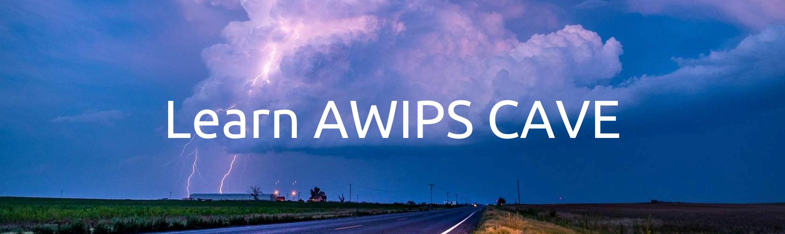
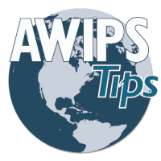

# Educational Resources

Here at Unidata, we want to provide as many resources as possible to make our tools and applications easy to use.  For AWIPS we currently have a new [eLearning course](#cave-elearning-course) that is specific to CAVE.  We also have a suite of [Jupyter Notebooks](#python-awips-example-notebooks) that are meant to provide a detailed overview of many capabilities of python-awips.

---

## CAVE eLearning Course

***Learn AWIPS CAVE*** is our online educational course for those interested in learning about CAVE.

### Access

Please create an account on <a href="https://elearning.unidata.ucar.edu/" target="_blank" rel="noopener noreferrer">Unidata eLearning</a>, then self-enroll in <a href="https://elearning.unidata.ucar.edu/course/view.php?id=2" target="_blank" rel="noopener noreferrer">Learn AWIPS CAVE</a>.

### Content

*Learn AWIPS CAVE* is specifically tailored to content regarding CAVE -- the local graphical application used to view weather data.  The following topics and capabilities are covered throughout the course:

- Launching CAVE
- Navigating the interface
- Modifying product appearances
- Understanding the time match basis
- Creating publication-quality graphics
- Exploring various CAVE layouts
- Saving and loading procedures and displays
- Using radar displays
- Using baselines and points
- Creating time series displays
- Creating vertical cross section displays
- Using the NSHARP editor for soundings
- Viewing model soundings

### Prerequisites

Required:

  - [A supported web browser](https://articulate.com/support/article/System-Requirements-for-Rise#viewing-content)
  - CAVE version 18.2.1 installed on a [supported operating system](http://unidata.github.io/awips2/install/install-cave/)

Recommended:
  
  - A keyboard with a numpad and mouse with a scrollwheel
  - Second monitor

### Design

*Learn AWIPS CAVE* is designed for those new to AWIPS or for those seeking to learn best practices. The course is organized into modular sections with supporting lessons, allowing for spaced learning or completion in multiple class or lab sessions. Each section concludes with a quiz to assess learning, and results can be requested by instructors or supervisors for their classes/teams. Below is a snapshot taken from the course.

- Lessons are tied to relevant [learning objectives](https://elearning.unidata.ucar.edu/AWIPS/LearnAWIPSCAVE/LearnAWIPSCAVELearningObjectives.pdf).
- Lessons are scaffolded such that each skill builds upon the next.
- Tutorials, challenges, and assessments are designed to support higher-order thinking skills and learning retention.

### Support

If you experience any technical issues with our online course, please contact us at: **support-elearning@unidata.ucar.edu**

---

## Python-AWIPS eLearning Course

***Learn Python-AWIPS*** is our online educational course for those interested in learning about [Python-AWIPS](http://unidata.github.io/python-awips/).

### Access

Please create an account on <a href="https://elearning.unidata.ucar.edu/" target="_blank" rel="noopener noreferrer">Unidata eLearning</a>, then self-enroll in <a href="https://elearning.unidata.ucar.edu/course/view.php?id=4" target="_blank" rel="noopener noreferrer">Learn Python-AWIPS</a>.

### Content

*Learn Python-AWIPS* is designed for new users of Python-AWIPS who have some background in both Python and CAVE. Through tutorials, challenges, and demonstrations, you will learn the basics for working with EDEX resources through Python.
The following topics and capabilities are covered throughout the course:

- Programmatically explore the resources available on an EDEX server
- Make a request to an EDEX for data
- See examples of data manipulation
- Plot requested data

### Prerequisites

Required:

  - [A supported web browser](https://articulate.com/support/article/System-Requirements-for-Rise#viewing-content)
  - Python3
  - Conda
  - Git
  - Python-AWIPS using the [Source Code with Examples Install instructions](http://unidata.github.io/python-awips/#source-code-with-examples-install)

### Support

If you experience any technical issues with our online course, please contact us at: **support-elearning@unidata.ucar.edu**

---

## Python-AWIPS Example Notebooks

In addition to CAVE, AWIPS also has a Python package called ***python-awips*** which allows access to all data on an EDEX server.  We have created a suite of Jupyter Notebooks as examples for how to use various functions of python-awips.

### Access

All of our Notebooks can be downloaded and accessed locally by following the <a href="http://unidata.github.io/python-awips/#source-code-with-examples-install" target="_blank" rel="noopener noreferrer"> source code installation instructions</a> found on our [python-awips website](http://unidata.github.io/python-awips/).

Additionally, non-interactive [webpage renderings](http://unidata.github.io/python-awips/examples/index.html) of each of the Notebooks are also available for quick and easy references.

### Content

Our python-awips Notebooks span a wide range of topics, but generally cover the following:

- Investigating what data is available on an EDEX server
- Accessing and filtering desired data based on time and location
- Plotting and analyzing datasets
- Specific examples for various data types: satellite imagery, model data, soundings, surface obs, and more

---

## YouTube Channel and Playlist

Unidata has a YouTube channel where we publish videos about all of our software pacakges.  Specifically we also have a playlist dedicated to AWIPS videos.

### Access

All [Unidata vidoes can be accessed here](https://www.youtube.com/c/unidatanews) on our channel.

All AWIPS vidoes can be found on the [AWIPS Playlist](https://www.youtube.com/watch?v=4ax6SRyaYTc&list=PLQut5OXpV-0gk9CcjfInV9hNIEAld-Tpp).

### Content

Our AWIPS videos cover a wide range of topics, but include some of the following themes:

- AWIPS topic overviews
- Instructional videos (ex. how to install CAVE)
- In-depth walkthroughs on CAVE functionality
- Python-AWIPS notebook examples

---

## AWIPS Tips Blog Series

AWIPS Tips is a bi-weekly (every two weeks) blog series that is posted on our Unidata blogs page.  Entries in the series cover topics relating to CAVE, python-awips, EDEX, and more. 

### Access

<a href="https://www.unidata.ucar.edu/blogs/news/tags/awipstips" target="_blank" rel="noopener noreferrer">View all of the AWIPS Tips blogs here</a>, and easily search for them using the *awips-tips* tag.

Please join our [mailing list (awips2-users)](https://www.unidata.ucar.edu/support/#mailinglists) to get the notifications of new AWIPS Tips when they come out!

### Content

A full list of all released blogs can be found below:

#### General

- [Welcome to AWIPS Tips!](https://www.unidata.ucar.edu/blogs/news/entry/welcome-to-awips-tips)
- [AWIPS 18.2.1 Software Release](https://www.unidata.ucar.edu/blogs/news/entry/awips-18-2-1-software)
- [Announcing AWIPS eLearning](https://www.unidata.ucar.edu/blogs/news/entry/announcing-a-new-elearning-course)
- [AWIPS 18.2.1-3 Software Release](https://www.unidata.ucar.edu/blogs/news/entry/awips-18-2-1-3)
- [Access Learn AWIPS CAVE from Unidata eLearning](https://www.unidata.ucar.edu/blogs/news/entry/awips-tips-access-learn-awips)
- [AWIPS 18.2.1-5 Software Release](https://www.unidata.ucar.edu/blogs/news/entry/awips-18-2-1-5)
- [GLM DATA IDD/LDM Feed Updates](https://www.unidata.ucar.edu/blogs/news/entry/awips-tips-glm-data-idd)
- [AWIPS 18.2.1-6 Software Release](https://www.unidata.ucar.edu/blogs/news/entry/awips-18-2-1-6)
- [Unidata AWIPS Summer Internship 2022: Rhoen Fiutak](https://www.unidata.ucar.edu/blogs/news/entry/unidata-awips-summer-internship-2022)
- [Announcing a New eLearning Course: Learn Python-AWIPS](https://www.unidata.ucar.edu/blogs/news/entry/announcing-a-new-elearning-course1)
- [Use Case Example: Texas A&M CAVE in the Classroom](https://www.unidata.ucar.edu/blogs/news/entry/awips-tips-use-case-example)
- [AWIPS 20.3.2-0.1 Beta CAVE Software Release](https://www.unidata.ucar.edu/blogs/news/entry/awips-tips-unidata-awips-20)
- [AWIPS 20.3.2-0.2 Beta CAVE Software Release](https://www.unidata.ucar.edu/blogs/news/entry/awips-tips-unidata-awips-201)
- [AWIPS 20.3.2-0.3 Beta CAVE Software Release](https://www.unidata.ucar.edu/blogs/news/entry/awips-tips-unidata-awips-202)
- [AWIPS 20.3.2-0.4 Beta Software Release - with EDEX!](https://www.unidata.ucar.edu/blogs/news/entry/unidata-awips-20-3-2)
  
#### CAVE

- [Visualizing Data in CAVE](https://www.unidata.ucar.edu/blogs/news/entry/awips-tips-visualizing-data-in)
- [Display Capabilities in CAVE](https://www.unidata.ucar.edu/blogs/news/entry/awips-tips-display-capabilities-in)
- [Time Tips](https://www.unidata.ucar.edu/blogs/news/entry/awips-tips-time-tips)
- [Explore the CAVE Product Browser](https://www.unidata.ucar.edu/blogs/news/entry/awips-tips-explore-the-cave)
- [CAVE's Local Cache: caveData](https://www.unidata.ucar.edu/blogs/news/entry/awips-tips-cave-s-local)
- [Explore the CAVE Volume Browser: Plan Views](https://www.unidata.ucar.edu/blogs/news/entry/awips-tips-explore-the-cave1)
- [Using CAVE's Points and Baselines Tool](https://www.unidata.ucar.edu/blogs/news/entry/awips-tips-using-cave-s)
- [Explore the CAVE Volume Browser: Cross Section and Time Series](https://www.unidata.ucar.edu/blogs/news/entry/awips-tips-explore-the-cave2)
- [Using CAVE Displays and Procedures](https://www.unidata.ucar.edu/blogs/news/entry/awips-tips-using-cave-displays)
- [Getting Started With the NSHARP Display Tool](https://www.unidata.ucar.edu/blogs/news/entry/awips-tips-using-the-nsharp)
- [Explore the CAVE Volume Browser: Model Soundings](https://www.unidata.ucar.edu/blogs/news/entry/awips-tips-explore-the-cave3)
- [NUCAPS Soundings](https://www.unidata.ucar.edu/blogs/news/entry/awips-tips-nucaps-soundings)
- [Import Shapefiles in CAVE](https://www.unidata.ucar.edu/blogs/news/entry/awips-tips-import-shapefiles-in)
- [Create Objective Analysis Plots](https://www.unidata.ucar.edu/blogs/news/entry/awips-tips-create-objective-analysis)
- [Use Warngen to Draw Convective Warnings](https://www.unidata.ucar.edu/blogs/news/entry/awips-tips-use-warngen-to)
- [Using Drawing Properties for WWA Display in CAVE](https://www.unidata.ucar.edu/blogs/news/entry/awips-tips-using-drawing-properties)
- [Understanding Graphic vs Image Products in CAVE](https://www.unidata.ucar.edu/blogs/news/entry/understanding-graphic-vs-image-products)
- [Getting to Know CAVE's Display Properties](https://www.unidata.ucar.edu/blogs/news/entry/awips-tips-getting-to-know)
- [Creating a User Override](https://www.unidata.ucar.edu/blogs/news/entry/awips-tips-creating-a-user)
- [Frames in CAVE](https://www.unidata.ucar.edu/blogs/news/entry/awips-tips-frames-in-cave)
- [Panes in CAVE](https://www.unidata.ucar.edu/blogs/news/entry/awips-tips-panes-in-cave)
- [Image Combination with CAVE](https://www.unidata.ucar.edu/blogs/news/entry/awips-tips-image-combination)
- [Colorized GOES CIRA Products](https://www.unidata.ucar.edu/blogs/news/entry/awips-tips-colorized-goes-cira)
- [Changing Localizations in CAVE](https://www.unidata.ucar.edu/blogs/news/entry/awips-tips-changing-localizations-in)

#### Python-AWIPS

- [Access Model Output with Python-AWIPS](https://www.unidata.ucar.edu/blogs/news/entry/awips-tips-access-model-output)
- [Plot New GOES Products From Unidata's Public EDEX](https://www.unidata.ucar.edu/blogs/news/entry/awips-tips-plot-new-goes)
- [Load Map Resources and Topography using Python-AWIPS](https://www.unidata.ucar.edu/blogs/news/entry/awips-tips-load-map-resources)
- [Create a Colored Surface Temperature Plot](https://www.unidata.ucar.edu/blogs/news/entry/awips-tips-create-a-colored)
- [Create Colorized Model Plots](https://www.unidata.ucar.edu/blogs/news/entry/awips-tips-create-colorized-model)
- [View WWA Polygons with Python-AWIPS](https://www.unidata.ucar.edu/blogs/news/entry/awips-tips-view-wwa-polygons)
- [Creating METAR Station Plots](https://www.unidata.ucar.edu/blogs/news/entry/awips-tips-creating-metar-station)
- [Create Sounding Plots with Model Data](https://www.unidata.ucar.edu/blogs/news/entry/awips-tips-create-sounding-plots)
- [Plotting Multiple Datasets from EDEX](https://www.unidata.ucar.edu/blogs/news/entry/awips-tips-plotting-multiple-datasets)
- [Open Jupyter Notebooks with our Virtual Machine](https://www.unidata.ucar.edu/blogs/news/entry/open-jupyter-notebooks-with-our)
- [Visualizing Upper Air Soundings](https://www.unidata.ucar.edu/blogs/news/entry/awips-tips-visualizing-upper-air)
- [Compare Model Sounding Data in Python](https://www.unidata.ucar.edu/blogs/news/entry/awips-tips-compare-model-sounding)

#### EDEX

- [Get to Know EDEX](https://www.unidata.ucar.edu/blogs/news/entry/awips-tips-get-to-know)
- [EDEX Data Retention](https://www.unidata.ucar.edu/blogs/news/entry/awips-tips-edex-data-retention)
- [Adding ECMWF Data to EDEX](https://www.unidata.ucar.edu/blogs/news/entry/awips-tips-adding-ecmwf-data)
- [Ingesting GOES Satellite Data](https://www.unidata.ucar.edu/blogs/news/entry/awips-tips-ingesting-goes-satellite)
- [Localization Levels in EDEX](https://www.unidata.ucar.edu/blogs/news/entry/localization-in-edex)
- [Porting Users CAVE Configurations](https://www.unidata.ucar.edu/blogs/news/entry/awips-tips-porting-users-cave)
- [Creating New Scales/Maps](https://www.unidata.ucar.edu/blogs/news/entry/awips-tips-creating-new-scales)
- [Adding Shapefiles to the Maps Menu with EDEX](https://www.unidata.ucar.edu/blogs/news/entry/awips-tips-adding-shapefiles-to)
- [Removing Model Data from EDEX](https://www.unidata.ucar.edu/blogs/news/entry/awips-tips-removing-model-data)
- [LDM Usage in AWIPS](https://www.unidata.ucar.edu/blogs/news/entry/awips-tips-ldm-usage-in)