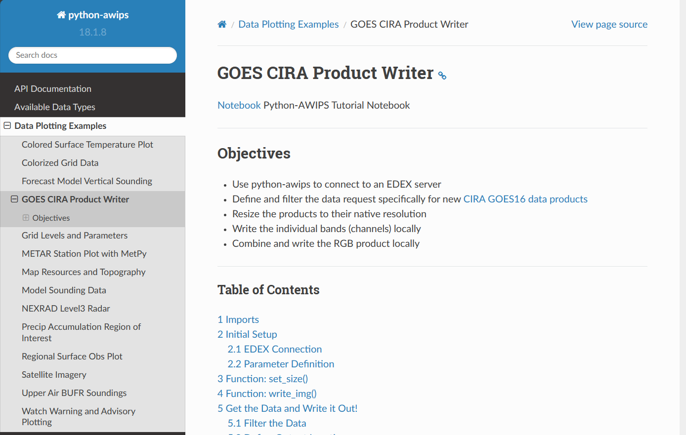

# Educational Resources

Here at Unidata, we want to provide as many resources as possible to make our tools and applications easy to use.  For AWIPS we currently have a new [eLearning course](#cave-elearning-course) that is specific to CAVE.  We also have a suite of [Jupyter Notebooks](#python-awips-example-notebooks) that are meant to provide a detailed overview of many capabilities of python-awips.

---

## CAVE eLearning Course

***Learn AWIPS CAVE*** is our online educational course for those interested in learning about CAVE.

### Access

Please <a href="https://forms.gle/Ea84m4JvboSm6iQx5" target="_blank" rel="noopener noreferrer">fill out this registration form</a> to receive access to *Learn AWIPS CAVE*.

### Content

*Learn AWIPS CAVE* is specifically tailored to content regarding CAVE -- the local graphical application used to view weather data.  The following topics and capabilities are covered throughout the course:

- Launching CAVE
- Navigating the interface
- Modifying product appearances
- Understanding the time match basis
- Creating publication-quality graphics
- Exploring various CAVE layouts
- Saving and loading procedures and displays
- Using radar displays
- Using baselines and points
- Creating time series displays
- Creating vertical cross section displays
- Using the NSHARP editor for soundings
- Viewing model soundings

### Prerequisites

Required:

  - [A supported web browser](https://articulate.com/support/article/System-Requirements-for-Rise#viewing-content)
  - CAVE version 18.2.1 installed on a [supported operating system](http://unidata.github.io/awips2/install/install-cave/)

Recommended:
  
  - A keyboard with a numpad and mouse with a scrollwheel

### Design

*Learn AWIPS CAVE* is organized in a modular layout, with multiple different sections and subsections.  The design allows for completing the course all at once, or in segments.  Throughout the course there are quizzes and interactive assessments to help gauge learning and understanding.  Below is a snapshot taken from the course.  

- The clear outline on the left allows learners to gauge how far along they are and how much time is required to finish the next subsection. 
- Built in videos, images, and gifs make it easy to follow along and understand important functionality in CAVE.  
- Quizzes, tasks, and challenges keep learners engaged and focused on understanding new concepts.

### Support

If you experience any technical issues with our online course, please contact us at: **support-elearning@unidata.ucar.edu**

---

## Python-AWIPS Example Notebooks

In addition to CAVE, AWIPS also has a Python package called ***python-awips*** which allows access to all data on an EDEX server.  We have created a suite of Jupyter Notebooks as examples for how to use various functions of python-awips.

### Access

All of our Notebooks can be downloaded and accessed locally by following the <a href="http://unidata.github.io/python-awips/#source-code-with-examples-install" target="_blank" rel="noopener noreferrer"> source code installation instructions</a> found on our [python-awips website](http://unidata.github.io/python-awips/).

Additionally, non-interactive [webpage renderings](http://unidata.github.io/python-awips/examples/index.html) of each of the Notebooks are also available for quick and easy references.

### Content

Our python-awips Notebooks span a wide range of topics, but generally cover the following:

- Investigating what data is available on an EDEX server
- Accessing and filtering desired data based on time and location
- Plotting and analyzing datasets
- Specific examples for various data types: satellite imagery, model data, soundings, surface obs, and more
