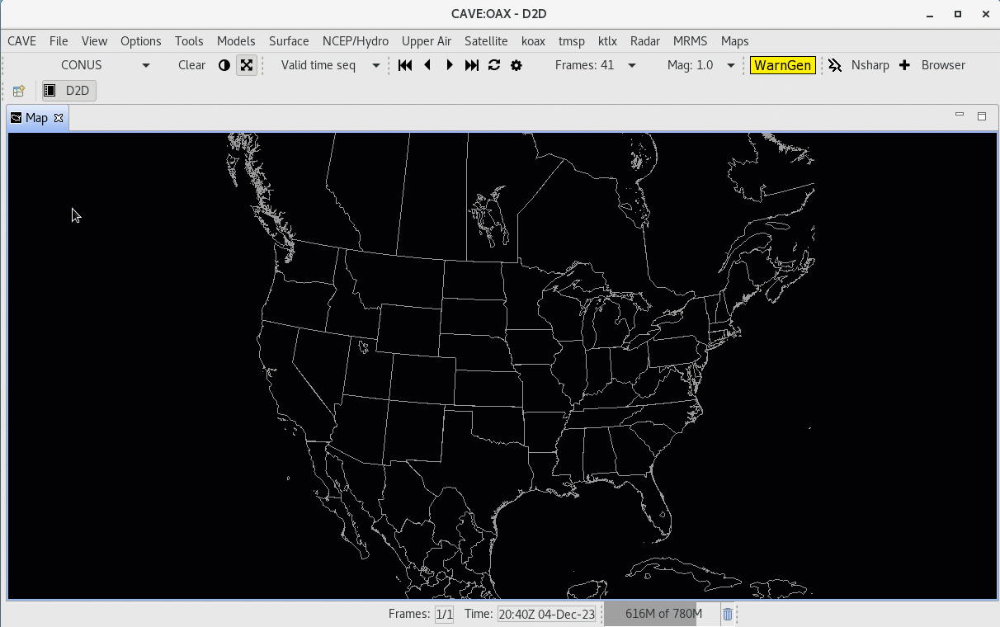

# Displays and Procedures
AWIPS contains two methods for saving and loading data resources:
  
- **Displays** are an all-encompasing way to save loaded resources and current view configurations either onto the connected EDEX server, or a local file for access in future CAVE sessions. 
- **Procedures** are similar to Displays, but can be thought of as *groups of procedure items* which allow the user to save/load only parts of the procedure they desire, and allows the user to manage saved resources with more control.

##  Displays

### **File > Load Display**

Load a previously-saved display from within the AWIPS system.  The pop-up dialog allows you to select your own saved displays as well as those saved by other users.

When loading a display, all existing tabs will be closed and replaced with the contents from the saved display.  Displays will load as many Map Editor tabs as existed when the display was originally saved.

---

### **Load Display from Local Disk**

To load a previously-saved display from a path within the file directory locally, select **File > Load Display** and then select the **File** button on the right to browse your local directories.

---

### **File > Save Display**

Save a product display within the AWIPS system. This saves the display to the EDEX server for your specific user.

---

### **File > Save Display Locally**

To save a product display to a path within the file directory locally, select **File > Save Display Locally** and then select the **File** button on the right.

---

### **File > Delete Displays**

Select and remove a saved display under **File > Delete Displays**, this will open a pop-up dialog.  Select the file name and click **OK** and then confirm deletion to remove the saved file permanently.

---

## Procedures

### New Procedure

* Select the menu **File > Procedures > New...**
* Select **Copy Into** to add all loaded resources from your current map to the Procedure Stack
* Select **Save** (or **Save As**) and then enter a name for the Procedure before clicking **OK** to save.

---

### Open Procedure

Similar to creating a new Procedure, select **File > Procedures > Open...**, select the saved resources and click **Load** to load them to the current Map Editor tab.  If multiple procedure items are wanted for loading, create a new tab for each procedure item and then load that item into the tab.  This process is shown in the video below.

---

### Delete Procedure

From the menu  **File > Procedures > Delete...** you can delete existing Procedure files in a way similar to deleting saved display files.
