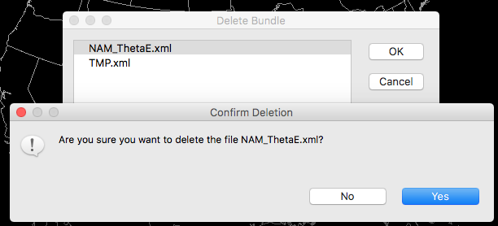
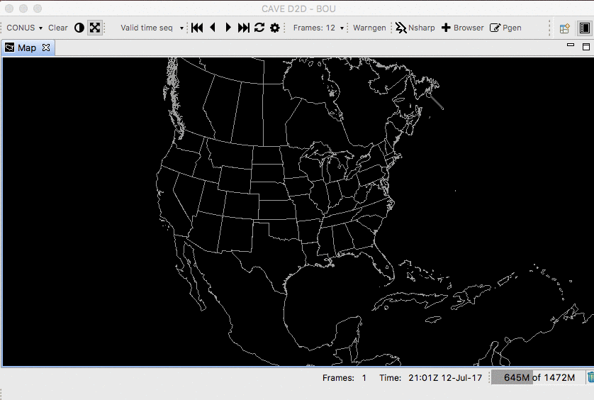
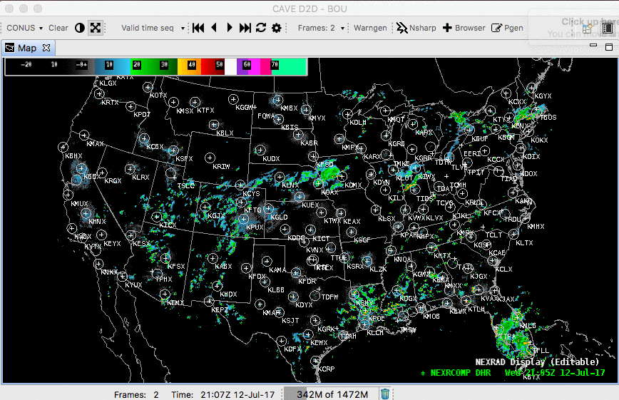

AWIPS contains two methods for saving and loading data resources: **Bundles** are a simple way to save loaded resources to access in future CAVE sessions.  **Procedures** are similar to Bundles, but can be thought of a *groups of bundles* and allows the user to manage saved resources with more control.

##  Bundles

### **File &gt; Open Bundle**

Load a previously-saved bundle from within the AWIPS system.  The Open Bundle dialog allows you to select your own saved bundles as well as those saved by other users (and other localization-levels such as *workstation*).

Each selected bundle will load its contents to new tabs which are named after the bundle file name (e.g. NAM_ThetaE)

Most saved bundles will consist of a single Map Editor (tab), but with multiple tabs saved each will open again in its own Map Editor

---

### **File &gt; Save Bundle**

Save a product display within the AWIPS system, synching the bundle between CAVE and the EDEX server.

---

### **File &gt; Delete Bundle**

Select and remove a saved bundle under File &gt; Delete Bundle.  Select the file name and click **OK** and then confirm deletion to remove the saved file permanently.

---

### Load Bundle from Local Disk

To load a previously-saved display from a path within the file directory of the workstation, select **File &gt; Open Bundle** and then select the **File** button on the right to browse your local directories.

---

### Save Bundle to Local Disk

To save a product display to a path within the file directory of the workstation, select **File &gt; Save Bundle** and then select the **File** button on the right.

---

## Procedures

### New Procedure

* Select the menu **File &gt; Procedures &gt; New**
* Select **Copy Into** to add all loaded resources to the Procedure Stack
* Select **Save** (or **Save As**) and then enter a name for the Procedure before clicking **OK** to save.

### Open Procedure

Similar to creating a new Procedure, select **File &gt; Procedures &gt; Open**, select the saved resources and click **Load** to load them to CAVE.

### Delete Procedure

From the menu  **File &gt; Procedures &gt; Delete** you can delete existing Procedure files in a way similar to deleting saved Bundle files.
