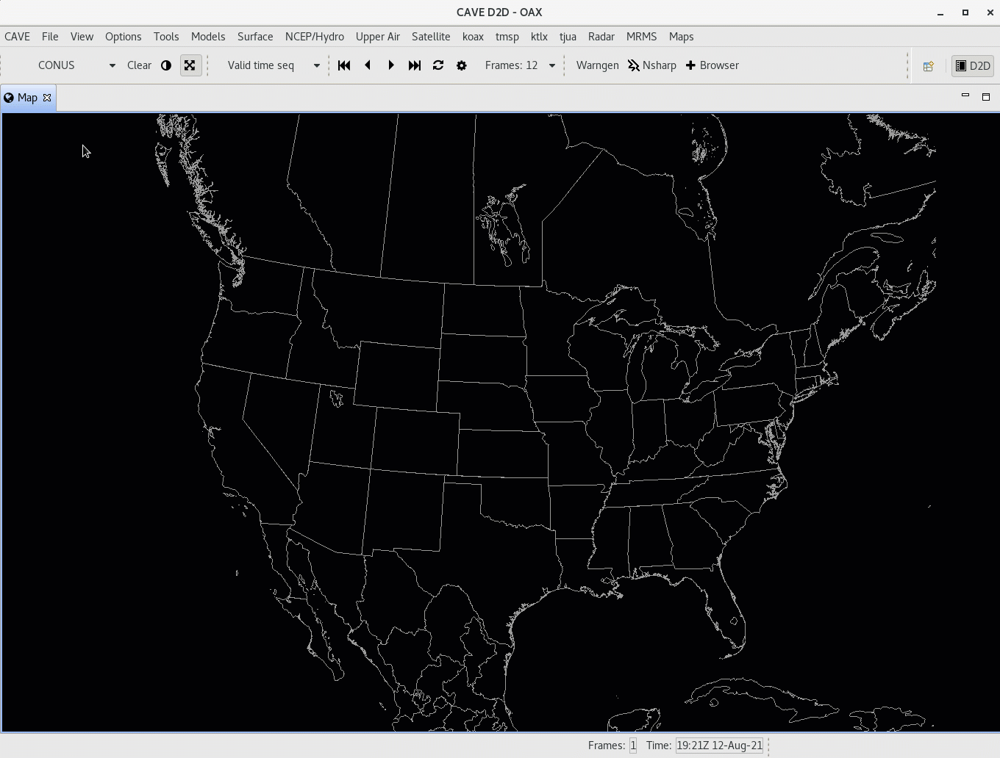

# Displays and Procedures
AWIPS contains two methods for saving and loading data resources: **Displays** are a simple way to save loaded resources into a bundle file to access in future CAVE sessions.  **Procedures** are similar to Displays, but can be thought of as *groups of displays* and allows the user to manage saved resources with more control.

##  Displays

### **File > Load Display**

Load a previously-saved display from within the AWIPS system.  The pop-up dialog allows you to select your own saved displays as well as those saved by other users.

Each selected display will load its contents to new tabs which are named after the display file name (e.g. GFS_TempWind).

Most saved displays will consist of a single Map Editor (tab), but with multiple tabs saved each will open again in its own Map Editor.

---

### **Load Display from Local Disk**

To load a previously-saved display from a path within the file directory of the workstation, select **File > Load Dislay** and then select the **File** button on the right to browse your local directories.

---

### **File > Save Display**

Save a product display within the AWIPS system. This syncs the display file between CAVE and the EDEX server.

---

### **File > Save Display Locally**

To save a product display to a path within the file directory of the workstation, select **File > Save Display Locally** and then select the **File** button on the right.

---

### **File > Manage Bundles**

Select and remove a saved display under File > Manage Bundles, this will open a pop-up dialog.  Select the file name and click **OK** and then confirm deletion to remove the saved file permanently.

---

## Procedures

### New Procedure

* Select the menu **File > Procedures > New**
* Select **Copy Into** to add all loaded resources from your current map to the Procedure Stack
* Select **Save** (or **Save As**) and then enter a name for the Procedure before clicking **OK** to save.

### Open Procedure

Similar to creating a new Procedure, select **File > Procedures > Open**, select the saved resources and click **Load** to load them to CAVE.

### Delete Procedure

From the menu  **File > Procedures > Delete** you can delete existing Procedure files in a way similar to deleting saved display files.
