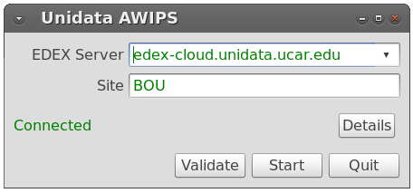
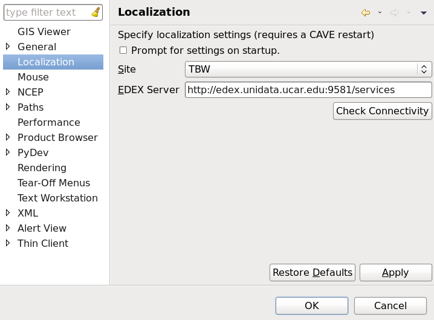
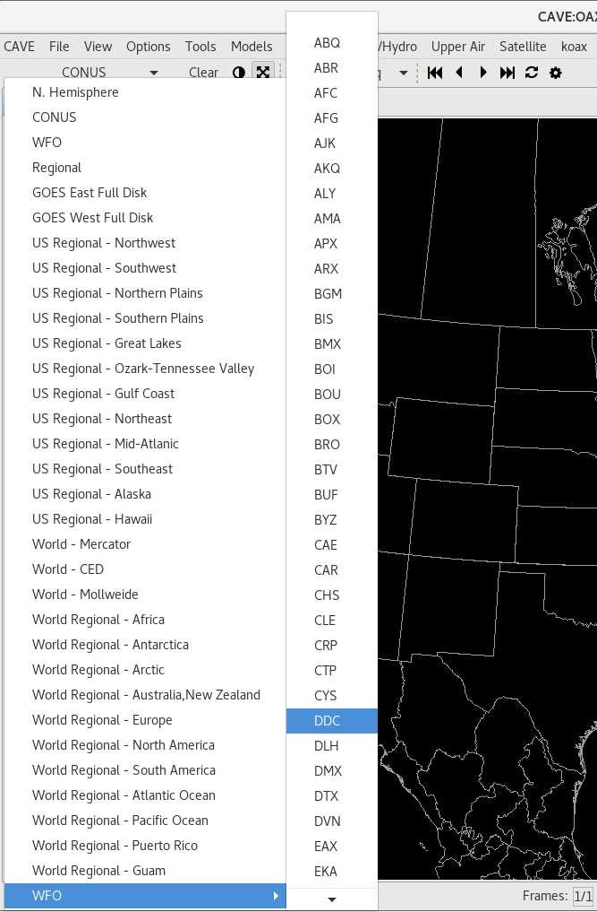

# Localization Preferences

The default localization site for Unidata AWIPS is BOU (Boulder, Colorado, where UCAR is located).  When you are prompted to connect to an EDEX server, you can change the WFO ID as well. 

Since release 16.1.4, CAVE users can switch the localization site to any valid NWS WFO from **CAVE > Preferences > Localization**, where edits canbe made to both the site ID and EDEX server name. Click **Restart** after changes are applied. 

Change the site (example shows TBW Tampa Bay) and click **Okay** or **Apply** and confirm the popup dialog, which informs you that you must *restart* CAVE for the changes to take effect.  

# WFO Map Scales

AWIPS release 16.2.2 contains all WFO map scales selectable in the left-most dropdown (**CONUS** by default).

