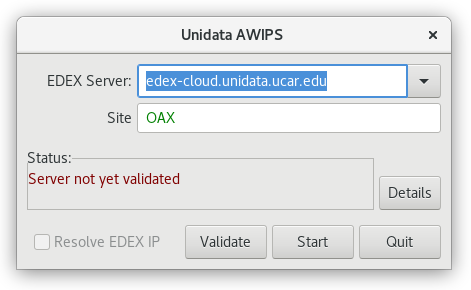
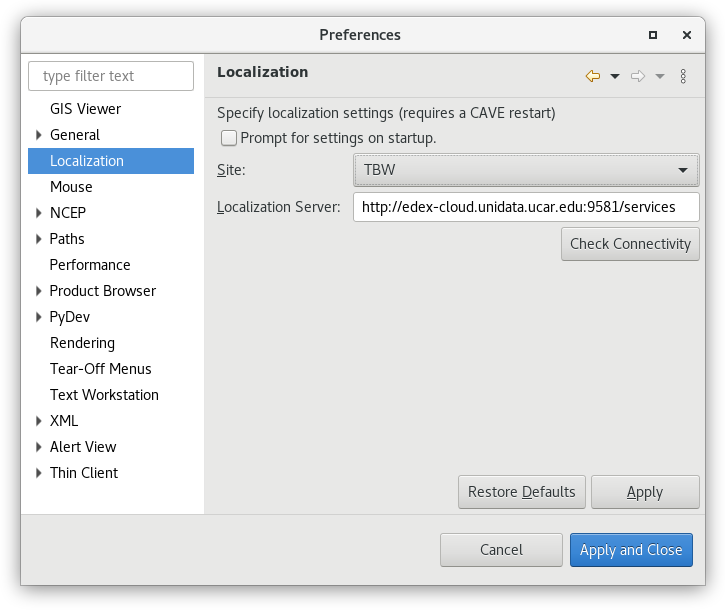
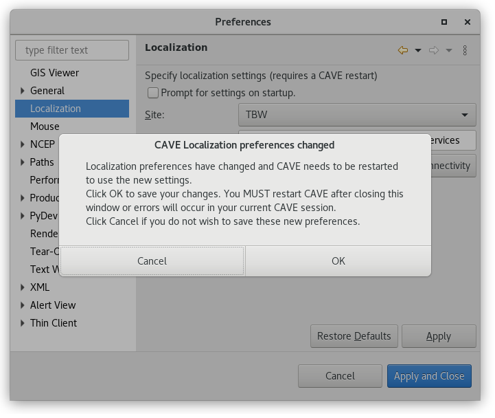

# Change Localization

## Localization Preferences

The default localization site for Unidata AWIPS is OAX (Omaha, Nebraska, where the Raytheon team is located).  When you are prompted to connect to an EDEX server, you can change the WFO ID as well. 

Since release 16.1.4, CAVE users can switch the localization site to any valid NWS WFO from **CAVE > Preferences > Localization**, where edits can be made to both the site ID and EDEX server name. Click **Restart** after changes are applied.  
This window also has the option to **Prompt for settings on startup**, which if checked, would ask for the EDEX Server and Site location every time CAVE is started (this can be useful if you are used to switching between servers and/or sites).

Change the site (example shows TBW Tampa Bay) and click **Apply** or **OK** and confirm the popup dialog, which informs you that you must *restart* CAVE for the changes to take effect.  

