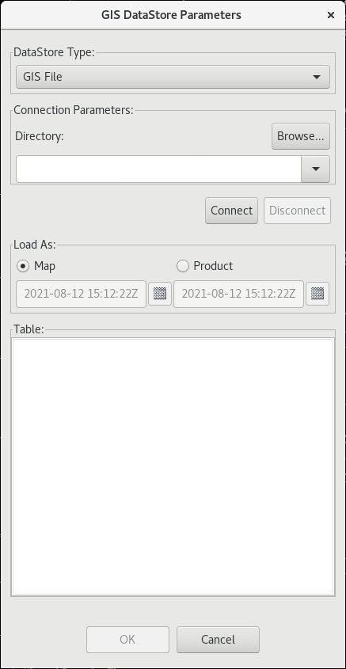
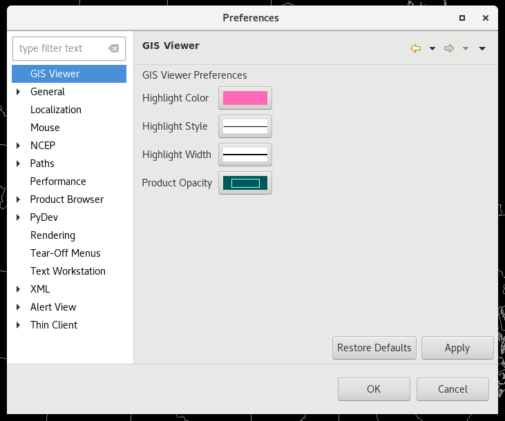
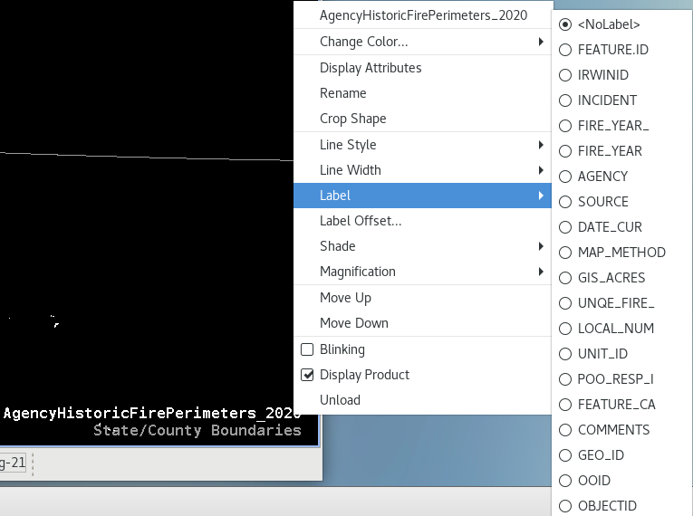

# GIS Import
The Geographic Information System (GIS) Import menu entry enables users to import geospatial data from varying GIS data sources for display in CAVE. CAVE currently only supports shape data in WGS84 unprojected latitude/longitude. This section describes how to:

* [Load GIS Data in CAVE](#display-gis-data)
* [Modify the GIS Data Preferences](#gis-data-preferences)
* [Customize the Attributes](#customizing-the-gis-attribute-dialog)
* [Label GIS Data](#labeling-gis-data)

---

## Display GIS Data

Importing a GIS shapefile is accessed through **File > Import > GIS Data**. The GIS DataStore Parameters dialog is comprised of four sections:

* **DataStore Type**: You can select a file type from the dropdown list. The only option is *GIS File*.
* **Connection Parameters**:  Click the **Browse** button and navigate to the directory where your shapefiles are. Pressing **Connect** will populate the available shapefiles.
* **Load As**: Shapefiles can be loaded as a Map or as a Product. 
    * **Map**: The selected shapefile displays as a map, similar to if you load a map from the Maps menu. 
    * **Product**: When this radio button is selected, you will also need to select the start and end date/time the data is valid for. The selected shapefile displays as a product with a shaded (color-filled) image. When plotting with additional products, if the display time falls within the start/end time range selected, the shapefile will display. When the valid time falls outside the start/end time, the map product image does not display.
* **Table**:  This section lists all of the available shapefiles that are available for display.

---

## GIS Data Preferences

Updating GIS display preferences is accessed through **CAVE** > **Preferences** > **GIS Viewer**. You are able to alter the highlight color, style, width, and opacity of the product in the Main Display here.

<!--
A description of each attribute follows.

* **Highlight Color**: This button opens a dialog that includes a color wheel and a color palette. Clicking the OK button after changing the color sets the new color for the highlight that appears around a selected area (via the Attributes dialog), and closes the dialog. The new color is then displayed on the swatch.
* **Highlight Style**: This button opens a menu displaying a set of lines of differing styles. Doubleclicking on the desired line style sets the new style for the highlight that appears around a selected area (via the Attributes dialog), and closes the menu. The new line style is then displayed on the swatch.
* **Highlight Width**: This button opens a menu displaying a set of lines of differing widths. Double-clicking on the desired line width sets the new width for the highlight that appears around a selected area (via the Attributes dialog), and closes the menu. The new line width is then displayed on the swatch.
* **Product Opacity**: This button opens the Set Opacity dialog for setting the default opacity level for GIS map product images. The dialog includes a swatch and a slider. Moving the slider increases or decreases the opacity level. Clicking the OK button sets the default level and closes the dialog.

Beneath the four attributes are two buttons: Restore Defaults on the left and Apply on the right. The function of the Restore Defaults button is to restore "all" the attributes to their initial (default) values. Click this button only if you want to restore all attributes to their default values. If you accidentally click the Restore Defaults button, you will need to return to the attribute dialog(s) and redefine your desired values.

Use the Apply button to save any changes you make to the default attribute settings. Wait until you are satisfied with all the values you have set, and then click the Apply button once to save all the changes. The values you set here for the attributes will then be applied to the GIS application as the new defaults.
-->

---

## Customizing the GIS Attribute Dialog

You have the ability to highlight or hide specific areas of the displayed map. These functionalities are available by right click and holding on the Map Product ID in the Legend area and selecting **Display Attributes**. The pop-up window is commonly referred to as the "Attributes Table". For each row of information there is an associated map/map product image displayed on the Main Display Pane.

### Highlighting

#### Highlighting Selected Areas

To highlight a selected area(s) of the GIS image, highlight the corresponding row(s) in the Attributes Table, right click and hold on one of the selected rows, and check the Highlighted checkbox. Active highlighted rows will be yellow in the table and the corresponding area in the map display will be pink.

#### Unhighlighting Selected Areas

You can unhighlight by selecting the row, right mouse hold and uncheck the Highlighted checkbox.

#### Unhighlighting All Areas

To remove all highlighted, select **Annotation > Clear Highlights**.

!!!Note "If you are interested in a particular area in the Main Display Pane, but don't know the where in the Attributes Table it is, left double-click on the area of interest and the corresponding row will be highlighted."

### Controlling Visibility of Image Areas

#### Hiding Selected Areas

To hide a selected area(s) of the GIS image, highlight the corresponding row(s) in the Attributes Table, right click and hold on one of the selected rows, and check the Visible checkbox. Hidden rows will be gray in the table and the corresponding area in the map display will disappear.

#### Unhiding Selected Areas

You can make these images visible by selecting the row, right mouse hold and check the Visible checkbox.

#### Unhiding All Areas

To make all images visible, select **Annotation > Make All Visible**.

### Configuring Attributes Table

In the Attributes Table, you have the option to sort by columns and select which columns are displayed.

#### Selecting Columns to Display

By default, all available columns are displayed. The Select Columns dialog will pop-up if you select **Data > Select Columns...**. You can highlight the columns use the arrows to move them into the Available or Displayed columns. Clicking OK will update your table.

#### Sorting Column Information

The **Sort Order** dialog will pop-up if you select **Data > Sort...**. You can use the drop down menu to choose the column to sort by and then sort by Ascending or Descending. You can sort by additional columns. Clicking OK will update your table.

---

## Labeling GIS Data

You can select which attribute you want to use to label the objects on the Main Display.

To open the Label submenu, right click and hold on the Map Product ID in the Legend area to open a pop-up menu and select **Label** and choose which attribute you want as the label.

<!--
##  GIS Data and Display Customization from within the GIS Application

Once the GIS data is displayed, there are several ways to customize the displayed data from within the GIS application. All customizations originate by selecting from the pop-up menu. To open the pop-up menu, click and hold mouse Button B3 (B3) on the GIS displayed image or on the Map/Map Product ID in the Legend area and move the cursor to the option you want to modify.

-->
