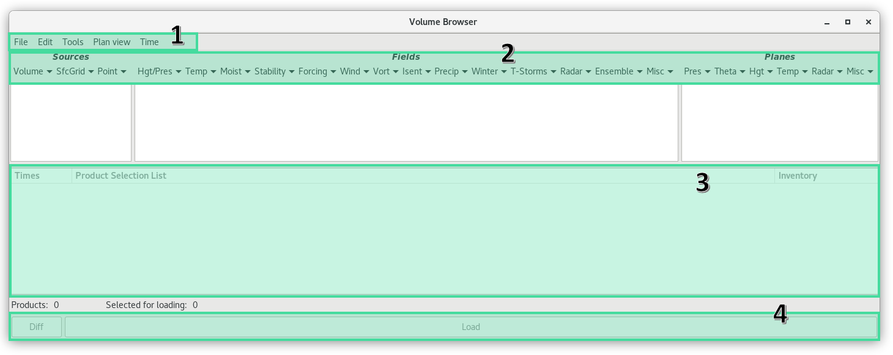
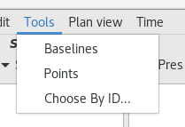
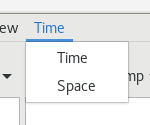

# Volume Browser

The Volume Browser provides access to numerical models, sounding data, and selected point data sources, such as RAOB, METAR, and Profiler. Through the Browser interface, you can choose the data source(s), field(s), plane(s), and point(s), and generate a customized list of model graphics or images for display.

The Volume Browser can be accessed from either the **Tools** (alphabetically organized) or **Models** (first option) menus.

---

## Visual Overview

The Volume Browser window is divided into four areas:

1. The [**Menu Bar**](#volume-browser-menu-bar) along the top
2. The Data Selection Menus
3. The Product Selection List
4. The Load Buttons (Diff and Load) to load items from the Product Selection List

Each area is then subdivided into menu components. The menu bar along the top of the Volume Browser window has dropdown lists that contain options for controlling all the various menu choices of the Volume Browser.

---

## Volume Browser Menu Bar

The dropdown menus in the Volume Browser menu bar contain options for controlling and manipulating the Volume Browser or the products chosen through the Volume Browser

* File
    * Clone
    * Exit
* Edit
    * Clear All
    * Clear Sources
    * Clear Fields
    * Clear Panes
    * Select None
    * Select All
    * Find (Ctrl+F)
* [**Tools**](#vb-tools)
* [**Display Types**](#display-types)
* [**Loop Types**](#loop-types)

---

## VB Tools

### Baselines

Selecting Baselines displays 10 lines, labeled A-A' to J-J', along which cross-sections can be
constructed from within the Volume Browser.  These baseline resources are **editable**.

If you are zoomed in over an area when you load baselines and none appear, press the middle mouse button (B3) to "snap" a baseline to where the mouse cursor is. The system chooses a baseline that has not been recently used. If you
are working with a baseline, a second click with B3 will return you to the original baseline, even
if you modified another baseline.

### Points

Points are used to generate model soundings, time-height cross-sections, time series, and variable vs.
height plots using the Volume Browser. As with the Baselines, the locations of these Points can be
edited in the following manner:

* **"Snapping" an Interactive Point**: If you are zoomed in over an area when you load Interactive
Points and no Points appear, click B3 to "snap" a Point to where the mouse cursor is positioned.
The system chooses a Point that has not been recently used. If you are currently working with a
Point, then a second B3 click will place another Point at the location of your cursor.
* **Dynamic Reference Map**: When you generate a model sounding, a time-height cross-section, a
time series, or a variable vs. height plot, a small reference map indicating the location(s) of the
plotted sounding(s) is provided in the upper left corner of the Main Display Pane.

Points may be created, deleted, hidden, and manipulated (location, name, font, and color). Points are
not limited in terms of number, location, or designation. Points may also be assigned to different
groups to facilitate their use.

### Choose By ID

Choose By ID, which is a function of DMD (Digital Mesocyclone Display), is a method of selecting feature locations. The tool is used to monitor the same feature at a certain location. Without the Choose By ID tool, a monitored feature (over a period of time) could move away from its monitored location and another feature could move in its place. You can use Choose By ID to set points, baselines, and "Home" for conventional locations like METARs and RAOBs (Radiosonde Observations), but its primary use is for the WSR-88D-identified mesocyclone locations.

---

## Display Types

### Plan View (default)

This is the default option for the Volume Browser. From the Plan-view perspective, data are plotted onto horizontal surfaces. The additional options menu that appears in the Volume Browser menu bar allows you to choose whether you want the Plan view data to Animate in Time or Animate in Space.

### Cross Section

Allows you to view gridded data as vertical slices along specific baselines. You need to use either the Interactive Baseline Tool or the predefined latitude/longitude baselines to specify the slice you wish to see. One of the additional options menus that appear in the Volume Browser menu bar allows you to choose whether you want the cross-section data to animate in time or space, while the other options menu allows you to adjust the vertical resolution. Descriptions of these options follows. (Note that the Fields and Planes submenu labels have changed after selecting "Cross section.")

### Time Height

Used in conjunction with the Interactive Points Tool to enable you to view a time height cross section of a full run of gridded model data for a specific location. Additional options menus in the Volume Browser menu bar allow you to choose the direction in which you want the data to be plotted, and to adjust the vertical resolution.

### Var vs Hgt

Enables you to view a profile of a meteorological model field as it changes through height, which is displayed in millibars. By using the Interactive Points Tool, you can select one or more locations from which to plot the data.

### Sounding

Works in conjunction with the Interactive Points Tool to enable you to generate a Skew-T chart for a specific location, no additional menus appear in the Volume Browser when the Soundings setting is chosen.

### Time Series

Used in conjunction with the Interactive Points Tool to enable you to plot gridded data on a time versus data value graph for a specified point.

## Loop Types

### Time

The default option for the Volume Browser. It allows you to view model data through time

### Space

Allows you to loop through a series of predefined latitude or longitude cross-sectional slices at a fixed time.
