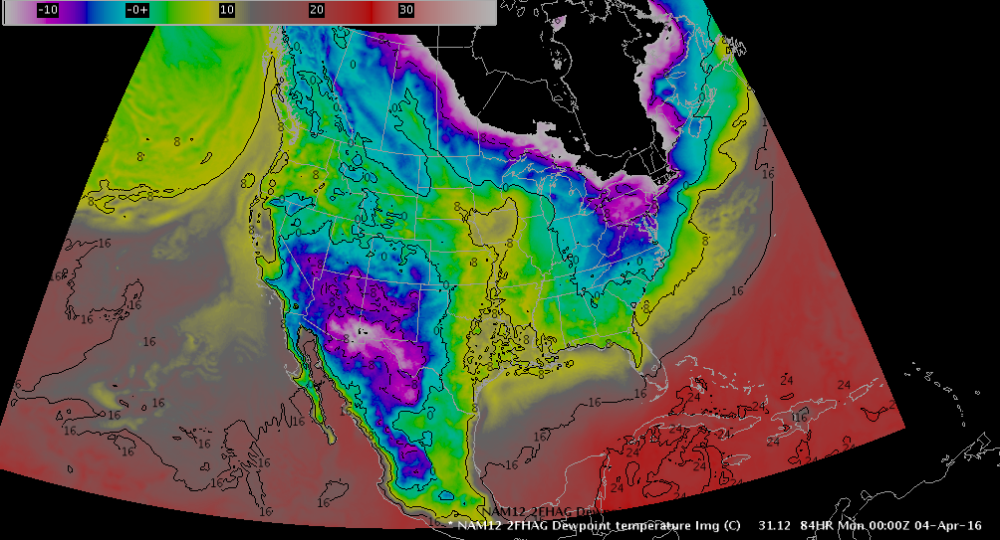
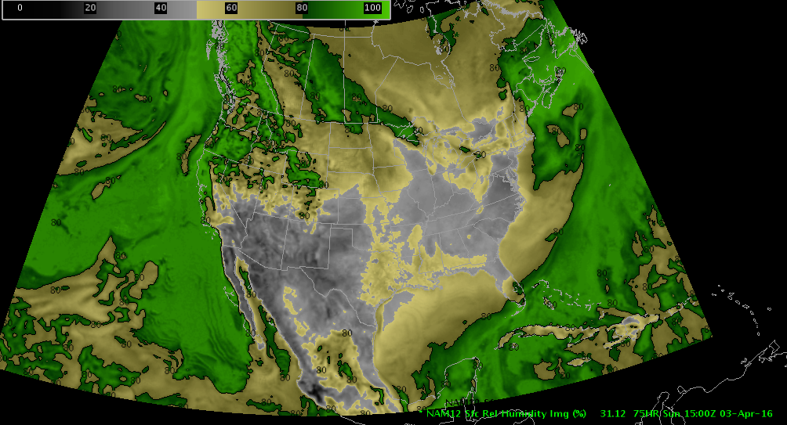
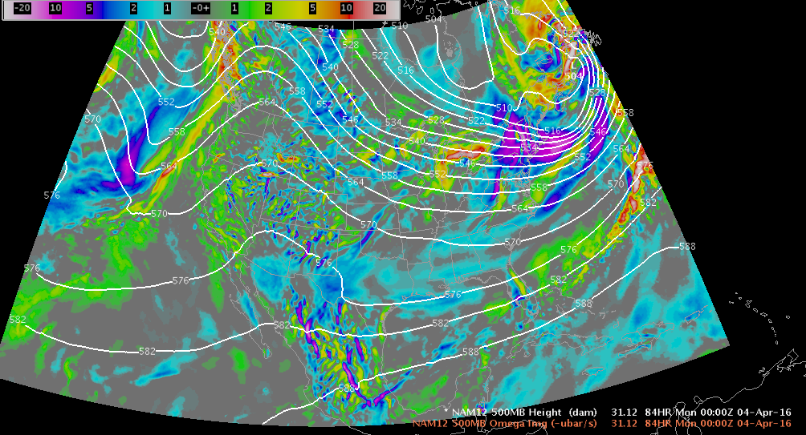
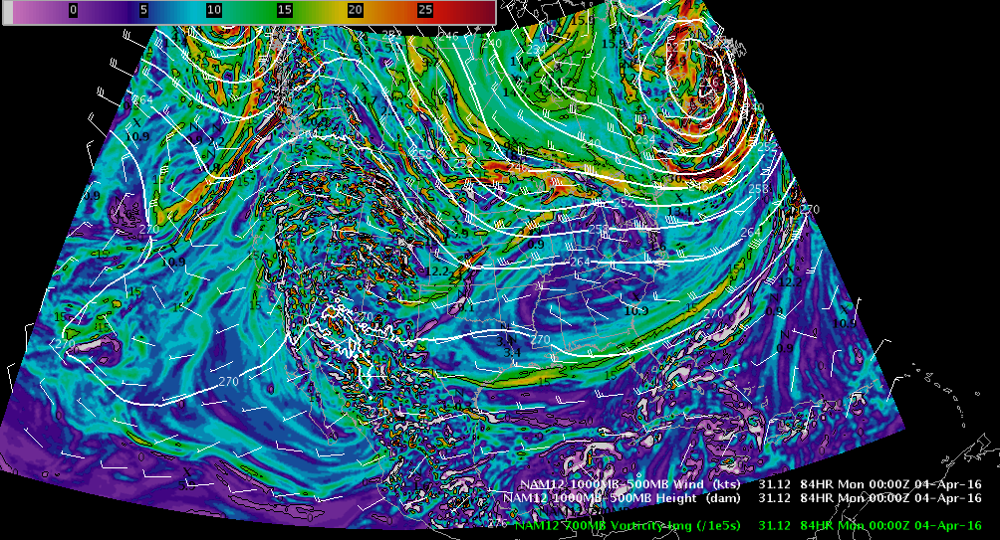
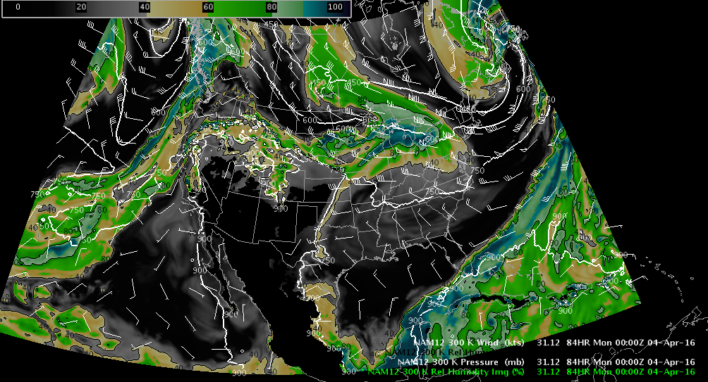

# MSLP and Precipitation

# Sfc Temperature and Wind

# Sfc Dewpoint Temperature

# Sfc Relative Humidity

# 30mb Mean Dewpoint

# Precipitable Water

# Simulated Reflectivity (REFC)

# Lightning Threat

# Precip Type / Moisture Transport

# Vorticity (500mb)

# Vertical Velocity (500mb, 700mb, 850mb)

# Thickness / Vorticity Advection (Trenberth)

# Wind / Height (850mb, 700mb, 500mb, 300mb, 250mb)

# Potential Vorticity (250mb)

# Helicity / Storm-Relative Flow

# Hail Parameters

# MCS Parameters

# Isentopic Analysis (270K-320K)

---
