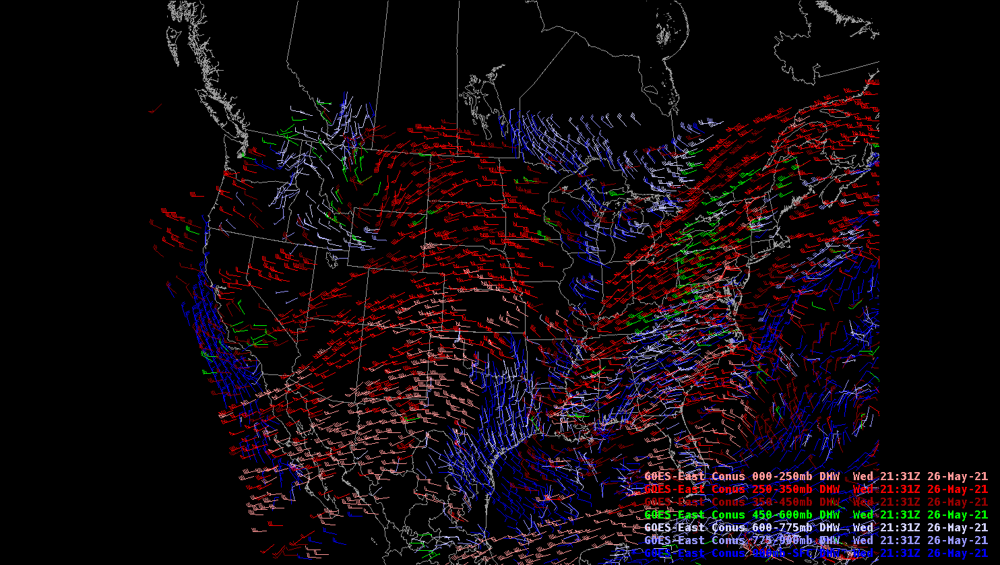

# GOES East/West Satellite Products

The ***goesr*** EDEX plugin decoder supports the ingest of GOES products coming over NOAAPort and Unidata's IDD. These products include:
- [single channel imagery](#individual-channels)
- [derived products](#derived-products) (Level 2b netCDF files)
- [CIRA created RGB](#cira-geocolor) specific products
- [vertical temperature/moisture profiles](#vertical-temperature-and-moisture-profile). 
- Using derived parameters, additional [RGB](#rgb-composites) and [channel difference](#channel-differences) products can be loaded.

The ***dmw*** EDEX plugin decoder supports the ingest of GOES:
  - [derived motion winds](#derived-motion-winds)
  - [Geostationary Lightning Mapper](#geostationary-lightning-mapper-glm) (GLM) gridded products
  - GLM Parallax corrected Flash Points

GOES East and West products are accessible from the **Satellite** menu.  The menu is broken into sections starting with common CONUS GOES East/West Combo products. There are submenus for each of the separate geospatial sectors:

* East CONUS
* East Full Disk
* East Mesoscale Sectors (x2)
* West CONUS
* West Full Disk
* West Mesoscale Sectors (x2)
* GOES OCONUS
  * Alaska
  * Puerto Rico
  
Each sector submenu has products for individual channels and vertical profiles, as well as submenus for derived products, channel differences, RGB Composites, GLM data, and derived motion winds where applicable. Additional documentation on specific products and quick guides can be found:
  - [CIMSS Quick Guides](https://cimss.ssec.wisc.edu/goes/GOESR_QuickGuides.html)
  - [CIRA Reference Material](https://rammb2.cira.colostate.edu/training/visit/quick_reference/#tab17)

---

## LDM Pattern Actions

The Unidata IDD redistributes both the NOAAPort/SBN GOES tiled products as well as stitched together GOES products. While Unidata's AWIPS can decode and ingest both, it's important to only be requesting from one or the other so you aren't creating duplicate processing.  The entries that should be used for GOES data are shown below which is found in the LDM's pqact.conf.priority file, located in `/awips2/ldm/etc`.   (For the full list of pqact entries, you can view [this](https://github.com/Unidata/awips2/blob/unidata_20.3.2/rpms/awips2.upc/Installer.ldm/patch/etc/pqact.goesr) file).

    # GOES 16/17 Single Channel (ABI) via Unidata IDD -(using)
    NIMAGE	^/data/ldm/pub/native/satellite/GOES/([^/]*)/Products/CloudAndMoistureImagery/([^/]*)/([^/]*)/([0-9]{8})/([^/]*)(c[0-9]{7})(..)(.....).nc
	    FILE	-close -edex	/awips2/data_store/GOES/\4/\7/CMI-IDD/\5\6\7\8.nc4

    # GOES 16/17 derived products + derived motion wind via SBN - (using)
    HDS	^(IXT.[8-9]9) (KNES) (..)(..)(..)
	    FILE	-close -edex	/awips2/data_store/GOES/(\3:yyyy)(\3:mm)\3/\4/derived-SBN/\1_KNES_\2\3\4\5-(seq)
    NOTHER	^(IXT[WXY]01) (KNES) (..)(..)(..)
	    FILE	-close -edex	/awips2/data_store/GOES/(\3:yyyy)(\3:mm)\3/\4/derived-SBN/\1_KNES_\2\3\4\5-(seq)
    
    # GOES CIRA derived products 
    NIMAGE	^/data/ldm/pub/native/satellite/GOES/([^/]*)/Products/GeoColor/([^/]*)/([^/]*)/([0-9]{8})/([^/]*)(c[0-9]{7})(..)(.....).nc
        FILE	-close -edex	/awips2/data_store/GOES/\4/\7/CIRA/GeoColor/\5\6\7\8.nc4
    NIMAGE	^/data/ldm/pub/native/satellite/GOES/([^/]*)/Products/DebraDust/([^/]*)/([^/]*)/([0-9]{8})/([^/]*)(c[0-9]{7})(..)(.....).nc
        FILE	-close -edex	/awips2/data_store/GOES/\4/\7/CIRA/DebraDust/\5\6\7\8.nc4
    NIMAGE	^/data/ldm/pub/native/satellite/GOES/([^/]*)/Products/CloudSnow/([^/]*)/([^/]*)/([0-9]{8})/([^/]*)(c[0-9]{7})(..)(.....).nc
        FILE	-close -edex	/awips2/data_store/GOES/\4/\7/CIRA/CloudSnow/\5\6\7\8.nc4

    #GOES GLM Stitched gridded products via ISatSS (using)
    SPARE|NIMAGE	^/data/ldm/pub/native/satellite/GOES/([^/]*)/Products/GLMISatSS/Level[23]/([^/]*)/([0-9]{8})/(OR_GLM-L[23]-GLMF-M6_G(..)_s(.......)(..).*)
        FILE	-close -edex	/awips2/data_store/GOES/\3/\7/GLMISatSS-Stitched/\4
---

## Individual Channels

All geospatial sectors have 16 individual channel products that can be viewed.  Below are samples of Channel 14 (11.20&mu;m) for each of the sectors.
  - Channel 1 (0.47&mu;m)
  - Channel 2 (0.64&mu;m)
  - Channel 3 (0.86&mu;m)
  - Channel 4 (1.38&mu;m)
  - Channel 5 (1.61&mu;m)
  - Channel 6 (2.25&mu;m)
  - Channel 7 (3.90&mu;m)
  - Channel 8 (6.19&mu;m)
  - Channel 9 (6.95&mu;m)
  - Channel 10 (7.34&mu;m)
  - Channel 11 (8.50&mu;m)
  - Channel 12 (9.61&mu;m)
  - Channel 13 (10.35&mu;m)
  - Channel 14 (11.20&mu;m)
  - Channel 15 (12.30&mu;m)
  - Channel 16 (13.30&mu;m)

### East CONUS

### East Full Disk

### East Mesoscale Sectors (EMESO-1, EMESO-2)

Two floating mesoscale sectors (location will vary day to day from image shown)

### West CONUS

### West Full Disk

### West Mesoscale Sectors (WMESO-1, WMESO-2)

Two floating mesoscale sectors (location will vary day to day from image shown)

### Alaska

### Puerto Rico (PRREGI)

---

## RGB Composites

RGB Composites are made by combining 3 channels (including derived parameter calculated channels) and are available for each sector. RGB products are always being added and updated. These products are generated **on the fly in AWIPS** and typically take a little bit of extra time to load.

!!! warning "GOES RGB Imagery is NOT SUPPORTED on macOS or within a Virtual Machine"

	OpenGL Shading Language limitations prevent multi-channel imagery from displaying correctly on Mac or in a Virtual Machine.  Please use the Linux or Windows installs to view RGB products.

### Day Cloud Phase Distinction

### Day Cloud Type

### Fire Temperature

### Day Land Cloud

### Day Cloud Convection

### Day Land Cloud Fires

### Day Fire

### VIS/IR Sandwich

### Simple Water Vapor

### Day Rocket Plume

### Night Rocket Plume

### Air Mass

### Ash

### Day Convection

### Day Snow Fog

### Differential Water Vapor

### Dust

### CIMSS Natural Color

### Nighttime Microphysics

### SO2

### CIRA Geocolor

### CIRA Debra Dust

### CIRA Cloud Snow

### Daytime Composite 1

### Daytime Composite 5

>Note: Additionally there is a submenu for RGB products with Derived Products (DP) readouts

---

## Channel Differences

Channel differences are the result of subtracting one channel from another to produce a new product.  These products are generated **on the fly in AWIPS** using the existing channel products from EDEX.

These are the channel differences currently available in CAVE:

* Split Window (10.3 - 12.3 &mu;m)
* Split Cloud Top Phase (11.2 - 8.4 &mu;m)
* Night Fog (10.3 - 2.9 &mu;m)
* Night Fog (11.2 - 2.9 &mu;m)
* Day Fog (3.9 - 10.3 &mu;m)
* Split Fire (2.2 - 1.6 &mu;m)
* Split Ozone (9.6 - 10.3 &mu;m)
* Split Water Vapor (6.19 - 7.3 &mu;m)
* Split Snow (1.6 - 0.64 &mu;m)
* Vegetation (0.64 - 0.87 &mu;m)
* Upper Level Info (11.2 - 6.19 &mu;m)

---

## Derived Products

Derived products are also known as **Level 2+** products. Not all sectors have the same set of products available. To find out some more information on some of the products visit the [**Quick Guides**](http://rammb.cira.colostate.edu/training/visit/quick_guides/) compiled by CIRA.

The current products offered in CAVE are listed below and to the right is which GOES East/West sector they are available for (F=Full Disk, C=CONUS, M=Mesoscale):

|Derived Product|East|West|
| ------------- | ---- | ---- |
|Aerosol Dust Detection High |F,C,M|F,C,M|
|Aerosol Dust Detection Low|F,C,M|F,C,M|
|Aerosol Dust Detection Med|F,C,M|F,C,M|
|Aerosol Optical Depth|F,C|F,C|
|Aerosol Smoke Detection (High)|F,C,M|F,C,M|
|Aerosol Smoke Detection (Low)|F,C,M|F,C,M|
|Aerosol Smoke Detection (Med)|F,C,M|F,C,M|
|All Cloud Layers|F,C,M|F,C,M|
|Clear Sky Mask|F,C,M|F,C,M|
|Cloud Layer Fraction (050-100)|F,C,M|F,C,M|
|Cloud Layer Fraction (100-180)|F,C,M|F,C,M|
|Cloud Layer Fraction (180-240)|F,C,M|F,C,M|
|Cloud Layer Fraction (>=240)|F,C,M|F,C,M|
|Cloud Layer Fraction (Sfc-050)|F,C,M|F,C,M|
|Cloud Optical Depth|F,C||
|Cloud Thickness|C|C|
|Cloud Top Height|F,C,M|F,C,M|
|Cloud Top Phase|F,C,M|F,C,M|
|Cloud Top Pressure|F,C||
|Cloud Top Temperature|F,M|F,M|
|Clout Particle Size|F,C,M||
|Derived CAPE|F,C,M|F,C,M|
|Derived K-Index|F,C,M|F,C,M|
|Derived Lifted Index|F,C,M|F,C,M|
|Derived Showalter Index|F,C,M|F,C,M|
|Derived Total Totals|F,C,M|F,C,M|
|Fire Area|F,C,M|F,C,M|
|Fire Mask|F,C,M|F,C,M|
|Fire Power|F,C,M|F,C,M|
|Fire Temp|F,C,M|F,C,M|
|Fog an Low Stratus (Instrument Flight Rules) |C|C|
|Fog and Low Stratus (Low Instrument Flight Rules) |C|C|
|Fog and Low Stratus (Marginal Visual Flight Rules) |C|C|
|Ice Age Category 3|F|F|
|Ice Age Category 8|F|F|
|Ice Concentration|F|F|
|Ice Mask (Day/Night)|F|F|
|Ice Surface Temp|F|F|
|Ice Thickness|F|F|
|Land Surface Temp|F,C,M|F,C,M|
|Rainfall Rate/QPE|F|F|
|Sea Surface Temp (F)|F|F|
|Sea Surface Temp|F|F|
|Snow Cover|F|F|
|Total Cloud Fraction|F,C,M|F,C,M|
|Total Precip Water|F,C,M|F,C,M|

---

## Geostationary Lightning Mapper (GLM)

Currently, the 1-min GLM gridded products are coming over the SBN and operational sites are calculating the 5-min GLM gridded products locally. At Unidata, we are receiving the 1 and 5-min gridded tiles from ISatSS (NWS) on the GOES East and West Full Disk scale, and we're stitching the tiles together locally before redistributing the full domain over our IDD/LDM feed. Current gridded products are available on the GOES East and West Full Disk Sectors:

* Minimum Flash Area
* Flash Extent Density
* Total Optical Energy

Additionally GLM flash points are available to plot as well. These are parallax corrected locations instead of the raw locations.

GLM data are located in the menu structure: **Satellite** > **GOES-[East/West] Full Disk** > **GLM Products**.

---

## Derived Motion Winds

Derived Motion Wind Vectors are produced using sequential CONUS sector goesABI images and can provide information about winds at different levels. The wind vectors are computed using both visible and infrared imagery. Winds can be plotted by different pressure layers or individual channels. More information can be found [here](http://cimss.ssec.wisc.edu/goes/OCLOFactSheetPDFs/ABIQuickGuide_BaselineDerivedMotionWinds.pdf). Below is an image of the winds at different pressure layers.

---

## Vertical Temperature and Moisture Profile

Vertical Temperature and Moisture profiles are available in AWIPS for the CONUS sectors. Similar to NUCAPS, when loaded in CAVE, a circle is displayed for each location that has a vertical profile available. When clicking on the circle, NSHARP will open with the vertical temperature and moisture profile. These profiles are GFS data that have been adjusted based on the satellite observations. More information can be found [here](https://rammb.cira.colostate.edu/training/visit/quick_guides/QuickGuide_GOES-R_Legacy_Temperature_Moisture%20Profiles.pdf).

