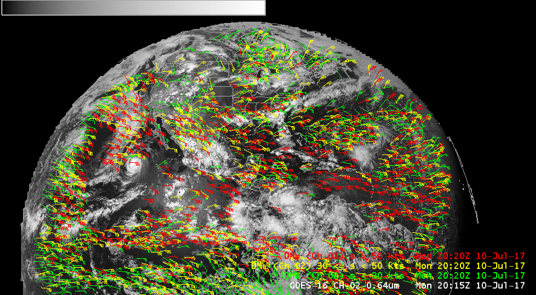

GOES-16 is now operational as GOES East, and products are available on Unidata's `edex-cloud.unidata.ucar.edu` server, including 16 channels of ABI imagery and various derived products.

The NASA Short-term Prediction Research and Transition ([SPoRT](https://weather.msfc.nasa.gov/sport/)) center has developed decoding and visualization plugins for global Geostationary Lightning Mapper (GLM) observations and Derived Wind Motion vectors, available in the [latest Unidata CAVE release](../install/install-cave) for Linux and macOS.

GOES East products are accessible in the **Satellite**  menu:

---

## RGB Composites

**Multi-Channel Icing Composite**

Channels 5,3,2 (1.61u, 0.87u, 0.64u)

**Multi-Channel Daytime 1 Composite **

Channels 2,5,14 (0.64u, 1.61u, 11.20u)

**Multi-Channel Daytime 2 Composite**

Channels 2,3,2 (0.64u, 0.87u, 0.64u)

!!! warning "GOES-16 Composite Imagery NOT SUPPORTED on macOS"

	OpenGL Shading Language limitations prevent multi-channel imagery from displaying correctly on Mac.

---

## Derived Products 

## GLM

## Derived Motion Winds

### LDM Pattern Action

    NOTHER  ^(TI[RS]...) (KNES) (......) (...)
            FILE    -close -edex
            /awips2/data_store/satellite/goes16/\1_\2_\3_\4_(seq).gini

### Puerto Rico sector (PRREGI)

### CONUS 1km 

### Full Disk 6km

### Mesoscale Sectors (TMESO-1, TMESO-2)

Two floating mesoscale sectors (will vary from image shown)

          

  

To display multi-channel composites requires CAVE for Linux or Windows.

### HDF5 Data Store

Decoded GOES-R satellite images are stored in `/awips2/edex/data/hdf5/satellite/` under sector subdirectories:

    drwxr-xr-x 18 awips fxalpha PRREGI
    drwxr-xr-x 18 awips fxalpha TCONUS
    drwxr-xr-x 18 awips fxalpha TFD
    drwxr-xr-x 18 awips fxalpha TMESO-1
    drwxr-xr-x 18 awips fxalpha TMESO-2

---

## Level 2+ Products

Level 2+ products are described as derived environmental variables which will be created and disseminated when GOES-16 is used operationally (compared to **Level 0**, described as unprocessed instrument data at full resolution, and **Level 1b** products, described as radiometric and geometric correction applied to produce parameters in physical units). 

Unidata does not currently have access to these products, but EDEX 17.1.1 can support their ingest if made available. 

[Read more about GOES-R data levels...](http://www.goes-r.gov/ground/overview.html)

### Level 2+ Decoder Regular Expression

From `/awips2/edex/data/utility/common_static/base/distribution/goesr.xml`

    ^OR_ABI-L2-\w{3,5}(C|F|M1|M2)-M[34]_G\d\d_s\d{14}_e\d{14}_c\d{14}.nc$
    
---

## Geostationary Lightning Mapper (GLM)

NASA's SPoRT MSFC Earth Science Office has contributed plugins to decode GLM level2 products, displayed as point data in CAVE.

While Unidata is not currently distributing GLM products, you can [download a sample netCDF file](http://www.unidata.ucar.edu/software/awips2/OR_GLM-L2-LCFA_G16_s20170402339144_e20170402339307_c20170402339509.nc) and copy it to `/awips2/data_store/ingest/` in order to test the decoding and display of GOES-R lightning data.

### Ingest Sample Data 

Run the single command from your EDEX server to ingest a single-time sample data set:

    wget http://www.unidata.ucar.edu/software/awips2/OR_GLM-L2-LCFA_G16_s20170402339144.nc -P /awips2/data_store/ingest/

### Display GLM Lightning Data

Load GLM data from the menu **Satellite** > **GOES-16 Provisional** > **GLM-Lightning**.  Data are displayable as **Flash**, **Event**, and **Group** and 1min, 5min, 15min, and 1hr intervals.

## Derived Motion Winds

At the bottom of the menu **Satellite** > **GOES-16 Provisional Products** are sub-menus for GOES-16 Derived Motion Wind (DMW) products.  Select the sub-menu **GOES-Test** and then region (CONUS, Full Disk, Mesoscale), and then select the wind product by level:

* By Pressure
* By Mandatory Levels
* By Channel

