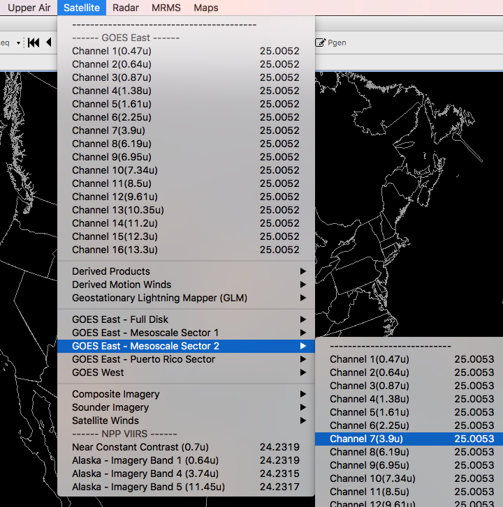
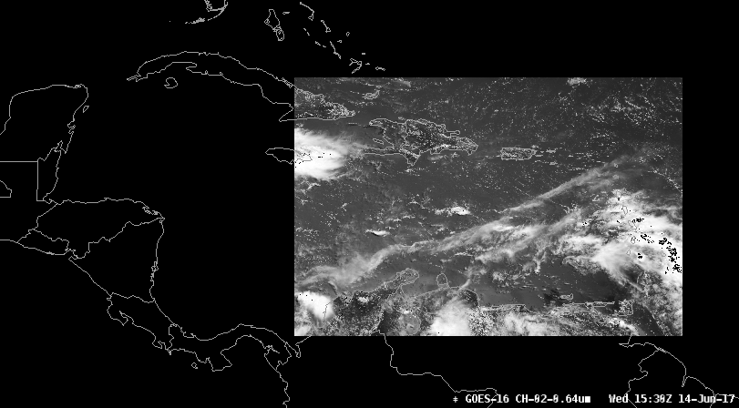
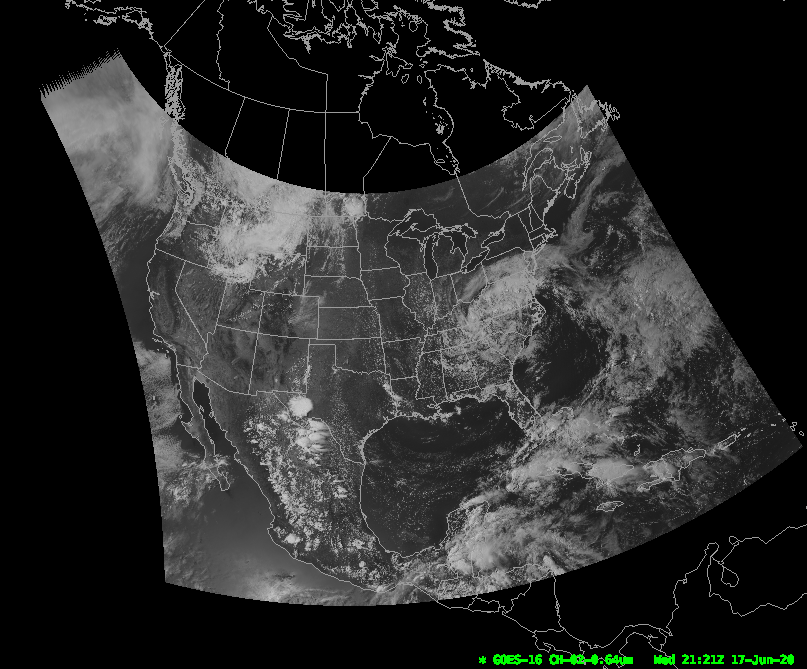
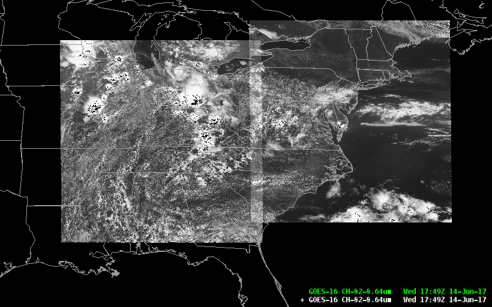
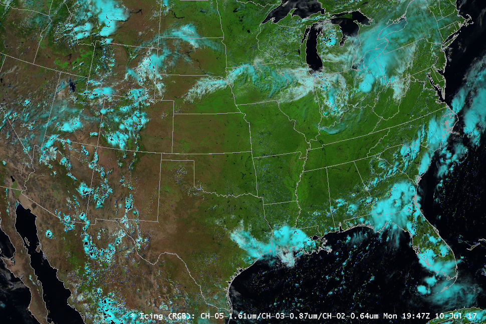
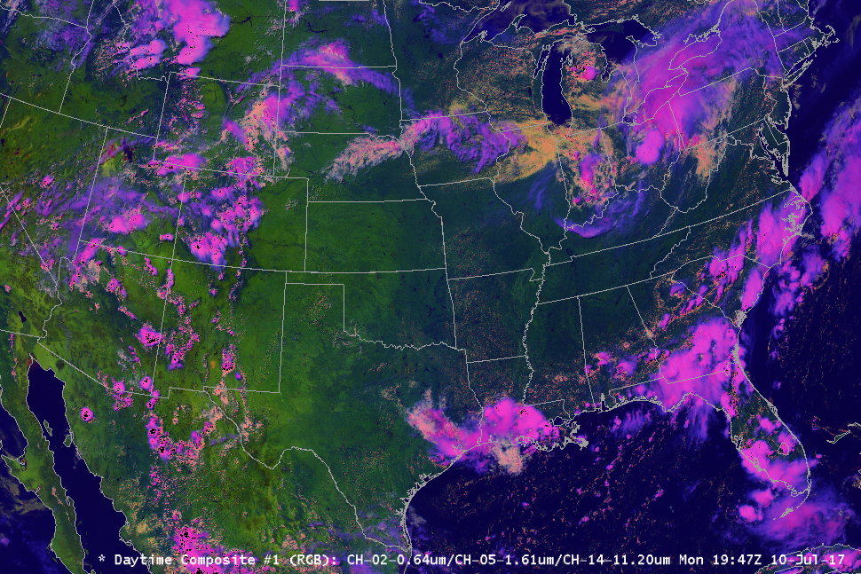
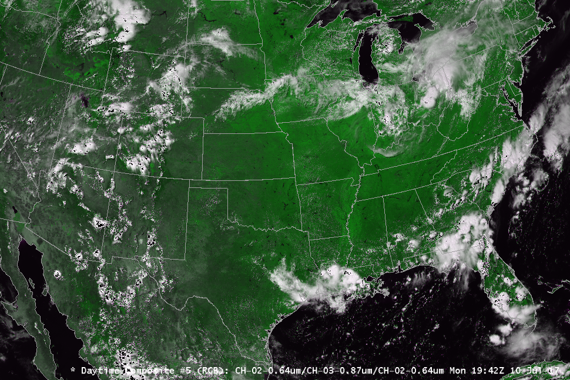
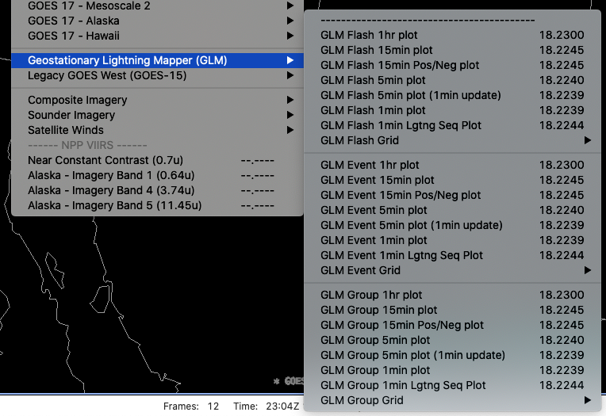
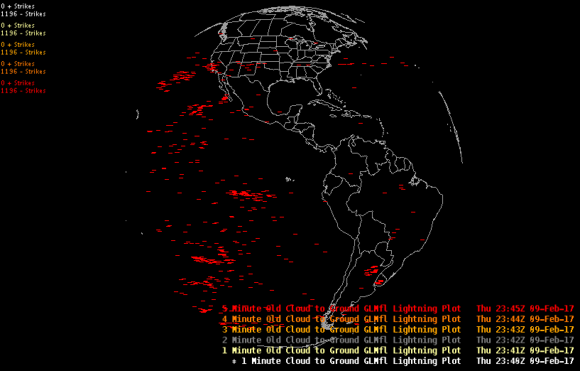

AWIPS ingest and display of GOES-16 (GOES-R) products is handled by contributions from the **[awips2-goesr](https://github.com/Unidata/awips2-goesr)** plugin repository. As of Unidata AWIPS 17.1.1, the GOES-R decoder supports the ingest and display of NOAAport provisional products (currently on the NOTHER feed), as well as Level 2b netCDF files.  A GOES-R Lightning Mapper (GLM) decoder is also provided to handle sensor lightning observations.  

GOES-R products are accessible in the menu **Satellite** > **GOES-16 Provisional Products**

---

## NOAAport Provisional Products

### LDM Pattern Action

    NOTHER  ^(TI[RS]...) (KNES) (......) (...)
            FILE    -close -edex
            /awips2/data_store/satellite/goes16/\1_\2_\3_\4_(seq).gini

### Puerto Rico sector (PRREGI)

### CONUS 1km 

### Full Disk 6km

### Mesoscale Sectors (TMESO-1, TMESO-2)

Two floating mesoscale sectors (will vary from image shown)

          

### Icing Composite

Channels 5,3,2 (1.61u, 0.87u, 0.64u)

### Daytime Composite 1

Channels 2,5,14 (0.64u, 1.61u, 11.20u)

### Daytime Composite 2

Channels 2,3,2 (0.64u, 0.87u, 0.64u)

  

!!! warning "GOES-16 Composite Imagery NOT SUPPORTED on macOS"

	OpenGL Scripting Language limitations on Mac prevent multi-channel imagery from shading:
	
	  * Icing (1.61, 0.87, 0.64)which dis
	  * Daytime Composite (0.64, 1.61, 11.20)
	  * Daytime Composite (0.64, 0.87, 0.64)  

To display multi-channel composites requires CAVE for Linux or Windows.

### HDF5 Data Store

Decoded GOES-R satellite images are stored in `/awips2/edex/data/hdf5/satellite/` under sector subdirectories:

    drwxr-xr-x 18 awips fxalpha PRREGI
    drwxr-xr-x 18 awips fxalpha TCONUS
    drwxr-xr-x 18 awips fxalpha TFD
    drwxr-xr-x 18 awips fxalpha TMESO-1
    drwxr-xr-x 18 awips fxalpha TMESO-2

---

## Level 2+ Products

Level 2+ products are described as derived environmental variables which will be created and disseminated when GOES-16 is used operationally (compared to **Level 0**, described as unprocessed instrument data at full resolution, and **Level 1b** products, described as radiometric and geometric correction applied to produce parameters in physical units). 

Unidata does not currently have access to these products, but EDEX 17.1.1 can support their ingest if made available. 

[Read more about GOES-R data levels...](http://www.goes-r.gov/ground/overview.html)

### Level 2+ Decoder Regular Expression

From `/awips2/edex/data/utility/common_static/base/distribution/goesr.xml`

    ^OR_ABI-L2-\w{3,5}(C|F|M1|M2)-M[34]_G\d\d_s\d{14}_e\d{14}_c\d{14}.nc$
    
---

## GOES Lightning Mapper (GLM)

NASA's SPoRT MSFC Earth Science Office has contributed plugins to decode GLM level2 products, displayed as point data in CAVE.

While Unidata is not currently distributing GLM products, you can [download a sample netCDF file](http://www.unidata.ucar.edu/software/awips2/OR_GLM-L2-LCFA_G16_s20170402339144_e20170402339307_c20170402339509.nc) and copy it to `/awips2/data_store/ingest/` in order to test the decoding and display of GOES-R lightning data.

### Ingest Sample Data 

Run the single command from your EDEX server to ingest a single-time sample data set:

    wget http://www.unidata.ucar.edu/software/awips2/OR_GLM-L2-LCFA_G16_s20170402339144.nc -P /awips2/data_store/ingest/

### Display GLM Lightning Data

Load GLM data from the menu **Satellite** > **GOES-16 Provisional** > **GLM-Lightning**.  Data are displayable as **Flash**, **Event**, and **Group** and 1min, 5min, 15min, and 1hr intervals.

