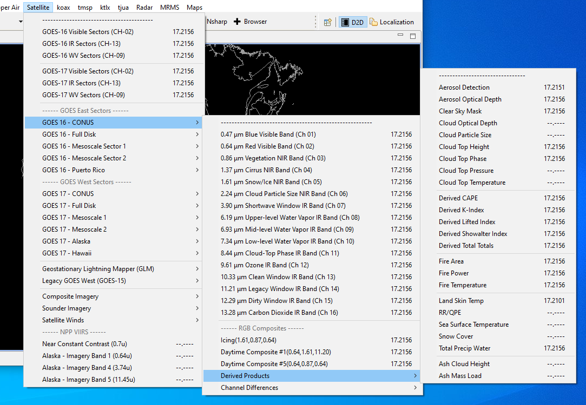
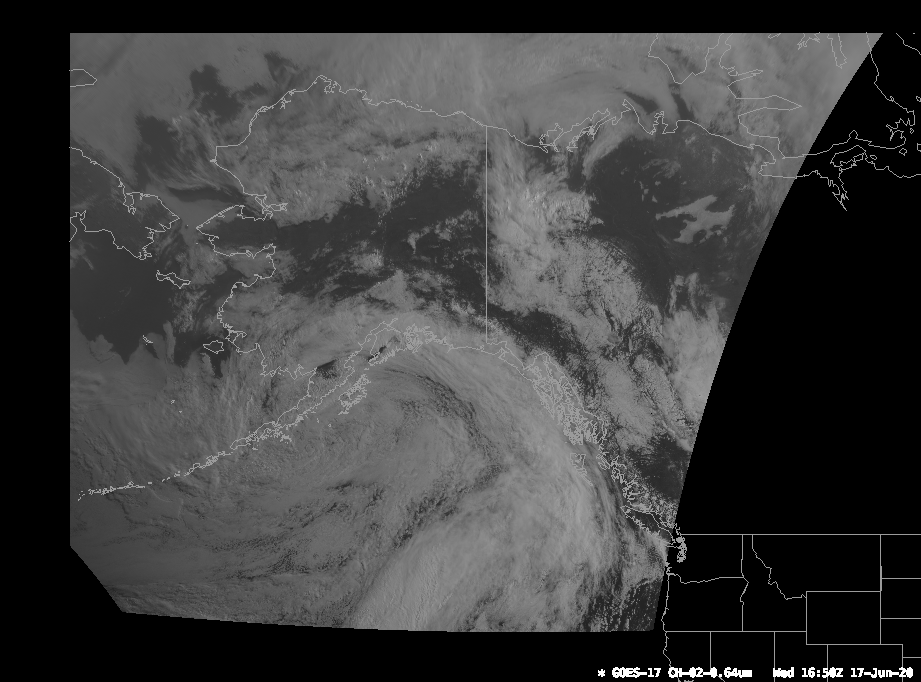
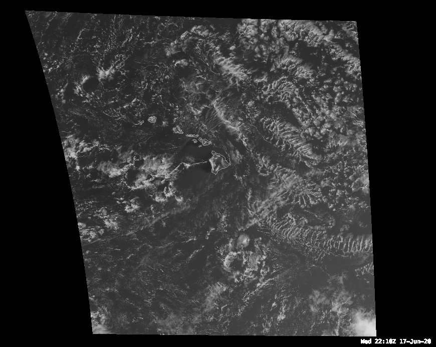
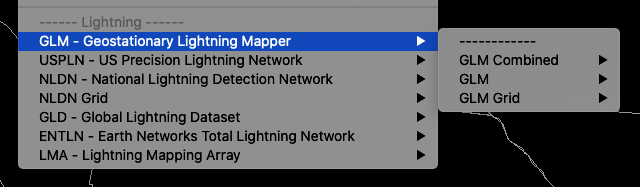

# GOES 16/17

The GOES-R decoder supports the ingest and display of NOAAport products (currently on the **NIMAGE** feed), Derived products (Level 2b netCDF files), and the Geostationary Lightning Mapper (GLM) products.

GOES-R products are accessible in the **Satellite** menu.  The menu is broken into sections and has submenus for each of the separate geospatial products: CONUS, Full Disk, Mesoscale Sectors, Hawaii, Alaska, and Puerto Rico.  Each submenu has products for [**individual channels**](#individual-channels) and [**RGB Composites**](#rgb-composites), as well as submenus for [**channel differences**](#channel-differences) and [**derived products**](#derived-products).  [**GLM data**](#geostationary-lightning-mapper-glm) can also be found with its own submenu option a little lower down the menu and under the **Surface** menu.

> **NOTE**: The RGB products are not available on MacOS.

---

## LDM Pattern Actions

This is found in the LDM's pqact.conf file which is located in /awips2/ldm/etc.  The entries for GOES data are shown below.  There are three different feeds that supply the individual channel data, derived products, and GLM data: NIMAGE, HDS and DIFAX, respectively.

    #
    # GOES 16/17 ABI
    #
    NIMAGE  ^/data/ldm/pub/native/satellite/GOES/([^/]*)/Products/CloudAndMoistureImagery/([^/]*)/([^/]*)/([0-9]{8})/([^/]*).nc
        FILE    -close -edex
        /awips2/data_store/GOES/CMI/\5.nc4
    #
    # GOES derived products
    #
    HDS     ^(IXT.99) KNES (......)
        FILE    -close -edex
        /awips2/data_store/GOES/derived/KNES_\1_\2-(seq)
    #
    # GLM
    #
    DIFAX   ^/data/cspp-geo/(EAST|WEST|GRB-R)/OR_GLM-L2-([^/]*).nc
        FILE    -close -edex
        /awips2/data_store/GOES/GLM/\1_OR_GLM-L2-\2.nc

---

## Individual Channels

All geospatial sectors have individual channel products that can be viewed.  Below are samples of Channel 02 (0.64&mu;m) for each of the sectors.  These products come through the **NIMAGE** feed in the LDM.

### CONUS 1km

### Full Disk 6km

### Mesoscale Sectors (TMESO-1, TMESO-2)

Two floating mesoscale sectors (will vary from image shown)

### Puerto Rico (PRREGI)

### Alaska

### Hawaii

---

## RGB Composites

RGB Composites are also available for each sector.  The three RGB products are: Icing - Ch 5, 3, 2 (1.61&mu;m, 0.87&mu;m, 0.64&mu;m), Composite - Ch 2, 5, 14 #1 (0.64&mu;m, 1.61&mu;m, 11.20&mu;m) and Composite #5 - Ch 2, 3, 2 (0.64&mu;m, 0.87&mu;m, 0.64&mu;m).  These products are generated **on the fly in AWIPS** using the existing channel products from EDEX.

!!! warning "GOES RGB Imagery is NOT SUPPORTED on macOS"

	OpenGL Shading Language limitations prevent multi-channel imagery from displaying correctly on Mac.  Please use the Linux or Windows installs to view RGB products.

### Icing Composite

### Daytime Composite 1

### Daytime Composite 5

---

## Channel Differences

Channel differences are the result of subtracting one channel from another to produce a new product.  These products are generated **on the fly in AWIPS** using the existing channel products from EDEX.

>**NOTE**: These may not be available for all sectors.

There currently 10 channel differences that are offered in CAVE:

  * Split Window (10.3 - 12.3 &mu;m)
  * Split Cloud Top Phase (11.2 - 8.4 &mu;m)
  * Night Fog (10.3 - 2.9 &mu;m)
  * Day Fog (3.9 - 10.3 &mu;m)
  * Split Fire (2.2 - 1.6 &mu;m)
  * Split Ozone (9.6 - 10.3 &mu;m)
  * Split Water Vapor (6.19 - 7.3 &mu;m)
  * Split Snow (1.6 - 0.64 &mu;m)
  * Vegetation (0.64 - 0.87 &mu;m)
  * Upper Level Info (11.2 - 6.19 &mu;m)

> **NOTE**: The rendering of these products uses the **Jep** package in Python, which has known to have issues installing on the MacOS and Windows versions.

---

## Derived Products

Derived products are also known as **Level 2+** products and are come through the **HDS** feed in the LDM.  There are over 20 products currently available in AWIPS.  To find out some more information on some of the products please the [**Quick Guides**](http://rammb.cira.colostate.edu/training/visit/quick_guides/) compiled by CIRA.

>**NOTE**: These may not all be available for each sector.

The current products offered in CAVE are:

  * Aerosol Detection
  * Aerosol Optical Depth
  * Clear Sky Mask
  * Cloud Optical Depth
  * Cloud Particle Size
  * Cloud Top Height
  * Cloud Top Phase
  * Cloud Top Pressure
  * Cloud Top Temperature
  * Derived CAPE
  * Derived K-Index
  * Derived Lifted Index
  * Derived Showalter Index
  * Derived Total Totals
  * Fire Area
  * Fire Power
  * Fire Temperature
  * Land Skin Temperature
  * RR/QPE
  * Sea Surface Temperature
  * Snow Cover
  * Total Precip Water
  * Ash Cloud Height
  * Ash Mass Load

---

## HDF5 Data Store

Decoded GOES-R satellite images are stored in `/awips2/edex/data/hdf5/satellite/` under sector subdirectories:

    drwxr-xr-x.  18 awips fxalpha  AKREGI
    drwxr-xr-x. 235 awips fxalpha  ECONUS
    drwxr-xr-x.  38 awips fxalpha  EFD
    drwxr-xr-x.  30 awips fxalpha  EMESO-1
    drwxr-xr-x.  30 awips fxalpha  EMESO-2
    drwxr-xr-x.  18 awips fxalpha  HIREGI
    drwxr-xr-x.  18 awips fxalpha  PRREGI
    drwxr-xr-x.  18 awips fxalpha  WCONUS
    drwxr-xr-x.  18 awips fxalpha  WFD
    drwxr-xr-x.  18 awips fxalpha  WMESO-1
    drwxr-xr-x.  18 awips fxalpha  WMESO-2

---

## Geostationary Lightning Mapper (GLM)

NASA's SPoRT MSFC Earth Science Office has contributed plugins to decode GLM level2 products, displayed as point data in CAVE.

GLM data is located in the menu structure: **Satellite** > **Geostationary Lightning Data (GLM)**.  Data are displayable is available for **Flash**, **Event**, and **Group** products.

There is also additional GLM data available in the **Surface** > **GLM - Geostationary Lightning Mapper** submenus.

<!---
---

## Derived Motion Winds
--->
