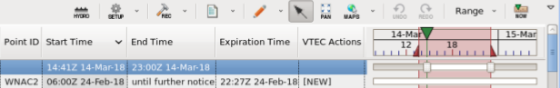
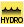

# AWIPS Hazard Service Display

Hazard Services is a collection of AWIPS applications used by forecasters to create, update, and manage hazards, replacing and unifying hazard generation capabilities.
 
* WarnGen
* RiverPro
* GHG
* etc.

In addition to providing a seamless forecast process for generating short-fused, long-fused, and hydrologic hazards, Hazard Services allows the forecaster to focus on the meteorology of the hazard situation, letting the system take on more of the responsibility for the generation and dissemination of products. 

## Launching Hazard Services 

Hazard Services can be launched from the various CAVE perspectives by selection the toolbar item "Hazards".

When Hazard Services is first started, the Console and the Spatial Display are visible.

## Spatial Display and Console

The **Spatial Display** is the Hazard Services drawing layer which is loaded into the CAVE Map Editor when Hazard Services is started. It is the Hazard Services map, displaying hazard areas relative to geopolitical boundaries and handling hazard drawing and editing. Its presence is indicated by the 'Hazard Services (Editable)' line in the CAVE Map Legend, and it supports operations common to other AWIPS drawing layers.

The **Console** is the main control panel for Hazard Services. It is always displayed if Hazard Services is running. Closing it closes Hazard Services as well.

The Console is a CAVE View, by default docked within the main window. The Console includes a toolbar and a drop-down ("view") menu to the right of or just under its title tab. Below these is the table of hazard events.

## Hazard Services Toolbar 

### Hydro  

The leftmost icon on the tool bar is an indicator if Hydro hazards are being worked or not (it will turn yellow if any active hazards are hidden from view by a filter). 

### Setup (Settings)

Allows you to filter displayed hazard information to focus on the meteorological situation of concern. For example, you may want to focus only on hydrological hazards in a particular time scale and over a particular area. 

The Settings drop-down menu allows you to select an existing Setting or a recently-used Setting, create a new Setting, edit the current Setting, or delete the current (User) Setting. As new Settings are created, they are added to this drop-down list. The Console’s title tab shows the name of the currently loaded Setting. 

> Settings can also be viewed and edited in the [Localization Perspective]((localization-perspective).).

#### Filters

Allows quick modification of the filters being used by the current Setting. Events may be filtered by Hazard Type, Site ID, and/or Status. As the filters are altered, the Hazard Event Table contents change to include only those hazards that pass the filters.

For example, with a number of potential events possible, you can select a couple of interest, move them to pending state, and propose one. To reduce  clutter in the Console you can hide potentials using the Filters menu, so that all potential events are still present but hidden in both the Console and the Spatial Display.

### Recommenders (Tools) 

The Tools button reveals a drop-down menu listing all the recommenders and other tools available in the current Setting. Recommenders may be run from this menu. When you select a Setting, this menu is populated with appropriate content.

### Products

* **Generate RVS​**

    With an FL.x hazard selected in the Console, select this item to bring up
a dialog to write an RVS text product.

* **Correct Product​**

    Selecting the Correct Product option provides a list of products that may be corrected. The dialog includes seven columns: Product Category, Issue Time, Event IDs, Hazard Type, VTEC, Expiration Time, and User Name. You can click in a column header to order by, or type in the Search box at the bottom. Upon selecting an item from the list, the Hazard Information Dialog launches.

* **View Product​**

    This option allows you to review issued products, selecting from a list in a *Select Product to View* dialog. Use the dialog to select the product type (using click, Ctrl-click, Shift-click), then click and select View Product or double-click to see the legacy text.
    
    A similar dialog will be produced by selecting the *View Products for Selected Events* item from the Console pop-up. In this case, the Filter/Query section is not needed, so you’ll see just the lower portion of the illustrated dialog.
    
    
### Spatial Display Modes

When Hazard Services is in Editable state, three buttons set the mode of the Spatial Display, governing how it interprets mouse clicks.

#### Drawing Tools

This menu has six choices:

* Draw Polygon​

    When set, mouse clicks on the Spatial Display draw polygons,
one click per node (MB1 click to place a node, MB3 click to complete the polygon).

* AddTo Polygon​

    If a polygon is active (hazard selected), this choice allows you to augment the area or create a new separate area that will be logically joined with the current polygon. Example of the latter:

    Note how the single hazard now comprises two polygons. (When you select Preview, these will be joined into a single polygon for issuance.)
    
* Draw Freehand Polygon​

    When set, mouse clicks on the Spatial Display draw freehand polygons (MB1 press, drag, and release to draw the polygon's outline). Note that issued text products will conform to current rules limiting polygon vertices to 20 or snapping areas to counties or zones. The freehand, many-vertex, shapes will be modified at some point during the hazard-issuance workflow.

* AddTo Freehand Polygon​

    Similar to AddTo Polygon, but drawing is freehand. Note that you can augment both “segments” and freehand polygons with either of the AddTo tools.

* Remove Polygon Vertices​

    In the case where you have a polygon with many vertices, it is very difficult to modify a boundary. This tool will remove a section of vertices to make the problem more tractable. With the tool selected, drag with MB1 to enclose a segment of the polygon. When you release, those vertices will be removed.

* Remove Polygon Area​

    This tool provides a way to remove sections of a geometry. Press MB1 and drag out an area that intersects your geometry. Upon release, the intersection area will be removed with the new boundary along the curve you drew.
    
If more than one hazard is selected in the Console, only Draw Polygon and Draw Freehand Polygon are available. The others are invalid and dimmed.

#### Select Event

This radio button sets the mode to event selection. When set, mouse clicks on the Spatial Display select hazard events, and drags cause panning. This is the default mode choice of this set of radio buttons.

#### Pan

This radio button sets the mode to pan mode. When clicked, you can pan the map without inadvertently moving or selecting polygons.

### Maps for Select by Area

The Maps for Select by Area button reveals a drop-down menu allowing the selection of maps that may be used for selecting by area within the Spatial Display. If the button is disabled, no maps that allow select-by-area are currently loaded. If the button is enabled, but a map menu item within the drop-down menu is disabled, that map is loaded but is currently invisible.

### Temporal Controls

There are two buttons used to control the Timeline view at the right side of the Hazard Table. You can also zoom and pan the Timeline using the mouse. 

* Selected Time Mode

    This options menu allows you to select the time mode, either a single time or range of times.

* Show Current Time

    ​This button moves the Timeline so that the current time is visible toward its left end.

## View Menu

The View menu is a drop-down menu holding menu items for functions that in general are less frequently used than those available via the toolbar.
