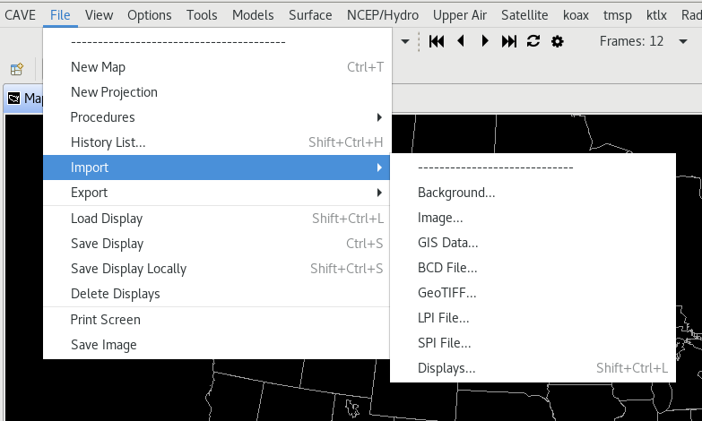
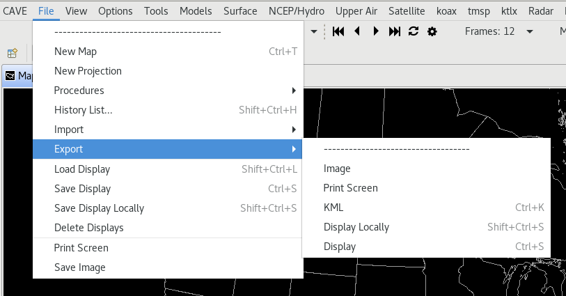

# Import/Export

## Export Images/GIFs

The D2D screen can be exported as a PNG image as well as an animated GIF using the **File > Export > Image** menu option.  This captures the current state of the screen, and allows you to set animation options (frame number, dwell time, etc) for exporting GIFs.  If you choose to animate, you will either need to rename the destination file to have the *.gif* extension, or CAVE will pop up a dialog when you go to save, asking you to confirm that you want to output a GIF.

> **Note**: This functionality **does not** currently work on **Mac OS** because it implements OGL libraries which are not compatible on Mac.

---

## Export KML

The *Export* submenu also includes a *KML* option (**File > Export > KML**), which allows users to save D2D displays or GFE grids in the KML (Keyhole Markup Language) file format. When zipped (compressed), the KML file format forms a KMZ file, which can be used in applications such as Google Earth.

The KML dialog box includes options to select frames to export. This includes exporting all frames,
the current/displayed frame, a range of frames, and, in GFE, the selected time range as highlighted in
the Grid Manager. Additional options are available for selection under the "Other Options" section:

* **Export Hidden**: When selected, all displayed and hidden products listed in the Product Legend section of the Main Display Pane will be exported.

* **Export Maps**: When selected, all enabled maps displayed within the Main Display Pane will be
exported.

* **Shade Earth**: When selected, a shaded background is applied to the exported product. If loaded in Google Earth, the earth will be overlaid with a black backdrop, and data will be displayed as it would in D2D with a black background.

* **Show Background Tiles**: When selected, data (such as plot data) will display on top of black
tiles when loaded in Google Earth.

---

## CAVE Import Formats

CAVE supported the following geo-referenced data files. CAVE can import the following through formats through the **File > Import** menu.

1. **Background...**
2. **Image...**
3. **BCD File**
4. **GeoTIFF**
5. **LPI File**
6. **SPI File** 
7. **Displays**

---

## CAVE Export Formats

CAVE can export to the following through the **File > Export** menu.

1. **Image**
2. **Print Screen**
3. **KML**
4. **Editor Display...**
5. **Perspective Displays...**

