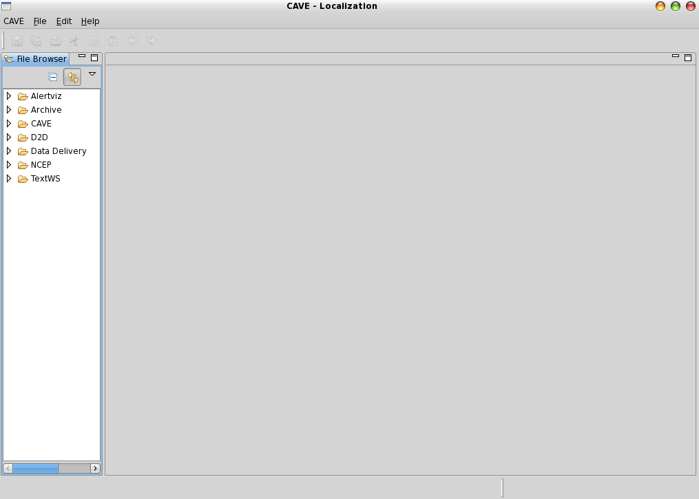

## Localization Levels

AWIPS uses a hierarchical system known as *Localization* to configure many aspects of EDEX and CAVE, such as available menu items, color maps, and derived parameters.  This system allows a user to override existing configurations and customize CAVE.  For example, a *User-level* localization file will supercede any similar file in a lower level (such as *Workstation* or *Site*).

!!! note "There are six *levels of localization*, starting with the default **BASE**"

	* **BASE** - default
		* **Region** - a region may have many sites (generally unused)
			* **Site** - a site may have many desks (required)
				* **Desk** - a desk may have many workstations
					* **Workstation** - a workstation may have many users
						* **User** - highest level of localization, overrides all others

---

## Localization Editor

The Localization Perspective acts as file editor for the XML, Python, and text files which customize the look and feel of CAVE.  

Users may copy and add files to available directories at the *Workstation* and *User* levels.

Examples of things that can be accessed through the perspective include (this list is not all-inclusive):

* NCP Predefined Areas, Color Maps and Style Rules

* D2D Volume Browser Controls

* D2D Bundles - Scales (WFO, State(s), etc.)

* CAVE Map Overlays, Color Maps and Style Rules

* GFE Tools and Utilities

The left panel contains a directory heirarchy of CAVE files for D2D, GFE, and NCP, which can be copied and edited as *user* localization files.

There may be several versions of each file including **BASE**, **CONFIGURED** (GFE only), **SITE**, **WORKSTATION**, and **USER**.  Each file version is listed separately under the actual file name.

The **_File Editor_** view opens the selected configuration file in an appropriate editor.  For example, a Python file is opened in a Python editor, and an XML file is opened in an XML editor.

--

## Customizing CAVE Menus

Navigate to **CAVE** > **Menus** and select a submenu (e.g. **satellite**).  This directory lists all of the menu file contributions made by this data plugin.   Most data menu directories will have an `index.xml` file from which you can investigate the menu structure and made needed changes. 

Selecting a file such as **index.xml** will show a sub-menu with a default localization level (typically **BASE** or **CONFIGURED**). Double-click this tab to open in the file editor (you may need to click **Source** at the bottom of the view to see the raw XML).  Right-click this tab and select **Copy To** > **User (awips)** and you will see the file localization versions update with the new copy. Select this file to edit, and override, the existing version.

--

## Add new Predefined Area to NCP

In the Localization Perspective, navigate to ‘**NCEP - Predefined Area Menus**’, double-click ‘**AreaMenus.xml**’, and then right-click ‘**BASE**’ and select ‘**Copy To - User**’.  You can also copy to **Desk** or **Workstation** localization.

You will see a new ‘**USER (username)**’ or **‘WORKSTATION (name)’ **entry for the file **AreaMenus.xml**.  

 

Double-click the new file and copy or create a new AreaMenuItem entry, such as a new CONUS Mercator projection called **CONUS_Mercator**:

    <AreaMenuItem subMenuName="" menuName="CONUS (Mercator)">

        <source>PREDEFINED_AREA</source>

        <areaName>CONUS_Mercator</areaName>

    </AreaMenuItem>

Now you can either copy and post an existing xml area file, or simple create one in the NCP.  Switch back to the NCP, and select ‘**Area - World**’ to load a known Mercator projection.  Zoom in to the continental United States and then from the menu bar select ‘**File - Save Area**’ and name it **CONUS_Mercator** so it matches the name string given in the above AreaMenuItem.

You can switch back to the Localization Perspective to confirm that the file was saved.  It will be viewable under **NCEP - Predefined Areas** and, in this example, be called **CONUS_Mercator.xml**.

CAVE needs to be restarted in order for the new menu item to show up under the NCP **Area** menu.

Switch to the new Area to confirm.

On your workstation you can find the new USER localization files in ~/caveData

	find ~/caveData -name CONUS_Mercator.xml

	./etc/user/mjames/ncep/PredefinedAreas/CONUS_Mercator.xml
	./.localization/NCEP/Predefined Areas/CONUS_Mercator.xml
