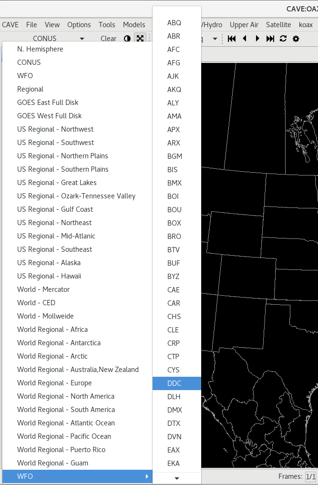
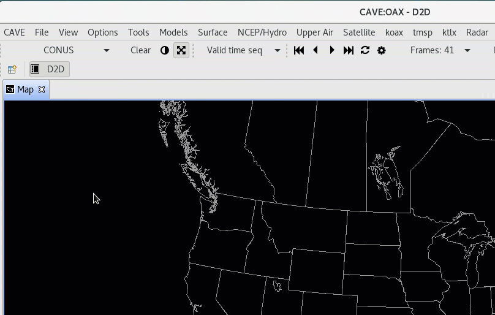
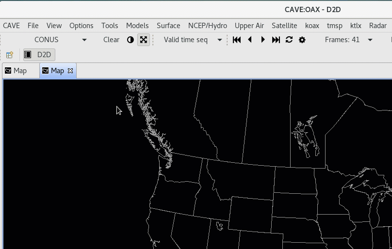

# Maps, Views, Projections
## Default Map Scales

The first toolbar menu item is a dropdown menu for different geographic areas and map projections.  The default view is always **CONUS**, which is a North Polar Steregraphic projection centered on the Continental United States.

Default projections and areas available in the menu

   * **CONUS**
   * **N. Hemisphere** (North Polar Stereographic)
   * **Regional** (for the selected localization site)
   * **WFO** (for the selected localization site)
   * **World - Mercator**
   * **World - CED**
   * **World - Mollweide**
   * **GOES East Full Disk** (Geostationary)
   * **GOES West Full Disk** (Geostationary)
   * **Regional** Mercator projections for
     - **Africa**
     - **Alaska**
     - **Antarctica**
     - **Arctic**
     - **Australia,New Zealand**
     - **Europe**
     - **Hawaii**
     - **Japan**
     - **Pacific Ocean**
     - **Puerto Rico**
     - **South America**
   * **WFO** (Has a submenu which contains a map scale for every NWS localization site)

---

## New Map Editor / View

### Adding a New Map Editor

This can be done in two ways: using the **file menu** and **right clicking** on the tab bar.

Using the file menu, simply go to: **File > New Map**.

This opens a new map editor tab with the default projection (CONUS Polar Stereographic).

To use the tab bar, **right-click** on or next to any tab and select **New Editor**

### Renaming Map Editor

Any of the map editor tabs can be renamed.  This can be particularly helpful if you have multiple tabs, with a different focus on each (ie. different geographic reigon, different types of data, etc).

---

## New Projection

A new map projection can be created using the file menu: **File > New Projection**.

