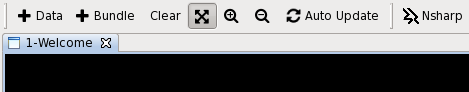
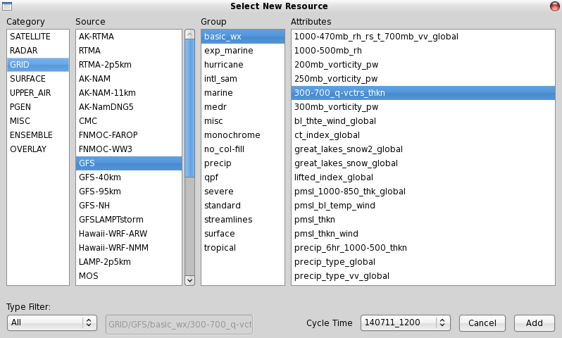
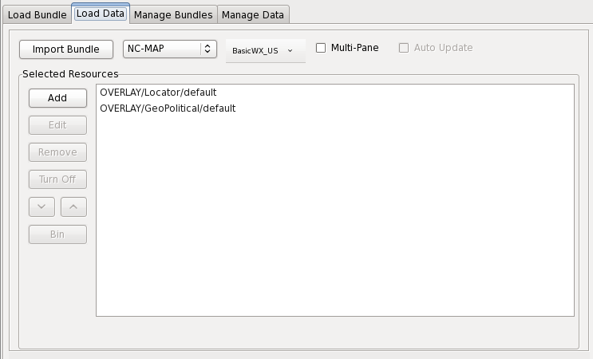
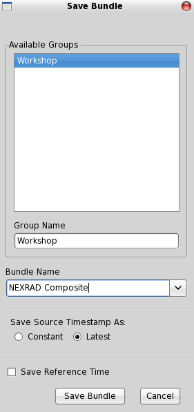
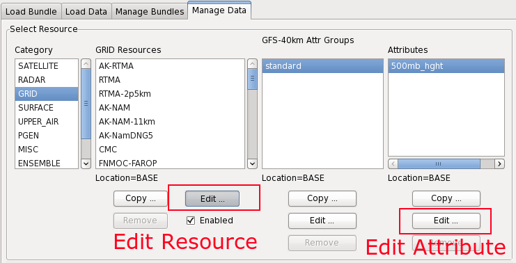

# The National Centers Perspective (NCP)

The NCP toolbar includes two buttons to load **Data** and **Bundles**, respectively.  The toolbar also include a **Clear** button, **Zoom** and **Unzoom**,  and the **NSHARP** plugin.
 

---

## Loading Data

1. Click the "**+Data**" button.

2. Select **Category**, **Source**, **Group**, and **Attributes**

3. Double-click the product, or select "**Add**" and the data will load to CAVE with the default number of frames (Note: this makes time-matching more difficult. For time-matching multiple products, load as a **Bundle**.)

**Latest Available Data Time** or **Cycle Time** is underneath the Attributes column at bottom-right.

---

## Create a Bundle

Open the Resource Manager by:

* Click the "**+Bundle**" button on the toolbar

* Press the **Spacebar**

* Press the "**W**" key

* Click **File -> New -> Bundle**.

---

## Timeline

A timeline is displayed for available data. Here, the user may choose the dominant resource, number of frames, time range, reference time, etc. for the products to be displayed.

Clicking "**Load**" will keep open the Resource Manager while the selected data layers are loaded to the map. ”**Load and Close**” will display data and close the Resource Manager.

---

## Save a Bundle

In AWIPS II CAVE, Bundles are organized within the Resource Manager GUI. Steps in the Bundle creation process are prompted with new GUI windows that are specific to the operation taking place, as you will see below.

1. Select resources for a Bundle (as in previous steps).

2. Click the "**Save Bundle**".

3. Select or type-in your desired Group Name and Bundle name and click "**Save Bundle**".

After saving a Bundle, its a good idea to confirm that it loads correctly. Select "**Bundle**" -> “**Load Bundle**” to find your newly created Bundle.

The "**Edit Bundle**" button is available to make any changes while loading.

---

## Manage Bundles

The third tab in the Resource Manager, titled **Manage Bundles** can be used to do just that: modify, create, and delete existing Bundle Groups.

At the top left, there are 3 options: **Modify Bundle Group**, **Create Bundle Group**, and **Delete Bundle Group**.

The user can change the order of the Bundles within the Bundle Group, by clicking the "**Move Up**" and “**Move Down**” buttons on the right. A user can add Bundles to an existing Bundle Group by clicking the “**Add Bundle**” button. A new Gui will pop up, allowing the user to select a Bundle that exists within a different Bundle Group or a current CAVE display.

A Bundle may be renamed by clicking the "**Rename Bundle**" button. Similarly, an Bundle may be removed from a specific Bundle Group by clicking the “**Remove Bundle**” button. NOTE: any changes made here must be saved by clicking the “**Save Bundle Group**” button on the left-hand side.

Deleting an Bundle Group is a fairly straightforward action. First, click the "**Delete Bundle Group**" option on the top-left, then select the Bundle Group Group and Name to be deleted.

---

## Edit Data Sources

Selection a Resource to edit allows you to update the number of frames, frame span, range and timeline form. The plugin name and grid name (**GDFILE**) can also be edited.

---

## Edit Resource Attributes

Using gridded data, selecting an Attribute to edit allows you to change the GEMPAK syntax used to define the resource.

---

## Add a New Grid

1. Click the "**Bundle**" button and then open the “**Manage Data**” tab.

2. Select the category (we will use **GRID**).

3. Select a model to copy as a template. In this example we select the base "**NAM-12km**" model.

4. Click the "**Copy**" button underneath the GRID column.

5. You can edit the new resource under "**Edit Resource Type**".

6. Choose a name for the new resource (e.g. **WRF**)

7. In "**Edit Resource Parameters**", change the “**GDFILE=**” definition to match the name of the new model in the database (In this case we change **GDFILE=NAM** to **GDFILE=WRF)**.

8. Click "**Create**" at the bottom of the window to finish.

9. The new Resource now displays with a (**U**) next to the name, signifying a user-created item.

10. In **Attribute Groups**, you can add attributes to a resource by clicking "**Edit**".

11. Select the desired Attribute Set and click "**Add ->**" to add it to the right column (You can hold the **Ctrl** key and select multiple Attributes.)

12. Click "**Save**" and then “**Ok**”.

13. In the "**Create Bundle**" tab, click “**New**” to see the new Resource.

---

## Multi-Pane Display

The NCP includes a configurable multi-pane display. As seen in the figure below, selecting the "Multi-Pane" check box extends the GUI window and displays additional options.

Selecting the "**Multi-Pane Display**" checkbox enables the multi-pane builder.

	 	 	 	

This new feature allows you to customize the number of panes you would like to display in AWIPS II CAVE. The "Select Pane" portion of the GUI allows you to load different products into each pane, which includes importing previously created bundles.

Here are a few quick steps to creating a Multi-pane display in AWIPS II:

1. Click the **Multi-Pane** checkbox in the Resource Manager

2. Select the number of **Rows** and **Columns** you would like your data display to contain

3. Select the precise pane in which you would like a specific product (i.e. Row 1, Column1)

4. Choose a product through the **Add** button (See Data Selection above)

5. Select a different cell in your multi-paned display in which you would like to display a product 

	!!! note "the user will need to load a separate product from the Resource Manager for each pane in the **select pane** layout"

6. Repeat step #4

7. Repeat the previous steps, until all of your panes have products queued up inside. 

8. Click "**Load**" and your multi-paned display will appear

---

## Load Multiple Bundles

The Load Bundle tab in the Resource Manager can be used to load Bundles previously created by the user:

The user should select name of the Group in which the desired Bundle is housed. After doing so, a list of available Bundles will appear in the centrally located "Bundles" pane. Selecting a Bundle will populate the pane on the right, which displays the contents of each Bundle, and also provides information on its Localization settings.

Clicking "Load" or “Load and Close” at the bottom of this window will load the saved Bundle. Before doing so, you can adjust things like Frames, dominant resources, time range, etc. in the “**Select Timeline**” section at the bottom of the window. 

Multiple Bundles can be selected and loaded all at once by simply hold the **Ctl** key and multi-selecting Bundles from the central pane, and then clicking either of the Load buttons. If multiple Bundles are loaded at once, they will each be displayed in different tabs in the CAVE interface. The order/arrangement of the Bundles will be mimicked in the order of the tabs when displayed in CAVE. 

Finally, the user may also edit an Bundle in this tab, simply by clicking the "**Edit**" button, and making desired changes in the GUI that pops up.
