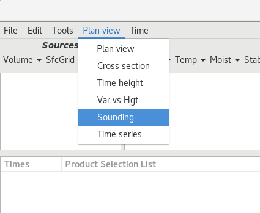
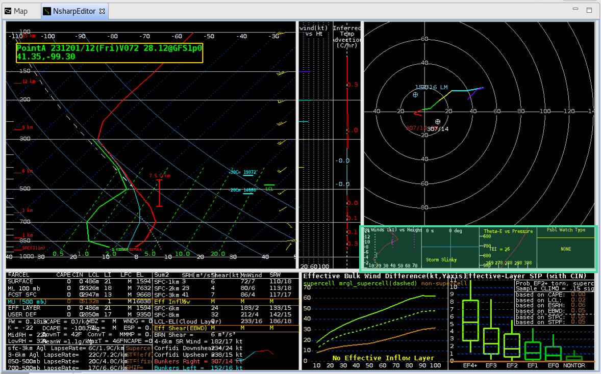
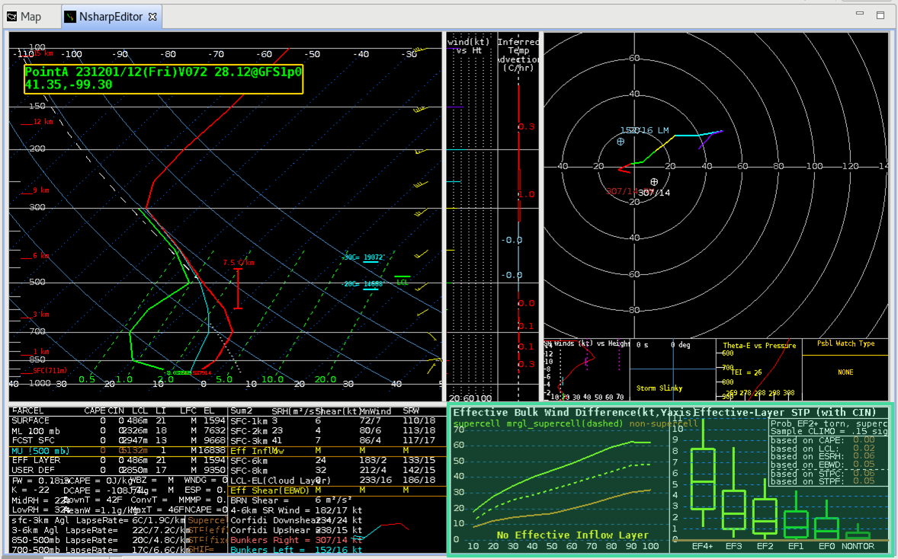
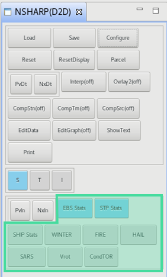
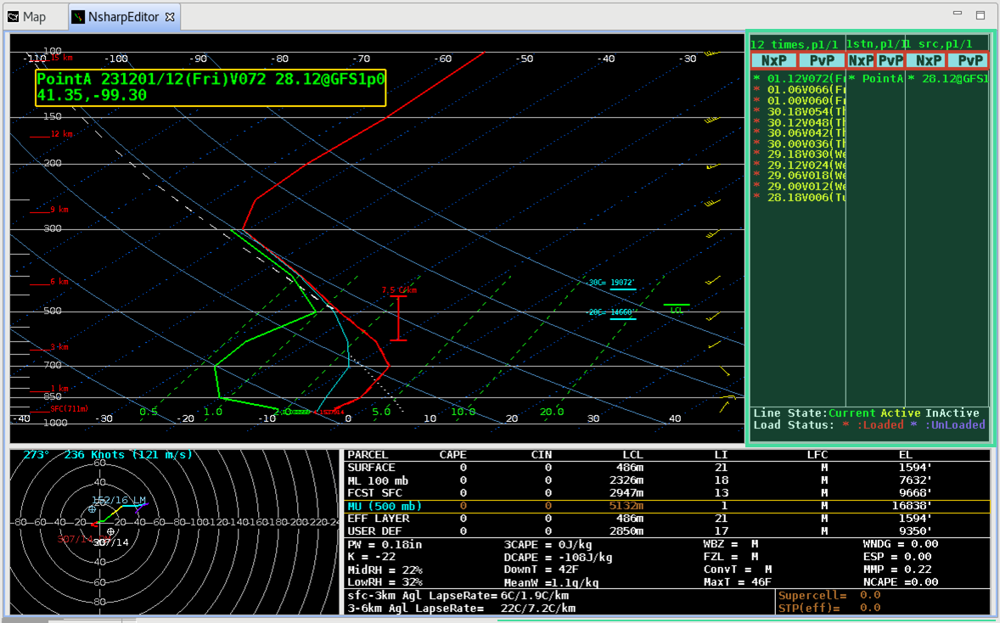

# NSHARP

NSHARP, which stands for the **N**ational Center **S**ounding and **H**odograph **A**nalysis and **R**esearch **P**rogram, is an AWIPS plugin originally based on NAWIPS NSHAREP, SPCs *BigSHARP* sounding display tool, and the Python package [SHARpy](https://github.com/aeroelastics/SHARPy).

NSHARP is available a number of ways in CAVE:

   * From the **D2D toolbar** select the NSHARP icon: 
   * From the **Upper Air** menu select **NSHARP Soundings**
   * From the **Upper Air** menu select a station from the _RAOB_ menus
   * From the **Upper Air** menu select **NUCAPS Soundings**
   * From the **Models** or **Tools** menu select **Volume Browser**
     - Make sure **Sounding** is selected from the menu at the top

		 

     - Select a source that has data (signified by a green box to the right)

		 

     - Select **Soundings** from the Fields menu

		 

     - Select any point from the Planes menu and an option will load in the table below
     - Use the **Load** button to load data and open the NSharp display

		 

---
## NSHARP Configurations

NSHARP has four configurations for use in different operational settings:

* **SPC Wide** - more insets and graphs at the expense of timeline/station inventory.
* **D2D Skewt Standard** - default for WFOs, larger SkewT with inventory, no Wind/Height, temperature advection, insets, or graphs.
* **D2D Lite** - Skew-T, table, and inventory only.
* **OPC** - Ocean Prediction Center display.

**To change the NSHARP confiuguration:**

* Open the **NSHARP(D2D)** controls tab by clicking on the Nsharp toolbar () icon again
* Click the **Configure** button
* Click **Display Pane Configuration** (third from the bottom)
* Use the dropdown to choose a configuration, apply, save, close

If you would like to interactively explore the different graphical areas in NSHARP **on the Web**, see the [NSHARP Interactive Overview](http://www.wdtd.noaa.gov/buildTraining/nsharp-interactive/interactive.html).

---
## Skew-T Display

The Skew-T display renders a vertical profile of temperature, dew point, and wind for RAOBs and model point soundings using a Skew-T Log-P diagram. The box in the upper-left of the main display is linked to the cursor readout when over the SkewT chart.  It reports the temperature, dewpoint, wind direction and speed, pressure, height AGL, and relative humidity of the trace.

Skew-T is the default upper air chart in AWIPS, and can be changed to *turbulence display* (**T**) or an *icing display* (**I**).  These options are available as buttons at the bottom of the NSHARP(D2D) controls tab (mentioned in [NSHARP Configurations](#nsharp-configurations)).  Use the [AWIPS-2 NSHARP Interactive Overview page](http://www.wdtd.noaa.gov/buildTraining/nsharp-interactive/interactive.html) for more information about the Skew-T display.

---
## Windspeed vs Height and Inferred Temperature Advection

The windspeed vs height and inferred temperature advection with height plot is situated next to the SkewT to show the values at the same heights. Inferred temperature advection is from the thermal wind. Use the [AWIPS-2 NSHARP Interactive Overview page](http://www.wdtd.noaa.gov/buildTraining/nsharp-interactive/interactive.html) for more information.

---
## Hodograph Display

This panel contains the hodograph display from the sounding data. The rings in the hodograph represent the wind speed in 20 knot increments. The hodograph trace uses different colors to highlight wind observations in 3 km height increments. This display also contains information such as the mean wind, Bunkers Left/Right Moving storm motion, upshear and downshear Corfidi vectors, and a user-defined motion. Use the [AWIPS NSHARP Interactive Overview page](http://www.wdtd.noaa.gov/buildTraining/nsharp-interactive/interactive.html) for more information about the hodograph display.

---
## Insets

In the SPC Wide Screen Configuration there are four small insets beneath the hodograph containing storm-relative windspeed versus height, a Storm Slinky, Theta-E vs Pressure, Possible Watch Type, Thea-E vs Height, and storm-relative wind vectors. There are buttons in the NSHARP(D2D) control button tab that toggle the six possible contents in the four boxes. There are also two buttons **PvIn** and **NxIn** in the control tab that can be used to cycle through the previous and next inset.

Use the [AWIPS NSHARP Interactive Overview page](http://www.wdtd.noaa.gov/buildTraining/nsharp-interactive/interactive.html) for more information.

---
## Table Output Displays

The Table Output Displays contains five different pages of parameters ranging from parcel instability to storm relative shear to severe hazards potential.  There are two buttons **PtDt** and **NxDt** in the controls tab that can be used to cycle through the previous and next tables.

Use the [AWIPS NSHARP Interactive Overview page](http://www.wdtd.noaa.gov/buildTraining/nsharp-interactive/interactive.html) for more information on the tables and a list/definition of the parameters available.

---
## Graphs/Statistics

In the SPC Wide Screen Configuration there are two graphs boxes under the insets, and they can display information on Enhanced Bulk Shear, Significant Tornado Parameter, Significant Hail Parameter (SHIP), Winter Weather, Fire Weather, Hail model (not implemented), and the Sounding Analog Retrieval System (SARS). There are buttons in the NSHARP(D2D) control button tab that toggle the six possible contents in the two boxes.

Use the [AWIPS NSHARP Interactive Overview page](http://www.wdtd.noaa.gov/buildTraining/nsharp-interactive/interactive.html) for more information.

---
## Sounding Inventory

This section controls the inventory of the soundings that have been loaded for potential display in NSHARP. The different colors of the text represent variously that a sounding/station is being displayed, available for display, or not available for display. Use the [AWIPS NSHARP Interactive Overview page](http://www.wdtd.noaa.gov/buildTraining/nsharp-interactive/interactive.html) for more information on how to use the sounding inventory and time line.
