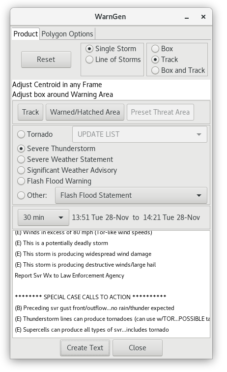
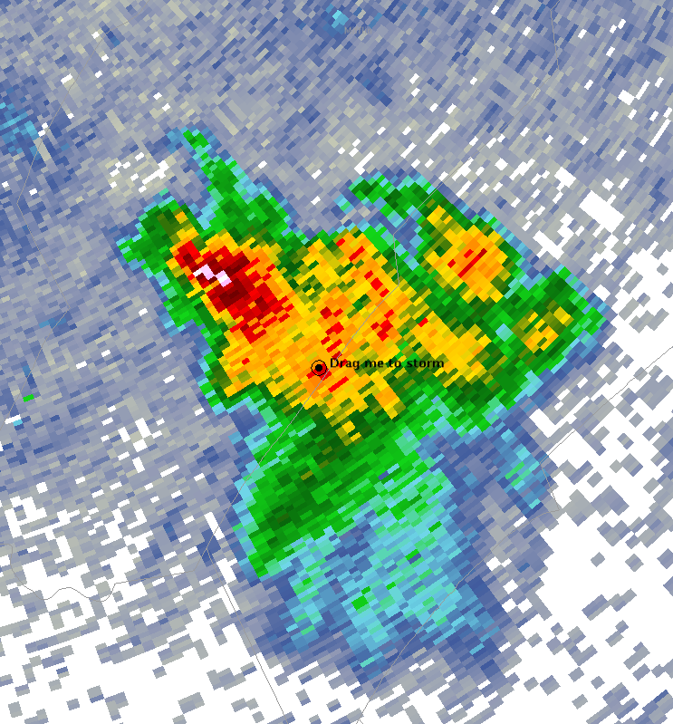

# WarnGEN

WarnGen is an AWIPS application for issuing short-term, text-based warnings by National Weather Service WFOs.  WarnGen is an operational tool, and is designed to create and issue warning products from CAVE to EDEX.  Unidata AWIPS is *non-operational*, and one of its limitations is that CAVE can not send or issue warning products.  Unidata developers have left the WarnGen tool accessible in CAVE for education and training purposes. 

## Launching WarnGen

Select the WarnGen application from the D2D toolbar button. When WarnGen is started, the storm centroid marker appears and the WarnGen GUI will pop up as a separate window. 

You will need to load one or more products (and maps) to observe severe weather (ideal products are radar reflectivity or velocity, or both).

|                           |                                   |
:--------------------------:|:---------------------------------:|
| |   |

In order to select a feature it must be within your *EDEX server* localization coverage (default BOU)

## Generate a Storm Motion Vector

1. Click and drag **Drag Me to Storm** to the feature you want to track (WarnGen uses a dot to track a single storm and a line to track a line of storms).
2. Step back 3 to 4 frames.
3. Drag the dot to the previous position of the feature you first marked.
4. Review the product loop and make adjustments to ensure the vector is accurate.

After determinng the storm motion you will want to redraw the polygon to fit the new storm track. The easiest way to do this task is to use one of the 

## Redrawing a Polygon

Select the **Track** button in the **"Redraw Box on Screen"** section to redraw a default warning polygon oriented along the storm motion track and containing the storm centroid dot for the most recent volume scan. The initial polygon may have unhatched areas that will be removed from the warning due to crossing CWAs or not meeting area thresholds in the county for inclusion. The Warned/Hatched Area button allow you to preview the polygon shape that will be issued, so you can make further edits.

## Moving Vertex Points

Vertices can be moved by clicking and dragging with the mouse. The warning polygon, including stippling, will update automatically.

When reshaping your warning polygon in this manner, the philosophy is to include all areas that are at risk of experiencing severe weather covered by that warning type. Effective polygons account for uncertainty over time and typically widen downstream. There will be a lot of training provided on Storm-Based Warning Fundamentals in RAC and in the workshop, and this lesson is more focused on the basic mechanics.

## Add and Remove Vertex Points

There will be some occasions where you will want to add vertices to your warning polygon. Most often, these situations will involve line warnings with bowing segments or single storm warnings where you want to account for storm motion uncertainty or multiple threat areas that may have differing storm motions.

New vertices are added to the warning polygon using a context relative menu accessed by selecting the warning polygon line segments with a Right Mouse Button “click and hold.” In the menu that appears, just select the “add vertex” option to add a new point to the warning polygon. Make sure, when using this feature, that you select the line segment in the warning where you want to add the additional vertex. After selecting this option, you will see a new vertex linked to the cursor. Just press your Left Mouse Button at the location you desire for the new vertex and the new point is located there. In addition, clicking with the middle mouse button (or scroll wheel) along an edge of the polygon will also place a vertex at that point.

Vertex points are removed from the warning polygon using the same context relative menu. Instead of selecting a line segment, you select the vertex you wish to remove and then “click and hold” with the Right Mouse Button. In the menu that appears, select “remove vertex” to remove the point from the warning polygon. Generally speaking, you should always have at least four points in your warning polygon. So, you should only remove a vertex if you are at a point after you have already added one to your warning polygon.

## Restoring a Polygon

When you are customizing a polygon in WarnGen, speed is critical. Everyone, even veteran warning forecasters, will occasionally draw a warning polygon one way and then realize, prior to sending the warning, that they want to draw the warning boundaries differently. Depending on the complexity of the changes you make to a warning polygon, sometimes it’s faster to just start over from scratch. The easiest way to proceed, especially if you are still comfortable with the storm motion, is to select the “Track” button from the “Redraw Box on Screen from” section of the WarnGen GUI.

## Text Window

Using the customized settings in the WarnGen GUI, WarnGen translates the information into a text product that is displayed in a text window on the Text Display. Initially the AWIPS Header Block window appears, and you will just click Enter to modify the text of the warning. The auto-generated text contains the storm speed and direction, the counties and cities affected by the warning/advisory, the valid times of the product, the warning/advisory body text (including any optional bullets selected in the GUI), and additional code to help our partners to efficiently process and disseminate the warning/advisory. The locked parts of the text are highlighted in blue and most of your text should not need to be edited if you configured your WarnGen window correctly.

For some products like Severe Weather Statements, there are parts of text that must be edited that have wild-card characters around them that need to be removed after modifying the text inside (e.g. !** WEAKENED.MOVED OUT OF THE WARNED AREA. **!). When you attempt to send a product, WarnGen will instruct you to modify this text if you have not. Once the text looks ready for submission you click the Send button, and, on a live system, the warning will be transmitted for public broadcast after you press the Go Ahead button on the final WarnGen check. WES-2 Bridge has been implemented in a way that cannot interact with the live AWIPS processes and communications, so warnings issued on the WES-2 Bridge will not be transmitted as live products.

NOTE: Edits made to product text in the editor window should be limited to items such as forecaster name/initials, call-to-action text, etc. If changes are warranted for items such as storm motion, warned counties, or Latitude/Longitude points, close the editor window and make changes using the D-2D and WarnGen graphical tools, then recreate the polygon and/or the text.

## "Issuing" a Warning

With a tracked storm in WarnGen:

1. Select **CAVE &gt; New &gt; Text Workstation**
2. Select the **Track** button to preview the polygon
3. Select the **Create Text** button.
4. Select **Enter** on the AWIPS Header Block window to enter the text editor. 
	- Blue text is locked and uneditable. You should not need to edit most text, and you need to be careful not to make the hazards inconsistent with the locked intensity summary at the bottom of the warning.
	- If WarnGen has text you need to edit, there will be wildcards around the text, and WarnGen will not let you send the warning until you modify it.
5. Read the text of the warning, identify your ETN number after the “SV.W.” (e.g. 0004) at the top of the warning, and make changes to the warning text if WarnGen tells you to.
6. Click the **Send** button (will not actually send). Sending warnings on the WES-2 Bridge is safe because it is not connected to the live AWIPS communications route, and the transmission capabilities have been disabled, firewalled, and modified to prevent any risk of warnings going out.  Unidata AWIPS always disables the sending of warnings.

