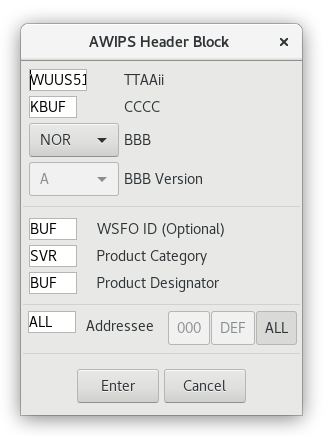

# WarnGen Walkthrough

WarnGen is an AWIPS graphics application for creating and issuing warnings as is done by National Weather Service offices.  In the Unidata AWIPS release it is a *non-operational* forecasting tool, meaning it allows users to experiment and simulate with the drawing and text-generation tools, but **prevents you from transmitting a generated warning upstream**.

!!! warning "In order to select a feature it must be within your *CAVE localization* coverage (load **Maps** > **County Warning Areas** to see coverages)"

## Quick Steps - Using WarnGen in Unidata AWIPS CAVE

1. [**Load NEXRAD Display**](#load-nexrad-level-3-display) from the Radar menu
2. Choose a CWA with active severe weather (BUF is used in the video below)
3. [**Re-localize**](#select-site-localization) to this site in the **CAVE** &gt; **Preferences** &gt; **Localization** menu
4. Exit out of CAVE and reload (you should notice the new CWA at the top of CAVE)
5. [**Load radar data**](#load-single-radar-data-from-the-local-radars) from the local radar menu **kbuf** &gt; **Z + SRM8**
6. Use the "period" key in the number pad to toggle between the 0.5 Reflectivity and SRM
7. Click [**WarnGen**](#launch-warngen) toolbar button  or load from **Tools** &gt; **WarnGen**
8. [**Drag the storm marker**](#generate-a-storm-motion-vector) to the center of a storm feature
9. Step through frames back and forth and adjust the marker to match the trajectory of the storm feature
10. Click **Track** in the Warngen GUI to update the polygon shape and trajectory
11. From the WarnGen dialog select the type of warning to generate, time range, basis of the warning, and any threats (wind, hail, etc)
12. Click [**Create Text**](#text-window) at the bottom of the WarnGen dialog to generate a text warning product in a new window
 
    

13. Click [**Reset**](#redrawing-a-polygon) at the top of the WarnGen dialog to reset the storm marker at any time
14. Select **Line of Storms** to enable a two-pointed vector which is to be positioned parallel to a storm line
15. To [**add another vertex**](#add-and-remove-vertex-points), middle button click along the polygon

## Video - Using WarnGen in AWIPS

The video below walks through creating a warning polygon and text in AWIPS. More detailed information can be found in the text below the video.

<iframe width="700" height="350"src="https://www.youtube.com/embed/hjytnJOxrOg?autoplay=0&rel=0" title="Tutorial: Using WarnGen in AWIPS" frameborder="0" allowfullscreen>
</iframe>

## Load NEXRAD level 3 display

Select the menu **Radar** > **NEXRAD Display** and note coverage areas of current severe weather.  We choose a CWA ID that contains some active severe weather (BUF Buffalo, New York, in this example).

## Select SITE Localization

Open **CAVE** > **Preferences** > **Localization**, select the CWA site ID (BUF) for the coverage area you want to use, followed by **Apply** and **Okay** and restart CAVE. Once CAVE is restarted, you should notice the new CWA at the top of the CAVE window.

## Load single radar data from the local radars

Use the specialized site menu for the local radar data products, ex. Click on the local radar **kbuf** &gt; **Z + SRM8**.

This menu includes several sections with submenus for all available radar data at that site.

Use the "period" key in the number pad to toggle between the 0.5 Reflectivity and SRM.

## Launch WarnGen

Select **WarnGen** from the D2D Toolbar or from the **Tools** &gt; **WarnGen** menu.  When started, the storm centroid marker appears and the WarnGen GUI will pop up as a separate window.

## Generate a Storm Motion Vector

1. Click and drag **Drag Me to Storm** to the feature you want to track (WarnGen uses a dot to track a single storm and a line to track a line of storms).
2. Step back 3 to 4 frames.
3. Drag the dot to the previous position of the feature you first marked to create the storm motion vector.
4. Click the **Track** button in the WarnGen GUI to update the polygon based off the storm motion.
5. Review the product loop and make adjustments to ensure the vector is accurate.

The initial polygon may have unhatched areas that will be removed from the warning due to crossing CWAs or not meeting area thresholds in the county for inclusion. The Warned/Hatched Area button allows you to preview the polygon shape that will be issued, so you can make further edits.

## Moving Vertex Points

Vertices can be moved by clicking and dragging with the mouse. The warning polygon, including stippling, will update automatically.

When reshaping your warning polygon in this manner, the philosophy is to include all areas that are at risk of experiencing severe weather covered by that warning type. Effective polygons account for uncertainty over time and typically widen downstream. 

## Add and Remove Vertex Points

There will be some occasions where you will want to add vertices to your warning polygon. Most often, these situations will involve line warnings with bowing segments or single storm warnings where you want to account for storm motion uncertainty or multiple threat areas that may have differing storm motions.

New vertices are added to the warning polygon two ways. Either by **Right Mouse Button** "click and hold" or a simple **Middle Mouse Button** click on the warning polygon line segment where you want to add the vertex.

Vertex points are removed from the warning polygon using the same context relative menu. Instead of selecting a line segment, you select the vertex you wish to remove and then right mouse button **click and hold** and select **remove vertex**.

## Redrawing a Polygon

Click the **Reset** button to clear the current polygon and vector and reset the storm centroid marker. Generate a new storm motion by moving the storm markers and select the **Track** button in the WarnGen GUI to draw the new polygon.

<!--
# Restoring a Polygon

When you are customizing a polygon in WarnGen, speed is critical. Everyone, even veteran warning forecasters, will occasionally draw a warning polygon one way and then realize, prior to sending the warning, that they want to draw the warning boundaries differently. Depending on the complexity of the changes you make to a warning polygon, sometimes it’s faster to just start over from scratch. The easiest way to proceed, especially if you are still comfortable with the storm motion, is to select the “Track” the WarnGen GUI.
-->

## Text Window

Once you are satisfied with your polygon and have chosen your selections, click **Create Text** in the WarnGen GUI. Initially the AWIPS Header Block window appears. Click **Enter** for the text window to open. 

This will open the Text Window.

Using the customized settings in the WarnGen GUI, WarnGen translates the information into a text product that is displayed in a text window on the Text Display. The auto-generated text contains the storm speed and direction, the counties and cities affected by the warning/advisory, the valid times of the product, the warning/advisory body text (including any optional bullets selected in the GUI), and additional code to help our partners to efficiently process and disseminate the warning/advisory. The locked parts of the text are highlighted in blue and most of your text should not need to be edited if you configured your WarnGen window correctly.

!!! danger "The Unidata AWIPS release is *non-operational*. You will be allowed to simulate the drawing and text-generation of warnings, but are **prevented from transmitting** a generated warning upstream"

<!--
For some products like Severe Weather Statements, there are parts of text that must be edited that have wild-card characters around them that need to be removed after modifying the text inside (e.g. !** WEAKENED.MOVED OUT OF THE WARNED AREA. **!). When you attempt to send a product, WarnGen will instruct you to modify this text if you have not. Once the text looks ready for submission you click the Send button, and, on a live system, the warning will be transmitted for public broadcast after you press the Go Ahead button on the final WarnGen check. WES-2 Bridge has been implemented in a way that cannot interact with the live AWIPS processes and communications, so warnings issued on the WES-2 Bridge will not be transmitted as live products.
-->

> Note: Edits made to product text in the editor window should be limited to items such as forecaster name/initials, call-to-action text, etc. If changes are warranted for items such as storm motion, warned counties, or Latitude/Longitude points, close the editor window and make changes using the D-2D and WarnGen graphical tools, then recreate the polygon and/or the text.

<!--
## "Issuing" a Warning

With a tracked storm in WarnGen:

1. Select **CAVE &gt; New &gt; Text Workstation**
2. Select the **Track** button to preview the polygon
3. Select the **Create Text** button.
4. Select **Enter** on the AWIPS Header Block window to enter the text editor.
	- Blue text is locked and uneditable. You should not need to edit most text, and you need to be careful not to make the hazards inconsistent with the locked intensity summary at the bottom of the warning.
	- If WarnGen has text you need to edit, there will be wildcards around the text, and WarnGen will not let you send the warning until you modify it.
5. Read the text of the warning, identify your ETN number after the “SV.W.” (e.g. 0004) at the top of the warning, and make changes to the warning text if WarnGen tells you to.
6. Click the **Send** button (will not actually send). Sending warnings on the WES-2 Bridge is safe because it is not connected to the live AWIPS communications route, and the transmission capabilities have been disabled, firewalled, and modified to prevent any risk of warnings going out.  Unidata AWIPS always disables the sending of warnings.
-->
