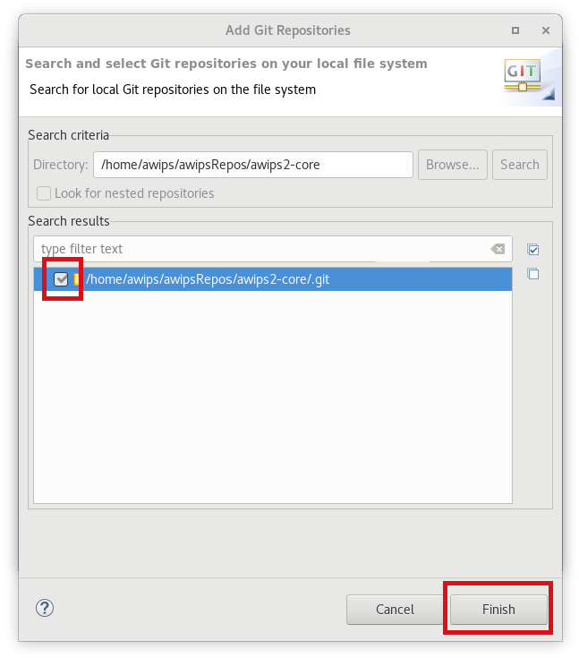
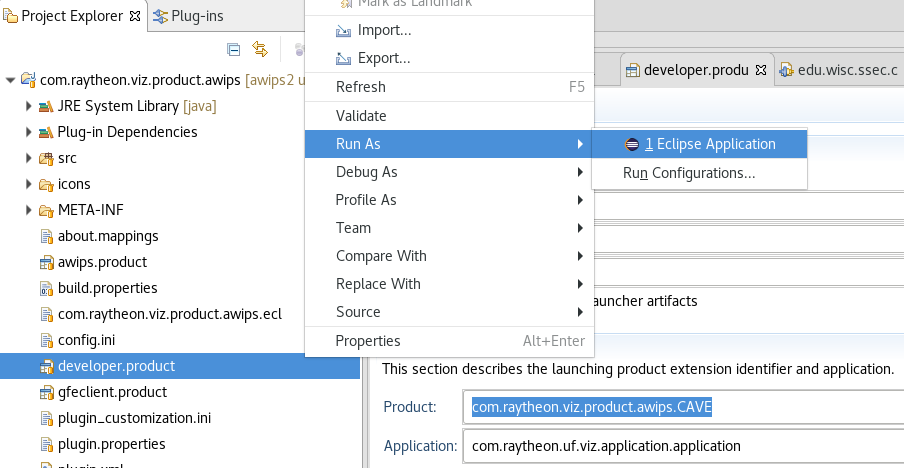
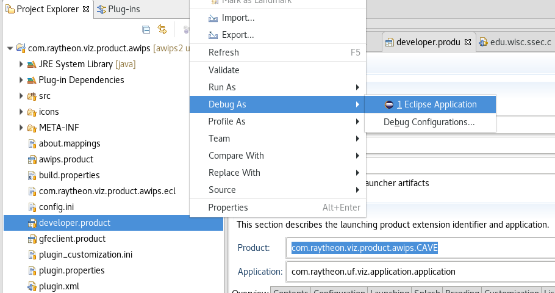

# AWIPS Development Environment (ADE)

Detailed instructions on how to download the latest source code and run CAVE from Eclipse.

!!! note  "It is important to keep in mind these instructions are intended for a system that is specifically used for developing AWIPS.  It should not be used in conjunction with installed production versions of AWIPS."

!!! note "The following *yum* commands listed in these instructions may need to be run as the *root* user, but the rest of the commands should be run as the local user."

## 1. Remove AWIPS Instances

First, make sure to remove any instances of AWIPS that are already installed, this can potentially cause problems when setting up the development environment.  Below is an example that had CAVE installed.

Uninstall with yum:

    yum clean all
    yum groupremove awips2-cave
          
Check to make sure all rpms have been removed:
      
    rpm -qa | grep awips2
            
Remove the awips2 directory:
          
    rm -rf /awips2
        
---        

## 2. Set Up AWIPS Repo

Create a repo file named `/etc/yum.repos.d/awips2.repo`, and set the contents to the following:

    sudo vi /etc/yum.repos.d/awips2.repo

<pre>
[awips2repo]
name=AWIPS II Repository
baseurl=https://downloads.unidata.ucar.edu/awips2/current/linux/rpms/<b>el7-dev/</b>
enabled=1
protect=0
gpgcheck=0
proxy=_none_
</pre>

!!! note "This file may already exist if AWIPS had been previously installed on the machine, so make sure to edit the baseurl."
        
---

## 3. Install the ADE

Install the AWIPS Development Environment (ADE) using yum.  This will install Eclipse (4.6.1), Java (1.8), Ant (1.9.6), Python 2.7 and its modules (Numpy, Matplotlib, Shapely, Jep, and others). 

    yum clean all
    yum groupinstall awips2-ade

!!! note "Check the libGLU package is installed by running `rpm -qa | grep mesa-libGLU`.  If nothing is returned, install the package via: `yum install mesa-libGLU`."

---

## 4. Download the Source Code

If it's not already installed, install git:
    
    yum install git
    
Next clone all of the required repositories for AWIPS:
    
    git clone https://github.com/Unidata/awips2.git
    git clone https://github.com/Unidata/awips2-cimss.git
    git clone https://github.com/Unidata/awips2-core.git
    git clone https://github.com/Unidata/awips2-core-foss.git
    git clone https://github.com/Unidata/awips2-drawing.git
    git clone https://github.com/Unidata/awips2-foss.git
    git clone https://github.com/Unidata/awips2-goesr.git
    git clone https://github.com/Unidata/awips2-gsd.git
    git clone https://github.com/Unidata/awips2-ncep.git
    git clone https://github.com/Unidata/awips2-nws.git
    
!!! note "Make sure to run `git checkout` in each repo if you'd wish to develop from a branch different from the default.  It's best to do this before importing the repos into eclipse."

---

## 5. Configure Eclipse

Open eclipse by running: `/awips2/eclipse/eclipse`

It is fine to choose the default workspace upon starting up.

### Set Preferences

Verify or make the following changes to set up eclipse for AWIPS development:

1. Window > Preferences > Java > Installed JREs
    
     * Set to **/awips2/java**

1. Window > Preferences > PyDev > Interpreters > Python Interpreter

      * Set to **/awips2/python/bin/python**
    
        > Note: Add all paths to the SYSTEM pythonpath if prompted
    
1. There might be some unresolved errors.  These should be made to warnings instead.

      * Window > Preferences > Java > Compiler > Building > Build path Problems > **Circular Dependencies** > Change to Warning
      * Window > Preferences > Plug-in Development > API Baselines > **Missing API Baseline** > Change to Warning
    
1. **Turn off automatic building** (you will turn this back on after importing the repos)
    
      * Project > Uncheck "Build Automatically"

### Importing Git Repos

All of the git repos that were [cloned in the previous step](#4-download-the-source-code) will need to be imported into Eclipse.  **But, be aware the `awips2` repo is done last,** because it requires different steps.

1. File > Import > Git > Projects from Git > **Next**
  
  
1. Continue with the default selection, Existing local repository > **Add..** > add each of the git repos (for example `.../awips2-core`) > check the checkbox > **Finish**
  
  
1. Then for each of the repos (except awips2 right now):
Select the repo name > **Next** > Continue with default selection (Working Tree) > **Next** > Continue with default selections (all choices selected) > **Finish**
  
  
1. Finally, for `awips2` repo, follow all the above steps except in the Working Tree, only select:
    * *cave* > **Next** > **Finish**
      
    * *edexOsgi* > **Next** > **Finish**
      

### Final Setup

1. Project > Clean > **OK**
     * Use default selections: *Clean all projects*, *Start a build immediately*, *Build the entire workspace*
     * Clean the build and ensure no errors are reported.  
      
    
1. Turn automatic building back on
      * Project > Check "Build Automatically"
    
---

## 6. Run CAVE
    
!!! note "CAVE can be ran from eclipse by using the *com.raytheon.viz.product.awips/developer.product*"

Double-click the **developer.product** file to open the Project Explorer in Eclipse.  Select **Overview** > **Synchronize**

Use the **Project Explorer** on the left-hand side of eclipse to run CAVE as a [Java application](#run-application) or in [Debug mode](#debug-application):

### Run Application

Select **Run As** > **Eclipse Application**

### Debug Application

Select **Debug** > **Eclipse Application**
 

---

## Troubleshooting

* If you are getting a lot of errors, try changing your Java Compiler to 1.7, build the project, then change back to 1.8 and rebuild.
    * **Window** > Preferences > Java > Compiler > **Compiler compliance level** setting
