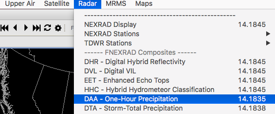
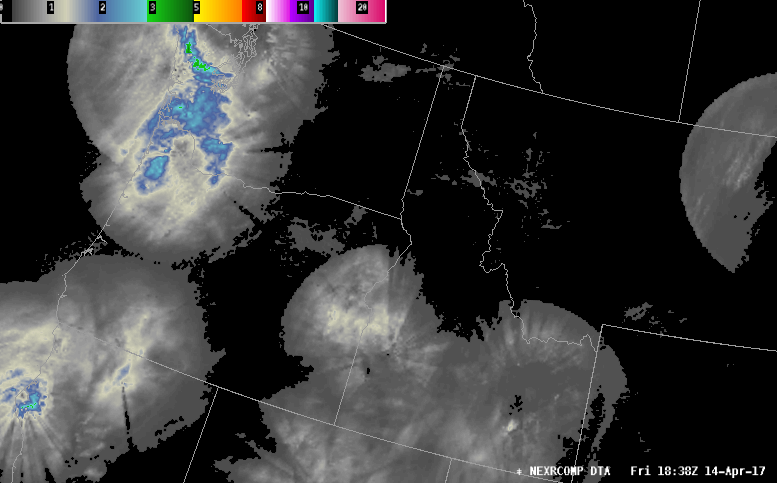

# GEMPAK/NEX2GINI for EDEX

## Install GEMPAK on EDEX 

The Unidata AWIPS yum repository includes the latest [GEMPAK](https://www.unidata.ucar.edu/software/gempak/) binary, installed with the command:

	yum install gempak

You can also install a version linked against **/awips2/python** to use [python-awips](https://python-awips.readthedocs.io) within GEMPAK:

	yum install gempak-python

## GEMPAK Cron Jobs

And example cron job and script for generating a national DAA or DTA radar precipitation composite from individual level3 files:

**crontab -e**

	*/5 * * * * /awips2/ldm/bin/gini daa >& /dev/null 2>&1
	*/5 * * * * /awips2/ldm/bin/gini dta >& /dev/null 2>&1

## NEX2GINI Script

The following gini script is bundled with the **awips2-ldm** package and is installed automatically in the latest AWIPS EDEX release, but does not run unless you add it to the cron mentioned above.

The AWIPS LDM client will write level 3 NEXRAD files to **/awips2/data_store/radar/NIDS** which allows us to override the GEMPAK envvar **$RAD** and allow nex2gini and other programs to find the site files.

Some notes:

1. The EDEX satellite decoder requires *uncompressed* GINI files, so use `COMPRESS=no` 
2. You can customize **/awips2/ldm/bin/nexrad.tbl** to include a subset of stations for a regional or local composite
3. The commands `RAD=/awips2/data_store/radar ; export RAD` override the GEMPAK environmental variable in order to use files in `/awips2/data_store`
4. **GDPFUN** must be lower case (e.g. *daa* and not *DAA*)

If you don't have this script already, copy the following to **/awips2/ldm/bin/gini**

	#!/bin/bash
	if [[ ! -e /home/gempak/GEMPAK7/Gemenviron.profile ]]; then
	  exit
	fi
	. /home/gempak/GEMPAK7/Gemenviron.profile
	RAD=/awips2/data_store/radar ; export RAD
	if [[ ! -e $OS_BIN/nex2gini ]]; then
	  exit
	fi
	nex2gini << EOF
	GRDAREA = 23;-120;47.2634;-63.5664
	PROJ    = lcc/40;-100;40
	KXKY    = 2368;1500
	CPYFIL  =
	GFUNC   = ${1}
	RADTIM  = current
	RADDUR  = 30
	RADFRQ  = 0
	STNFIL  = nexrad.tbl
	RADMODE =
	SATFIL  = nexrcomp_${1}_YYYYMMDD_HHNN
	COMPRESS= no
	r
	
	e
	EOF
	
	# Move to manual ingest endpoint
	files=$(ls | grep ${1})
	mv $files /awips2/data_store/ingest/
	
## Manual Ingest

The last line moves the created file to **/awips2/data_store/ingest** (previously /awips2/edex/data/manual), and you can confirm decoding by the GINI satellite plugin by watching the satellite log:

	edex log satellite

	INFO [Ingest.Gini-1] satellite /awips2/data_store/manual/satellite.gini/20170414/18/nexrcomp_daa_20170414_1835 processed in: 0.1620 (sec) Latency: 0.1930 (sec)
	INFO [Ingest.Gini-1] satellite /awips2/data_store/manual/satellite.gini/20170414/18/nexrcomp_dta_20170414_1838 processed in: 0.1570 (sec) Latency: 0.3450 (sec)
        ...

!!! note "NEXRAD composites are GINI images and therefore decoded by the satellite plugin rather than the radar plugin"

## Display in CAVE

In the **CAVE &gt; Radar** menu select the **DAA** or **DTA** product:

