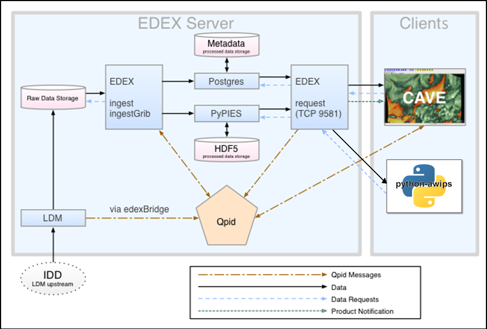

# Unidata AWIPS User Manual

[https://www.unidata.ucar.edu/software/awips2](https://www.unidata.ucar.edu/software/awips2) 

---

[ldm]: https://www.unidata.ucar.edu/software/ldm/
[idd]: https://www.unidata.ucar.edu/projects/#idd
[gempak]: https://www.unidata.ucar.edu/software/gempak/
[awips2]: https://www.unidata.ucar.edu/software/awips2/
[ncep]: http://www.ncep.noaa.gov
[apache]: http://httpd.apache.org
[postgres]: www.postgresql.org
[hdf5]: http://www.hdfgroup.org/HDF5/
[eclipse]: http://www.eclipse.org
[camel]: http://camel.apache.org/
[spring]: http://www.springsource.org/
[hibernate]: http://www.hibernate.org/
[qpid]: http://qpid.apache.org

 The Advanced Weather Interactive Processing System (AWIPS) is a meteorological software package.  It is used for decoding, displaying, and analyzing data, and was originally developed for the National Weather Service (NWS) by Raytheon. There is a division here at UCAR called the Unidata Program Center (UCP) which develops and supports a modified non-operational version of AWIPS for use in research and education by [UCAR member institutions](http://president.ucar.edu/governance/members/universities-representatives).  This is released as open source software, free to download and use by anyone.

AWIPS takes a unified approach to data ingest, where most data ingested into the system comes through the [LDM](#ldm) client pulling data feeds from the [Unidata IDD](https://www.unidata.ucar.edu/projects/#idd). Various raw data and product files (netCDF, grib, BUFR, ASCII text, gini, AREA) are decoded and stored as HDF5 files and Postgres metadata by [EDEX](install/install-edex), which serves products and data over http.

Unidata supports two data visualization frameworks: [CAVE](install/install-cave) (an Eclipse-built Java application which runs on Linux, Mac, and Windows), and [python-awips](python/overview) (a python package).

> **Note**: Our version of CAVE is a **non-operational** version.  It does not support some features of NWS AWIPS.  Warnings and alerts cannot be issued from Unidata's CAVE.  Additional functionality may not be available as well.

---

## [Download and Install CAVE](install/install-cave)

---

## [Download and Install EDEX](install/install-edex)

---

## [Work with Python-AWIPS](python/overview)

---

## License

Unidata AWIPS source code and binaries (RPMs) are considered to be in the public domain, meaning there are no restrictions on any download, modification, or distribution in any form (original or modified). Unidata AWIPS license information can be found [here](https://github.com/Unidata/awips2/blob/unidata_18.2.1/LICENSE).

---

## AWIPS Data in the Cloud

Unidata and XSEDE Jetstream have partnered to offer an EDEX data server in the cloud, open to the community.  Select the server in the Connectivity Preferences dialog, or enter **`edex-cloud.unidata.ucar.edu`** (without *http://* before, or *:9581/services* after).

---

## Distributed Computing

AWIPS makes use of service-oriented architecture to request, process, and serve real-time meteorological data.  Because AWIPS was originally developed for use on internal NWS forecast office networks, where operational installations of AWIPS can consist of a dozen servers or more, Unidata modified the package to be more applicable in the University setting.  Because the AWIPS source code was hard-coded with the NWS network configuration, the early Unidata releases were stripped of operation-specific configurations and plugins, and released specifically for standalone installation. This made sense given that a single EDEX instance with a Solid State Drive (SSD) could handle most of the entire NOAAport data volume.  However, with GOES-R(16) now online, and more gridded forecast models being created at finer temporal and spatial resolutions, there was a need to distribute EDEX data decoding in order to handle this firehose of data.

* Read More: [Distributed EDEX](edex/distributed-computing)

---

## Software Components

* [EDEX](#edex)
* [CAVE](#cave)
* [LDM](#ldm)
* [edexBridge](#edexbridge)
* [Qpid](#qpid)
* [PostgreSQL](#postgresql)
* [HDF5](#hdf5)
* [PyPIES](#pypies)

### EDEX

The main server for AWIPS.  Qpid sends alerts to EDEX when data stored by the LDM is ready for processing.  These Qpid messages include file header information which allows EDEX to determine the appropriate data decoder to use.  The default ingest server (simply named ingest) handles all data ingest other than grib messages, which are processed by a separate ingestGrib server.  After decoding, EDEX writes metadata to the database via Postgres and saves the processed data in HDF5 via PyPIES.   A third EDEX server, request, feeds requested data to CAVE clients. EDEX ingest and request servers are started and stopped with the commands `edex start` and `edex stop`, which runs the system script `/etc/rc.d/init.d/edex_camel`

* [Read More: How to Install EDEX](install/install-edex)

### CAVE

Common AWIPS Visualization Environment. The data rendering and visualization tool for AWIPS. CAVE contains of a number of different data display configurations called perspectives.  Perspectives used in operational forecasting environments include **D2D** (Display Two-Dimensional), **GFE** (Graphical Forecast Editor), and **NCP** (National Centers Perspective). CAVE is started with the command `/awips2/cave/cave.sh` or `cave.sh`

* [Read More: How to Install CAVE](install/install-cave)

### LDM

[https://www.unidata.ucar.edu/software/ldm/](https://www.unidata.ucar.edu/software/ldm/)

The **LDM** (Local Data Manager), developed and supported by Unidata, is a suite of client and server programs designed for data distribution, and is the fundamental component comprising the Unidata Internet Data Distribution (IDD) system. In AWIPS, the LDM provides data feeds for grids, surface observations, upper-air profiles, satellite and radar imagery and various other meteorological datasets.   The LDM writes data directly to file and alerts EDEX via Qpid when a file is available for processing.  The LDM is started and stopped with the commands `edex start` and `edex stop`, which runs the commands `service edex_ldm start` and `service edex_ldm stop`

### edexBridge

edexBridge, invoked in the LDM configuration file `/awips2/ldm/etc/ldmd.conf`, is used by the LDM to post "data available" messaged to Qpid, which alerts the EDEX Ingest server that a file is ready for processing.

### Qpid

[http://qpid.apache.org](http://qpid.apache.org)

**Apache Qpid**, the Queue Processor Interface Daemon, is the messaging system used by AWIPS to facilitate communication between services.  When the LDM receives a data file to be processed, it employs **edexBridge** to send EDEX ingest servers a message via Qpid.  When EDEX has finished decoding the file, it sends CAVE a message via Qpid that data are available for display or further processing. Qpid is started and stopped by `edex start` and `edex stop`, and is controlled by the system script `/etc/rc.d/init.d/qpidd`

### PostgreSQL

[http://www.postgresql.org](http://www.postgresql.org)

**PostgreSQL**, known simply as Postgres, is a relational database management system (DBMS) which handles the storage and retrieval of metadata, database tables and some decoded data.  The storage and reading of EDEX metadata is handled by the Postgres DBMS.  Users may query the metadata tables by using the termainal-based front-end for Postgres called **psql**. Postgres is started and stopped by `edex start` and `edex stop`, and is controlled by the system script `/etc/rc.d/init.d/edex_postgres`

### HDF5

[http://www.hdfgroup.org/HDF5/](http://www.hdfgroup.org/HDF5/)

[**Hierarchical Data Format (v.5)**][hdf5] is the primary data storage format used by AWIPS for processed grids, satellite and radar imagery and other products.   Similar to netCDF, developed and supported by Unidata, HDF5 supports multiple types of data within a single file.  For example, a single HDF5 file of radar data may contain multiple volume scans of base reflectivity and base velocity as well as derived products such as composite reflectivity.  The file may also contain data from multiple radars. HDF5 data is stored on the EDEX server in `/awips2/edex/data/hdf5/`.

### PyPIES

**PyPIES**, Python Process Isolated Enhanced Storage, (httpd-pypies) was created for AWIPS to isolate the management of HDF5 Processed Data Storage from the EDEX processes.  PyPIES manages access, i.e., reads and writes, of data in the HDF5 files.  In a sense, PyPIES provides functionality similar to a DBMS (i.e PostgreSQL for metadata); all data being written to an HDF5 file is sent to PyPIES, and requests for data stored in HDF5 are processed by PyPIES.

PyPIES is implemented in two parts: 1. The PyPIES manager is a Python application that runs as part of an Apache HTTP server, and handles requests to store and retrieve data. 2. The PyPIES logger is a Python process that coordinates logging. PyPIES is started and stopped by `edex start` and `edex stop`, and is controlled by the system script `/etc/rc.d/init.d/httpd-pypies`.
