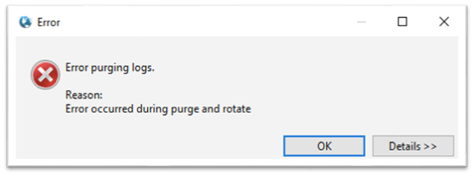
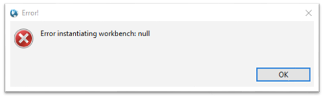
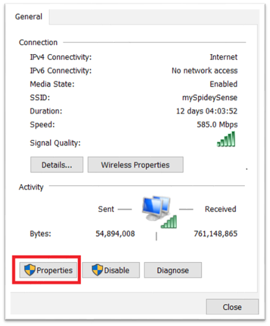
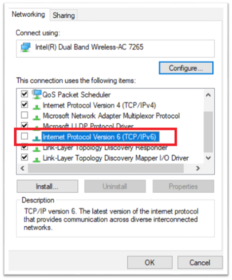

# Common Problems

## Windows CAVE Start Up Error

One common error some users are seeing manifests itself just after selecting an EDEX server to connect to.  The following error dialogs may show up:

These errors are actually happening because the Windows machine is using IPv6, which is not compatible with AWIPS at this time.

**To fix the issue simply follow these steps:**
>**Note**: These screenshots may vary from your system.

**1. Close all error windows and any open windows associated with CAVE.**

**2. In the Windows 10 search field, search for "control panel".**

**3. Once in the Control Panel, look for "Network and Sharing Center".**

**4. Select the adapter for your current connection (should be either "Ethernet" or "Wi-Fi").**

**5. Click on "Properties".**

**6. Uncheck "Internet Protocol Version 6 (TCP/IPv6)" and select OK.**

**7. Restart CAVE.**

---
