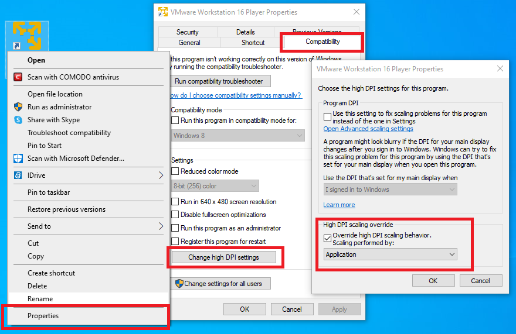
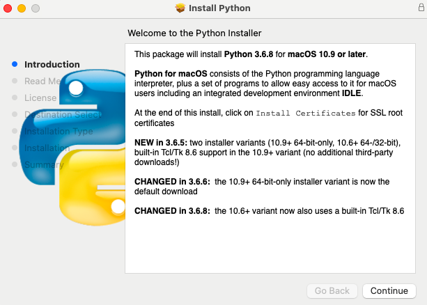
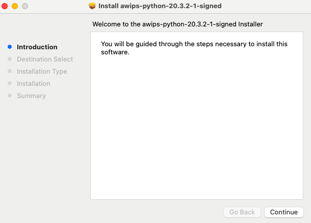
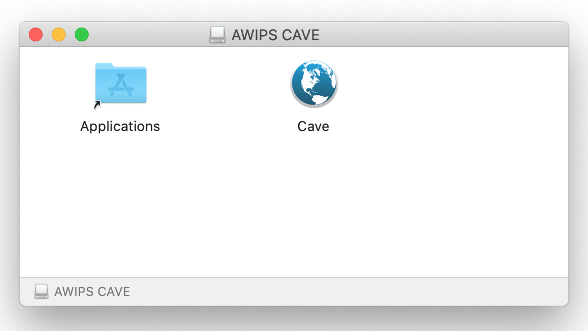

# Install CAVE - BETA Version

CAVE is the **C**ommon **A**WIPS **V**isualization **E**nvironment that is used for rendering and analyzing data for AWIPS.  The installer may require administrator priviledges to install and may require other system changes (environment variables, etc) as well.

---

## Latest CAVE Versions

- [**Linux: 20.3.2-0.2**](#linux)
- [**Windows: 20.3.2-0.2**](#windows)
- [**Mac: 20.3.2-0.2**](#macos)

[**View release notes**](https://www.unidata.ucar.edu/blogs/news/tags/awips-release)

!!! note "Version 20.\* of CAVE is not compatible with Version 18.\* EDEX and vice versa, Version 18.\* of CAVE is not compatible with Version 20.\* EDEX."

---

## Functionality/Reporting

This is a beta release, so we are aware that not all functionality is working as expected. We ask you to please be aware of this and have similar expectations. One noteworthy deficiency we are aware of is the radar menu has not been updated yet to reflect what is in version 18. If you come across issues/bugs/missing functionality, we also encourage you to <a href=https://forms.gle/aYUZSi78KU3ZYJ3q7>report it using this short form</a>.

---

## General Requirements

Regardless of what Operating System CAVE is running on, these general requirements are recommended in order for CAVE to perform optimally:

- Local machine

    !!! error "Running CAVE via X11 forwarding or ssh tunneling is **not** supported. Using a [VNC connection is the only remote option](../appendix/common-problems.md#remotely-connecting-to-cave), and may result in worse performance than running locally."
  
- OpenGL 2.0 Compatible Devices
- At least 4GB RAM
- At least 2GB Disk Space for Caching
- NVIDIA Graphics Card
- [Latest NVIDIA Driver](http://www.nvidia.com/Download/index.aspx?lang=en-us)

    !!! warning "While other graphics cards *may* work, NVIDIA Quadro graphics card is recommended for full visualization capability"

---

## Linux <i class="fa fa-linux"></i> 

**Latest Version: 20.3.2-0.2**

### System Requirements

- 64 bit CentOS/Red Hat 7
- Bash shell environment

!!! note "While CentOS8 has reach End of Life as of Dec. 31, 2021, CentOS7 End of Life isn't until June 30, 2024."

### Download and Installation Instructions

1. Download the following installer: [**awips_install-v20.sh** <i class="fa fa-download"></i>](https://downloads.unidata.ucar.edu/awips2/20.3.2/linux/awips_install-v20.sh)
2. In a terminal, go to the download directory 
3. Make the installer an executable by running: `chmod 755 awips_install-v20.sh`
4. Run the installer: `sudo ./awips_install-v20.sh --cave`
     - This will install the application in `/awips2/cave/` and set the local cache to `~/caveData/`

### Run CAVE

To run CAVE either:

- Use the terminal and type the command `cave`
- Find the application in the Linux Desktop menu: Applications > Internet > AWIPS CAVE

Additionally users can choose to run a [virtual machine (VM)](#linux-virtual-machine) on Linux.

---

## Windows <i class="fa fa-windows"></i> 

**Latest Version: 20.3.2-0.2**

For Windows, Unidata offers two installation options: a [**Direct Windows Installation**](#method-1-direct-windows-install), or a  [**Linux Virtual Machine**](#method-2-linux-virtual-machine).

The direct install is much easier/faster than v18*. The virtual machine option won't render RGB composites of satellite imagery.

### Method 1: Direct Windows Install

#### System Requirements
- User variables PATH and PYTHONHOME must be defined and set to the AWIPS Python path

#### Download and Installation Instructions

1. Download and install: [**awips-cave.msi** <i class="fa fa-download"></i>](https://downloads.unidata.ucar.edu/awips2/20.3.2/windows/awips-cave-20.3.2-0.2.msi)
2. Set the **user** environment variables:
    - Access the Environment Variables window by typing "env" in the start bar, and selecting the "Edit environment variables for **your** account"
    - Edit your **Path** variable and add `%APPDATA%\UCAR Unidata\AWIPS CAVE\Python`
    - If not created, create a New Variables: **PYTHONHOME** and set the path to `%APPDATA%\UCAR Unidata\AWIPS CAVE\Python`

!!!note "If you have multiple paths to python set in your variables, make sure that the one you added is at the top"

    
    

#### Run CAVE

To run CAVE, either:

- Double click on the CAVE icon on your desktop
- Type "cave" in the start bar and hit enter
- Find and run CAVE app in the file browser:  `C:\Users\%USER%\AppData\Roaming\UCAR Unidata\AWIPS CAVE\CAVE.exe`

### Method 2: Linux Virtual Machine

Please note, running CAVE in a Virtual Machine does have reduced functionality than running CAVE directly on hardware (ex: rendering RGB satellite images).

#### System Requirements

- [VMWare Workstation Player](https://www.vmware.com/products/workstation-player/workstation-player-evaluation.html) must be installed (free software):
- For high definition monitors (4k), you will want to enable the high DPI setting for VMWare Workstation Player
     1. Create a desktop shortcut for VMWare Workstation Player
     1. Right-click the shortcut and select Properties
     1. Open the Compatability Tab
     1. Select the "Change high DPI settings" button
     1. Check the "High DPI scaling ovveride" checkbox and choose "Application" in the enabled dropdown
     
      


#### Download and Installation Instructions

1. Download the zipped file containing the virtual machine: [**CentOS7-Unidata-CAVE-20.3.2-0.1** <i class="fa fa-download"></i>](https://downloads.unidata.ucar.edu/awips2/20.3.2/windows/CentOS7-Unidata-CAVE-20.3.2-0.1.zip)
2. Unzip the folder.
3. Open VMWare Player and go to **Player** > **File...** > **Open** and locate the folder that was created from the downloaded zipped file.  Select the file called **"CentOS 7 - Unidata CAVE 20.3.2-0.1.vmx"**.
4. Run this new VM option.  If it asks if it's been moved or copied, select **"I Copied It"**.
     - There will be a user in the Linux machine named "awips" and the password is "awips"
     - The root password is "unidataAWIPS" if ever needed

#### Run CAVE 

Once inside the VM, to run CAVE either:

- Use the desktop icon 
- Use the terminal and type the command `cave`
- Find the application in the Linux Desktop menu: Applications > Internet > AWIPS CAVE

---

## macOS <i class="fa fa-apple"></i> 

**Latest Version: 20.3.2-0.2**

!!! warning "These installation steps reqiure **Admin Privileges** to fully complete."

### System Requirements

- Python3.6

### Download and Installation Instructions

1. [Download and install Python3.6](https://www.python.org/ftp/python/3.6.8/python-3.6.8-macosx10.9.pkg) to the default directory (`/Library/Framework/...`)
    
     - Use all the default settings during installation.
     - This will require Admin Privileges
     1. After completing the installer, you must run the `Install Certificates.command`, do this by double-clicking on the file in the downloaded folder.
     1. Finally, you need to change your environment with these latest changes, to do so, open a terminal and type `source .zprofile`
     1. Now you can confirm you have the correct version of python by running `which python3` and the output should be:
   ```
   /Library/Frameworks/Python.framework/Versions/3.6/python3
   ```
2. [Download and install these supplemental python packages](https://downloads.unidata.ucar.edu/awips2/20.3.2/mac/awips-python-20.3.2-1-signed.pkg)
    
     - Use all the default settings during installation
     - This will require Admin Privileges
3. [Download and install CAVE](https://downloads.unidata.ucar.edu/awips2/20.3.2/mac/awips-cave-20.3.2-0.2.dmg)
    
     - You can click and drag the CAVE icon into the Applications Directory to install at the System Application level
     - You can drag that icon to any other location (Desktop, local user's Applications directory, etc) to install CAVE at that location

### Run CAVE

To run CAVE either:

- Use the System Menu Go > Applications > CAVE
- Type &#8984; + Spacebar and then type "cave", the application should appear and you can hit **enter** to run it

!!! note "The first time CAVE is opened, it will ask you if you are sure you want to run it, because it was downloaded from the internet and not the Apple Store.  This is normal, and hit Open.  Your message my differ slightly but should look like the image below:"


---

## EDEX Connection

Unidata and Jetstream2 have partnered to offer a EDEX data server in the cloud, open to the public.  Select the server in the Connectivity Preferences dialog, or enter **edex-beta.unidata.ucar.edu**.


---

## Local Cache

After connecting to an EDEX server, you will have a local directory named **caveData** which contains files synced from EDEX as well as a client-side cache for data and map resources.

You can reset CAVE by removing the **caveData** directory and reconnecting to an EDEX server. Your local files have been removed, but if you are re-connecting to an EDEX server you have used before, the remote files will sync again to your local **~/caveData** (bundles, colormaps, etc.).

- Linux: `/home/<user>/caveData/`
- macOS: `/Users/<user>/Library/caveData/`
- Windows: `C:\Users\<user>\caveData\`

---

## Uninstalling CAVE (Linux)
These are instructions to manually uninstall CAVE. However, the [`awips_install-v20.sh`](#download-and-installation-instructions) script will do these steps for you if you are installing a newer version of CAVE.

**1. Make sure you have exited out of any CAVE sessions**

!!! note "Check to make sure your `/etc/yum.repos.d/awips2.repo` file has `enabled=1`."

**2. Remove currently installed CAVE**
```
sudo yum clean all
sudo yum groupremove "AWIPS CAVE"
```

!!! note "If you are having trouble removing a group, see the [troubleshooting](../appendix/common-problems.md#troubleshooting-uninstalling-edex) section."

**3. Check to make sure all awips rpms have been removed**
```
rpm -qa | grep awips2
```

If you still have rpms installed, remove them

```
sudo yum remove awips2-*
```

**4. Remove the cave directory in /awips2 and caveData from your home directory**
```
rm -rf /awips2/cave
rm -rf ~/caveData
```


[def]: ../images/E
