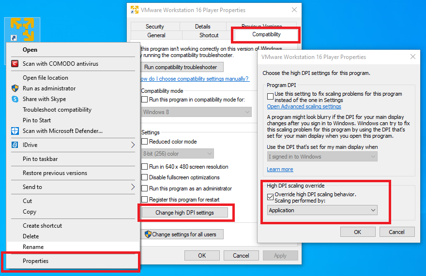
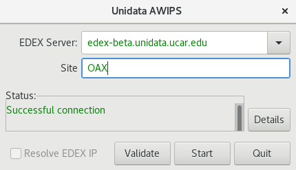

# Install CAVE - <span style="color:red">BETA Version!</span> 

CAVE is the **C**ommon **A**WIPS **V**isualization **E**nvironment that is used for rendering and analyzing data for AWIPS.  The installer may require administrator priviledges to install and may require other system changes (environment variables, etc) as well.

---

## Latest CAVE Versions

- [**Linux: 23.4.1-0.2**](#linux)
- [**Windows: 23.4.1-0.2**](#windows)

[**View release notes**](https://www.unidata.ucar.edu/blogs/news/tags/awips-release)

!!! note "Version 23.\* of CAVE is not compatible with Version 20.\* EDEX and vice versa, Version 20.\* of CAVE is not compatible with Version 23.\* EDEX."

---

## Functionality/Reporting

This is a beta release, so we are aware that not all functionality is working as expected. We ask you to please be aware of this and have similar expectations. If you come across issues/bugs/missing functionality, we also encourage you to <a href="https://docs.google.com/forms/d/e/1FAIpQLScqWZho98cI8ByYTe99YRidfiYK_VeHvjsAculZmiVdWGwUnw/viewform?usp=sf_link" target="_blank">report it using this short form</a>.

---

## General Requirements

Regardless of what Operating System CAVE is running on, these general requirements are recommended in order for CAVE to perform optimally:

- Local machine

    !!! error "Running CAVE via X11 forwarding or ssh tunneling is **not** supported. Using a [VNC connection is the only remote option](../appendix/common-problems.md#remotely-connecting-to-cave), and may result in worse performance than running locally."

- OpenGL 2.0 Compatible Devices
- At least 4GB RAM
- At least 2GB Disk Space for Caching
- NVIDIA Graphics Card
- [Latest NVIDIA Driver](http://www.nvidia.com/Download/index.aspx?lang=en-us)

    !!! warning "While other graphics cards *may* work, NVIDIA Quadro graphics card is recommended for full visualization capability"

---

## Linux <i class="fa fa-linux"></i> 

**Latest Version: 23.4.1-0.2**

### System Requirements

- 64 bit Rocky/Red Hat 8
- Bash shell environment

### Download and Installation Instructions

1. Download the following installer: [**awips_install-v23.sh** <i class="fa fa-download"></i>](https://downloads.unidata.ucar.edu/awips2/23.4.1/linux/awips_install-v23.sh)
2. In a terminal, go to the download directory 
3. Make the installer an executable by running: `chmod 755 awips_install-v23.sh`
4. Run the installer: `sudo ./awips_install-v23.sh --cave`
     - This will install the application in `/awips2/cave/` and set the local cache to `~/caveData/`

### Run CAVE

To run CAVE either:

- Use the terminal and type the command `cave`
- Find the application in the Linux Desktop menu: Applications > Internet > AWIPS CAVE

Additionally users can choose to run a [virtual machine (VM)](#linux-virtual-machine) on Linux.

---

## Windows <i class="fa fa-windows"></i> 

**Latest Version: 23.4.1-0.2**

For Windows, we offer two installation options: a [**Direct Windows Installation**](#method-1-direct-windows-install), or a  [**Linux Virtual Machine**](#method-2-linux-virtual-machine).

!!! warning "The virtual machine option won't render RGB composites of satellite imagery."

### Method 1: Direct Windows Install

We offer CAVE installers at both the user-level (no administrative permissions needed), and the system-level (useful in a lab setting for instance).  If you need the system-level installer, please skip to the [System-Level Installation section](#system-level-installation), otherwise simply proceed with the next sections.

#### Upgrade Existing Installation

If you do not currently have CAVE installed, please go directly to the [Download and Installation Instructions](#download-and-installation-instructions_1).

If you already have CAVE installed:

1. First remove it by going to the **Installed Apps** settings dialog.  You can access this window by: Start bar > Settings > Apps > Installed Apps.
    - *Typing "remove" in the start bar should bring you to this screen as well*
2. Find AWIPS CAVE, click on it, and click Uninstall.
3. Once the uninstall is finished, simply [download and install the latest version](#download-and-installation-instructions_1) as instructed below.

#### Download and Installation Instructions

1. Download and install: [**awips-cave.msi** <i class="fa fa-download"></i>](https://downloads.unidata.ucar.edu/awips2/23.4.1/windows/awips-cave-23.4.1-0.2.msi)

#### Run CAVE

To run CAVE, either:

- Double click on the CAVE icon on your desktop
- Type "cave" in the start bar and hit enter
- Find and run CAVE app in the file browser:  `C:\Users\%USER%\AppData\Roaming\UCAR Unidata\AWIPS CAVE\CAVE.bat`

#### System-Level Installation

If you need a system-level installation of CAVE, please fill out [this brief access form](https://docs.google.com/forms/d/e/1FAIpQLSfQ0ZBf-zq-S50nXV1R3spa6nEnZ7VTEHO8r1iW604QF-vHbA/viewform?usp=sf_link) for the .msi, and then proceed with installation similar to that described above.

---

### Method 2: Linux Virtual Machine

Please note, running CAVE in a Virtual Machine does have reduced functionality than running CAVE directly on hardware (ex: rendering RGB satellite images).

#### System Requirements

- [VMWare Workstation Player](https://downloads.unidata.ucar.edu/awips2/current/windows/VMware-player-17.5.2-23775571.exe) must be installed (free software):
- For high definition monitors (4k), you will want to enable the high DPI setting for VMWare Workstation Player
     1. Create a desktop shortcut for VMWare Workstation Player
     1. Right-click the shortcut and select Properties
     1. Open the Compatability Tab
     1. Select the "Change high DPI settings" button
     1. Check the "High DPI scaling overide" checkbox and choose "Application" in the enabled dropdown
     
      
      
#### Upgrade Existing Installation

If you do not currently have CAVE installed, please go directly to the [Download and Installation Instructions](#download-and-installation-instructions_2).

If you already have CAVE installed you can either:

- Download the new Virtual Machine ([as described below](#download-and-installation-instructions_2)) and you will see the new VM in VMware, similar to this screenshot:
    

- Upgrade the version of CAVE within the Virtual Machine by following the [Linux instructions](#upgrade-existing-installation)


#### Download and Installation Instructions

1. Download the zipped file containing the virtual machine: [**CentOS7-Unidata-CAVE-20.3.2-2** <i class="fa fa-download"></i>](https://downloads.unidata.ucar.edu/awips2/23.4.1/windows/Rocky8-NSFUnidata-CAVE-23.4.1-0.2.zip)
2. Unzip the folder.
3. Open VMWare Player and go to **Player** > **File...** > **Open** and locate the folder that was created from the downloaded zipped file.  Select the file called **"CentOS 7 - Unidata CAVE 20.3.2-2.vmx"**.
4. Run this new VM option.  If it asks if it's been moved or copied, select **"I Copied It"**.
     - There will be a user in the Linux machine named "awips" and the password is "awips"
     - The root password is "unidataAWIPS" if ever needed

#### Run CAVE 

Once inside the VM, to run CAVE either:

- Use the desktop icon 
- Use the terminal and type the command `cave`
- Find the application in the Linux Desktop menu: Applications > Internet > AWIPS CAVE

---

## EDEX Connection

Unidata and Jetstream2 have partnered to offer a EDEX data server in the cloud, open to the public.  Select the server in the Connectivity Preferences dialog, or enter **edex-beta.unidata.ucar.edu**.

<center></center>

---

## Local Cache

After connecting to an EDEX server, you will have a local directory named **caveData** which contains files synced from EDEX as well as a client-side cache for data and map resources.

You can reset CAVE by removing the **caveData** directory and reconnecting to an EDEX server. Your local files have been removed, but if you are re-connecting to an EDEX server you have used before, the remote files will sync again to your local **~/caveData** (bundles, colormaps, etc.).

- Linux: `/home/<user>/caveData/`

---

## Uninstalling CAVE (Linux)
These are instructions to manually uninstall CAVE. However, the [`awips_install-v23.sh`](#download-and-installation-instructions) script will do these steps for you if you are installing a newer version of CAVE.

**1. Make sure you have exited out of any CAVE sessions**

!!! note "Check to make sure your `/etc/yum.repos.d/awips2.repo` file has `enabled=1`."

**2. Remove currently installed CAVE**
```
sudo yum clean all
sudo yum groupremove "AWIPS CAVE"
```

!!! note "If you are having trouble removing a group, see the [troubleshooting](../appendix/common-problems.md#troubleshooting-uninstalling-edex) section."

**3. Check to make sure all awips rpms have been removed**
```
rpm -qa | grep awips2
```

If you still have rpms installed, remove them

```
sudo yum remove awips2-*
```

**4. Remove the cave directory in /awips2 and caveData from your home directory**
```
rm -rf /awips2/cave
rm -rf ~/caveData
```