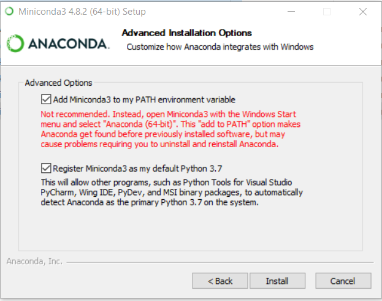
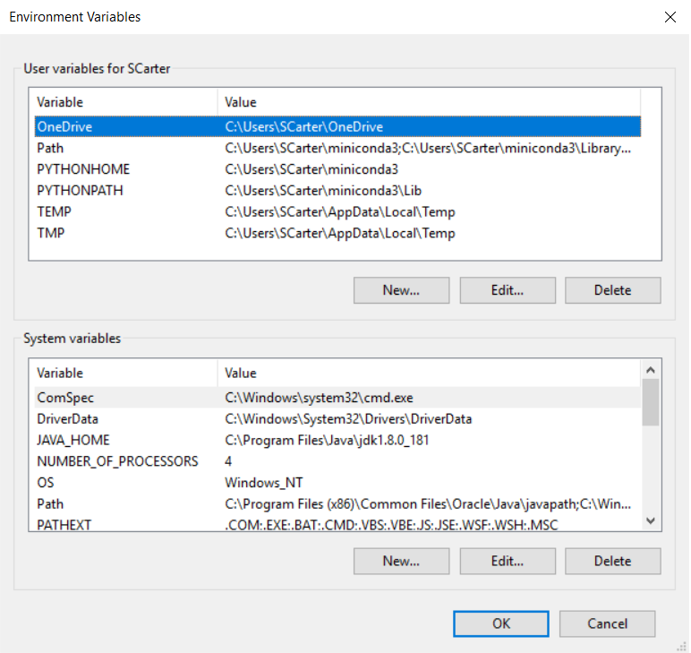
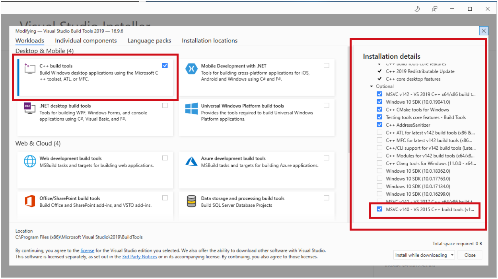
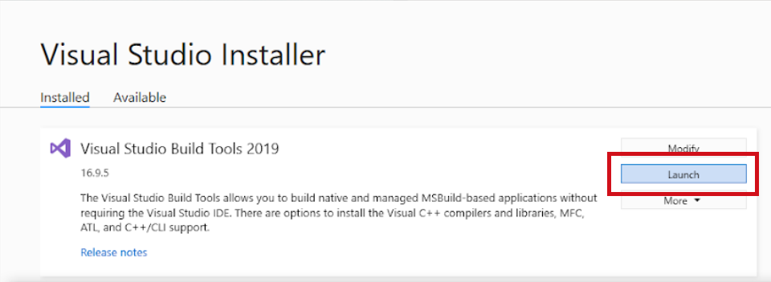
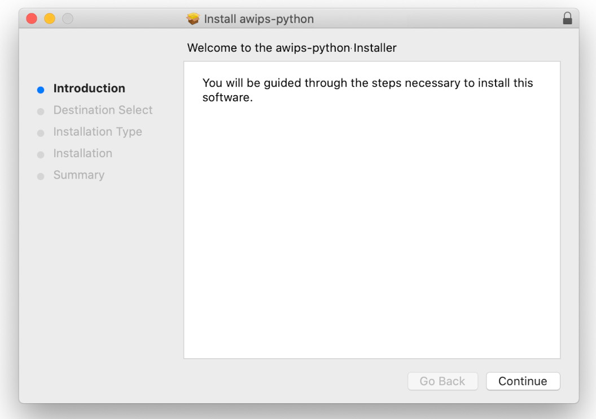
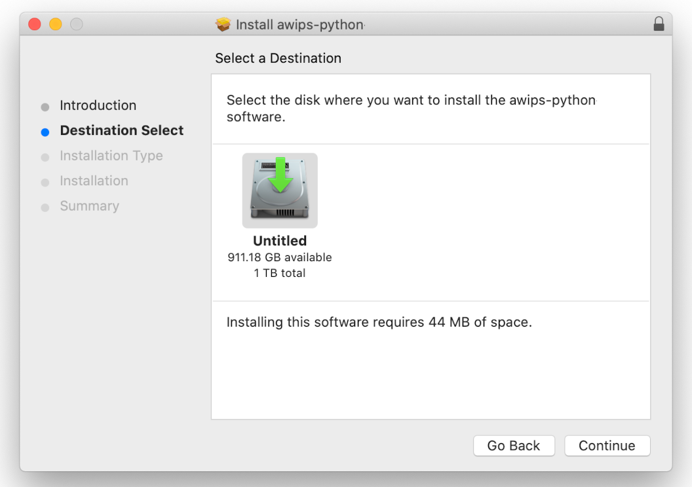
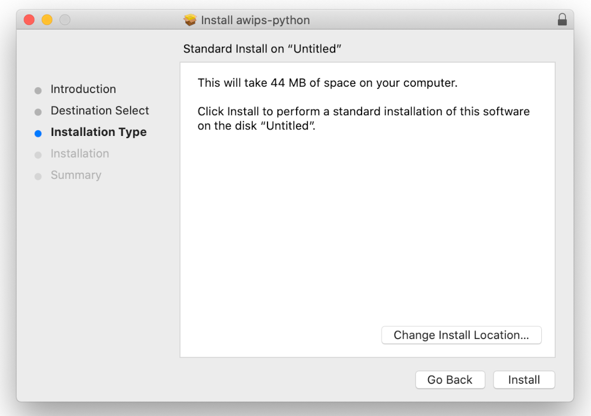
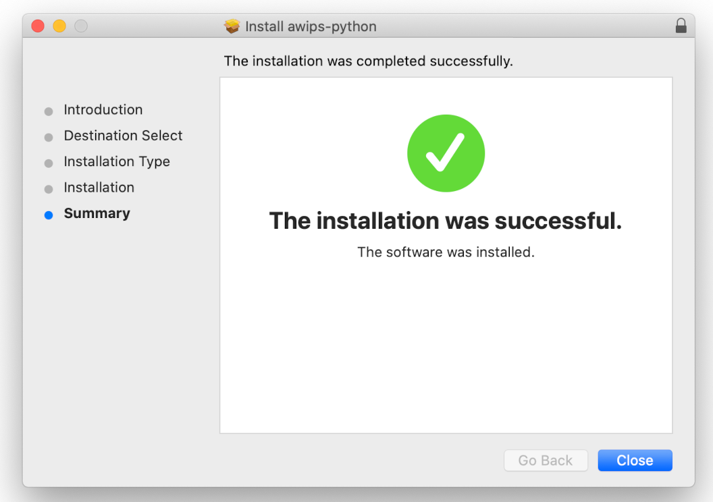
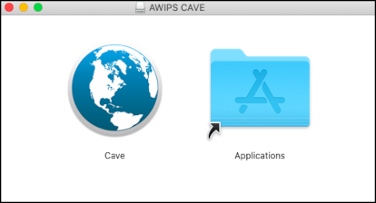
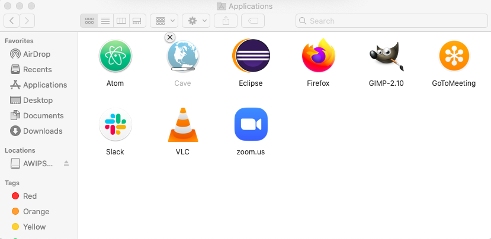

# Install CAVE

CAVE is the **C**ommon **A**WIPS **V**isualization **E**nvironment that is used for rendering and analyzing data for AWIPS.  Unidata supports CAVE to work on three platforms: [Centos (Redhat) Linux](#linux), [Windows](#windows), and [macOS](#macos).  The installer may require administrator priviledges to install and may require other system changes (environment variables, etc) as well.

---

## General Requirements

Regardless of what Operating System CAVE is running on, these general requirements are recommended in order for CAVE to perform optimally:

- Local machine

    !!! error "Running CAVE via X11 forwarding or ssh tunneling is **not** supported. Using a [VNC connection is the only remote option](common-problems.md#remotely-connecting-to-cave), and may result in worse performance than running locally."
  
- Java 1.8
- OpenGL 2.0 Compatible Devices
- At least 4GB RAM
- At least 2GB Disk Space for Caching
- NVIDIA Graphics Card
- [Latest NVIDIA Driver](http://www.nvidia.com/Download/index.aspx?lang=en-us)

    !!! warning "While other graphics cards *may* work, NVIDIA Quadro graphics card is recommended for full visualization capability"

---

## Linux <i class="fa fa-linux"></i> 

### System Requirements

- 64 bit CentOS/Red Hat 7

### Download and Installation Instructions

1. Download the following installer: [**awips_install.sh** <i class="fa fa-download"></i>](https://www.unidata.ucar.edu/software/awips2/awips_install.sh)
2. In a terminal, go to the download directory 
3. Make the installer an executable by running: `chmod 755 awips_install.sh`
4. Run the installer: `sudo ./awips_install.sh --cave`
     - This will install the application in `/awips2/cave/` and set the local cache to `~/caveData/`

### Run CAVE

To run CAVE either:

- Use the terminal and type the command `cave`
- Find the application in the Linux Desktop menu: Applications > Internet > AWIPS CAVE

---

## Windows <i class="fa fa-windows"></i> 

For Windows, Unidata offers two installation options: a [**Linux Virtual Machine**](#method-1-linux-virtual-machine), or a [**Direct Windows Installation**](#method-2-direct-windows-install).

Currently, the [virtual machine (VM)](#method-1-linux-virtual-machine) is the recommended form of install for those who do not have administrative priviledges on the machine, or beginners who want a simpler installation process.  
!!! warning "At the moment, the VM option may not render all products in CAVE (ex. RGB composites of satellite imagery)"

The [direct installation method](#method-2-direct-windows-install) is recommended for those who have administrative priviledges and a little bit of experience installing more software.

### Method 1: Linux Virtual Machine

This method is recommended for beginners, or those with less computer knowledge as it is a very simple installation, however at this time, some CAVE functionality may be missing (ex: rendering RGB satellite images).

#### System Requirements

- [VMWare Workstation Player](https://www.vmware.com/products/workstation-player/workstation-player-evaluation.html) must be installed (free software)

#### Download and Installation Instructions

1. Download the zipped file containing the virtual machine: [**unidata_cave.zip** <i class="fa fa-download"></i>](https://www.unidata.ucar.edu/downloads/awips2/unidata_cave.zip)
2. Unzip the folder by right-clicking and selecting "Extract All".  All files will be extracted into a new folder.
3. Open VMWare Player and go to **Player** > **File...** > **Open** and locate the folder that was created from the downloaded zipped file.  Select the file called **"CentOS 7 - Unidata CAVE 18-1-1.vmx"**.
4. Run this new VM option.  If it asks if it's been moved or copied, select **"I Copied It"**.
     - There will be a user in the Linux machine named "awips" and the password is "awips"
     - The root password is "unidataAWIPS" if ever needed

#### Run CAVE 

Once inside the VM, to run CAVE either:

- Use the desktop icon 
- Use the terminal and type the command `cave`
- Find the application in the Linux Desktop menu: Applications > Internet > AWIPS CAVE

### Method 2: Direct Windows Install

This method is recommended for personal use and requires Administrative priviledges.  It should enable full CAVE capability, but it is a bit lengthy and might take about 20 minutes or so to complete.  
For additional assistance we have created an [**installation video**](https://youtu.be/QAuBSsSp9Ak) that walks through the steps below.

!!! note "It is important to use the exact versions of software that we link to or specify in our instructions.  Deviations may cause installation problems or failures."

#### System Requirements

- 64-bit Miniconda3 (Python3.7 - 4.8.2)
- Python3 (comes with Miniconda installation)
- 64-bit Java JDK 1.8 (1.8_181)
- 64-bit Visual C++ Build Tools 2015 and 2019
- Numpy (1.15.1)
- Jep (3.8.2)
- User Variable PATH must have miniconda3 location
- User Variables PYTHONHOME and PYTHONPATH must be defined
- System Variable JAVA_HOME must be defined

#### Download and Installation Instructions

1. Download and install 64-bit [Miniconda Python3.7 version 4.8.2 for Windows](https://repo.anaconda.com/miniconda/Miniconda3-py37_4.8.2-Windows-x86_64.exe)
    - **Allow** Miniconda3 to set **PATH** and other environment variables
    - **Register** miniconda as the default python
    
2. Download and install the 64-bit [Java JDK 1.8_181](https://www.unidata.ucar.edu/downloads/awips2/jdk-8u181-windows-x64.exe) (this is necessary so Jep can install properly).
    - Select **Development Tools** as the installation options
    - Make note of where it installs on your computer (the default is C:\ProgramFiles\Java\jdk1.8.0_181)
3. Set the environment variables:
    - Access the Environment Variables window by typing "env" in the start bar, hitting enter, and clicking on the "Environment Variables..." button at the bottom of the "System Properties" window
    - Create the variables in their respective locations using the **New...** buttons
    - User Variables: **PYTHONPATH** and **PYTHONHOME**
    - System Variable: **JAVA_HOME**
    
    
        !!! warning "If PYTHONHOME is not set, the **gridslice** Python module will not be installed or available"
      
4. [Download and install 64-bit Microsoft Visual Studio C++ Build Tools](https://my.visualstudio.com/Downloads?q=Build%20Tools%20for%20Visual%20Studio%202019%20%28version%2016.9%29&pgroup=)
    - To access the page linked above you will need a Microsoft account
    - Download the executable for **Build Tools for Visual Studio 2019 (version 16.9)**
    - Allow it to run some pre-installations
    - The installer will pop up as shown below.  Make sure to select the **C++ build tools** (upper left), and then view the **Installation details** on the right
      - Scroll down and check the **MSVC v140 - VS 2015 C++ build tools**
    
5. Install dependent Python packages
    - Once the installer has finished, close the installer. Another window is present and there is an option to **launch** a command terminal
    
    - Click that and run the following:
        - `pip install numpy==1.15.1`
        - `pip install jep==3.8.2`
        !!! note "These must be run as two separate commands, as stated above for all derived parameters to display properly."
6. Download and install: [**awips-cave.msi** <i class="fa fa-download"></i>](https://www.unidata.ucar.edu/downloads/awips2/awips-cave.msi)
    - In addition to the application directory, the MSI installer will attempt to copy the [*gridslice*](https://github.com/Unidata/gridslice) shared library to `$PYTHONHOME/Dlls/`.  If the `$PYTHONHOME` environmental variable is not defined *gridslice* will not be installed.  You can check to see if it was installed in the Dlls directory after you have completed steps 1-3.
    !!! note "CAVE will still run without gridslice, but certain bundles which use derived parameters, such as [**isentropic analysis**](../images/screenCapture-2016.04.04.13.41.26-20160404_000000.png), will not load."

#### Run CAVE

To run CAVE, either:

- Type "cave" in the start bar and hit enter
- Find and run CAVE app in the file browser:  C:\Program Files\Unidata\AWIPS CAVE\cave.exe

---

## macOS <i class="fa fa-apple"></i> 

### System Requirements

- Will need admin privileges to install `awips-python.pkg`
- NVIDIA Graphics card is recommended, some Intel Graphics cards will working

    !!! warning "Most AMD graphics cards are not supported"

### Download and Installation Instructions

1. Download and install: [**awips-python.pkg** <i class="fa fa-download"></i>](https://www.unidata.ucar.edu/downloads/awips2/awips-python.pkg)  *(This step requires administrative privileges)*
    - Once downloaded, double click and the installer will launch with the following screens, **please keep the default selections**:
    
    
    
    
    
    !!! warning "Between these steps it will prompt for an administrator's password"
    
    
        
    !!! note "The awips-python.pkg is not necessarily required, and CAVE will still run without it, but any derived data such as barbs, arrows, and various grid products will not render without having **jep** installed (it is assumed to be in /Library/Python/2.7/site-packages/jep/)"
        
1. Download and install: [**awips-cave.dmg** <i class="fa fa-download"></i>](https://www.unidata.ucar.edu/downloads/awips2/awips-cave.dmg)
    - Either use the default location, which is in the system-wide "Applications" directory, by clicking and dragging the CAVE icon into the Applications folder, in the window that pops up when installing:
    
        
    
    - Or open a new Finder window to your \[user home\]/Applications/ directory (if it doesn't exist, simply create a new folder with the name "Applications"), and drag the CAVE icon into that folder:
    
    - This will install CAVE as an application and set the local cache to `~/Library/caveData`

### Run CAVE

To run CAVE either:

- Use the System Menu Go > Applications > CAVE
- Type &#8984; + Spacebar and then type "cave", the application should appear and you can hit **enter** to run it

---

## EDEX Connection

Unidata and XSEDE Jetstream have partnered to offer a EDEX data server in the cloud, open to the Unidata university community.  Select the server in the Connectivity Preferences dialog, or enter **edex-cloud.unidata.ucar.edu** (without *http://* before, or *:9581/services* after).

---

## Local Cache

After connecting to an EDEX server, you will have a local directory named **caveData** which contains files synced from EDEX as well as a client-side cache for data and map resources.

You can reset CAVE by removing the **caveData** directory and reconnecting to an EDEX server. Your local files have been removed, but if you are re-connecting to an EDEX server you have used before, the remote files will sync again to your local **~/caveData** (bundles, colormaps, etc.).

- Linux: `/home/<user>/caveData/`
- macOS: `/Users/<user>/Library/caveData/`
- Windows: `C:\Users\<user>\caveData\`
