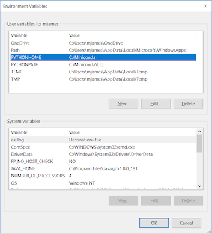

# Install CAVE

CAVE is the **C**ommon **A**WIPS **V**isualization **E**nvironment that is used for rendering and analyzing data for AWIPS.  Unidata supports CAVE to work on three platforms: [Centos (Redhat) Linux](#linux), [Windows](#windows), and [macOS](#macos).  The installer may require administrator priviledges to install and may require other system changes (environment variables, etc) as well.

---

## General Requirements

Regardless of what Operating System CAVE is running on, these general requirements are recommended in order for CAVE to perform optimally:

- Java
- OpenGL 2.0 Compatible Devices
- At least 4GB RAM
- At least 2GB Disk Space for Caching
- [Latest NVIDIA Driver](http://www.nvidia.com/Download/index.aspx?lang=en-us)
> Note: NVIDIA Quadro graphics card is recommended for full visualization capability

---

## Linux <i class="fa fa-linux"></i> 

### System Requirements

- 64 bit CentOS/Red Hat 7

### Download and Installation Instructions

1. Download the following installer: [**awips_install.sh** <i class="fa fa-download"></i>](https://www.unidata.ucar.edu/software/awips2/awips_install.sh)
2. In a terminal, go to the download directory 
3. Make the installer an executable by running: `chmod 755 awips_install.sh`
4. Run the installer: `sudo ./awips_install.sh --cave`
     - This will install the application in `/awips2/cave/` and set the local cache to `~/caveData/`

To run CAVE either:

- Use the terminal and type the command `cave`
- Find the application in the Linux Desktop menu: Applications > Internet > AWIPS CAVE

---

## Windows <i class="fa fa-windows"></i> 

For Windows, Unidata offers two installation options: a [**Linux Virtual Machine**](#method-1-linux-virtual-machine-recommended), or a [**Direct Windows Installation**](#method-2-direct-windows-install).  Currently, the virtual machine is the recommended form of install.  The direct installation can work, but currently we do not have complete instructions on how to get **jep** (which is a python package) running properly with CAVE.  Because of this, CAVE will install just fine, but certain data products will not render in the application.  The direct install also requires several system modifications and will require administrator priviledges.  We are in the process of producing a working set of instructions for the direct install, but as of now just have old instructions, which likely will not have jep working properly.

### Method 1: Linux Virtual Machine (Recommended)

#### System Requirements

- [VMWare Workstation Player](https://www.vmware.com/products/workstation-player/workstation-player-evaluation.html) must be installed (free software)

#### Download and Installation Instructions

1. Download the zipped file containing the virtual machine: [**unidata_cave.zip** <i class="fa fa-download"></i>](https://www.unidata.ucar.edu/downloads/awips2/unidata_cave.zip)
2. Unzip the folder by right-clicking and selecting "Extract All".  All files will be extracted into a new folder.
3. Open VMWare Player and go to **Player** > **File...** > **Open** and locate the folder that was created from the downloaded zipped file.  Select the file called **"CentOS 7 - Unidata CAVE"**.
4. Run this new VM option.  If it asks if it's been moved or copied, select **copied**.
     - There will be a user in the Linux machine named "awips" and the password is "awips"
     - The root password is "unidataAWIPS" if ever needed

To run CAVE either:

- Use the desktop icon 
- Use the terminal and type the command `cave`
- Find the application in the Linux Desktop menu: Applications > Internet > AWIPS CAVE

### Method 2: Direct Windows Install

#### System Requirements

- Miniconda3
- Python
- Numpy
- Jep
- PYTHONHOME must be defined
- JAVA_HOME must be defined
- Visual C++ Build Tools 2015 Update 3 (Version 14.1)

!!! warning "[Specific instructions](#download-and-installation-instructions_2) are detailed for installing the above, but they still may not install jep properly"

#### Download and Installation Instructions

1. Download and install [Miniconda Python 3.7 for Windows](https://conda.io/miniconda.html)
    - Allow Miniconda3 to set **PATH** and other environment variables
    - Ensure that **PYTHONHOME** is set to the Miniconda3 location
    
    > Note: If PYTHONHOME is not set, the **gridslice** Python module will not be installed or available
2. [Download and install Microsoft Visual Studio C++ Build Tools](https://my.visualstudio.com/Downloads?q=visual%20studio%202015&wt.mc_id=o~msft~vscom~older-downloads)
    - To access the page linked above you will need a Microsoft account
    - Once at that webpage, **search for** ***"build tools c+"*** in order for the proper download to be returned
    - Download **Visual C++ Build Tools 2015 Update 3**
3. Install dependent Python packages
    - `pip install numpy==1.15.1 jep=3.8.2`
4. Download and install: [**awips-cave.msi** <i class="fa fa-download"></i>](https://www.unidata.ucar.edu/downloads/awips2/awips-cave.msi)
    - In addition to the application directory, the MSI installer will attempt to copy the [*gridslice*](https://github.com/Unidata/gridslice) shared library to `$PYTHONHOME/Dlls/`.  If the `$PYTHONHOME` environmental variable is not defined *gridslice* will not be installed.  You can check to see if it was installed in the Dlls directory after you have completed steps 1-3.
    > Note: CAVE will still run without gridslice, but certain bundles which use derived parameters, such as [**isentropic analysis**](../images/screenCapture-2016.04.04.13.41.26-20160404_000000.png), will not load.

---

## macOS <i class="fa fa-apple"></i> 

### System Requirements

- NVIDIA Graphics card is recommended, some Intel Graphics cards will working

> Note: Most AMD graphics cards are not supported

### Download and Installation Instructions
1. Download and install both: [**awips-cave.dmg** <i class="fa fa-download"></i>](https://www.unidata.ucar.edu/downloads/awips2/awips-cave.dmg) and [**awips-python.pkg** <i class="fa fa-download"></i>](https://www.unidata.ucar.edu/downloads/awips2/awips-python.pkg)
    - This will install CAVE as an application and set the local cache to `~/Library/caveData`

> Note: The awips-python.pkg is not necessarily required, and CAVE will still run without it, but any derived data such as barbs, arrows, and various grid products will not render without having **jep** installed (it is assumed to be in /Library/Python/2.7/site-packages/jep/)

To run CAVE either:

- Use the System Menu Go > Applications > CAVE
- Type &#8984; + Spacebar and then type "cave", the application should appear and you can hit **enter** to run it

---

## EDEX Connection

Unidata and XSEDE Jetstream have partnered to offer a EDEX data server in the cloud, open to the Unidata university community.  Select the server in the Connectivity Preferences dialog, or enter **edex-cloud.unidata.ucar.edu** (without *http://* before, or *:9581/services* after).

---

## Local Cache

After connecting to an EDEX server, you will have a local directory named **caveData** which contains files synced from EDEX as well as a client-side cache for data and map resources.

You can reset CAVE by removing the **caveData** directory and reconnecting to an EDEX server. Your local files have been removed, but if you are re-connecting to an EDEX server you have used before, the remote files will sync again to your local **~/caveData** (bundles, colormaps, etc.).

- Linux: `/home/<user>/caveData/`
- macOS: `/Users/<user>/Library/caveData/`
- Windows: `C:\Users\<user>\caveData\`
