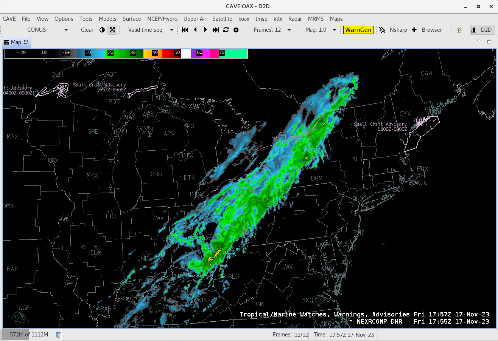
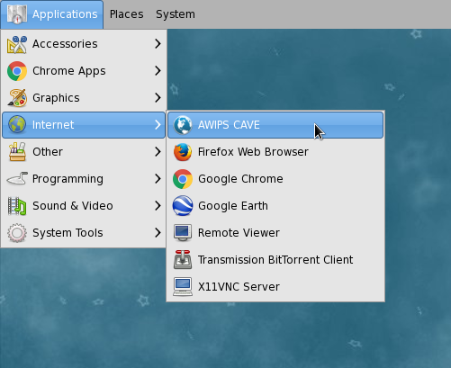

# Download and Install CAVE

---

|          | current release 17.1.1                         |
|----------------|-----------------------:|
| Linux x86_64   | [installCAVE.sh <i class="fa fa-download"></i>](http://www.unidata.ucar.edu/software/awips2/installCAVE.sh)         |
| macOS	         | Download and install both [awips2-cave-17.1.1.dmg <i class="fa fa-download"></i>](http://www.unidata.ucar.edu/downloads/awips2/awips2-cave-17.1.1.dmg) [awips-python-jep.pkg <i class="fa fa-download"></i>](http://www.unidata.ucar.edu/downloads/awips2/awips-python-jep.pkg)|
| 32-bit Windows | [awips-cave.msi <i class="fa fa-download"></i>](http://www.unidata.ucar.edu/downloads/awips2/awips-cave.msi)        |
| 64-bit Windows | [awips-cave.amd64.msi <i class="fa fa-download"></i>](http://www.unidata.ucar.edu/downloads/awips2/awips-cave.amd64.msi)  |

---

## <i class="fa fa-linux"></i> Linux

* [installCAVE.sh <i class="fa fa-download"></i>](http://www.unidata.ucar.edu/software/awips2/installCAVE.sh)

For CentOS/Red Hat 6 and 7. Installs to **/awips2/cave** and writes files to **~/caveData**.

Install as root (all package dependencies should be resolved by yum)

	chmod 755 ./installCAVE.sh
	./installCAVE.sh

Run CAVE from the menu **Applications** &gt; **Internet** &gt; **AWIPS CAVE**, or from the command line as simply `cave`.

!!! note "System Requirements"

	* x86_64 CentOS/RHEL 6 or 7
	* OpenGL 2.0
	* 4GB RAM
	* [Latest NVIDIA driver](http://www.nvidia.com/Download/index.aspx?lang=en-us) for your graphics card
	* 2GB disk space for caching datasets in **~/caveData**

---

## <i class="fa fa-apple"></i> macOS

CAVE for macOS requires the **[awips-python-jep.pkg](http://www.unidata.ucar.edu/downloads/awips2/awips-python-jep.pkg)** package be installed in order for **derived parameters** to work.

* [awips2-cave-17.1.1.dmg <i class="fa fa-download"></i>](http://www.unidata.ucar.edu/downloads/awips2/awips2-cave-17.1.1.dmg)
* [awips-python-jep.pkg <i class="fa fa-download"></i>](http://www.unidata.ucar.edu/downloads/awips2/awips-python-jep.pkg)

*awips-python-jep.pkg* is not a prerequisite, and CAVE will still run and display data without it, but to use any derived parameter functions such as wind barbs/arrows and grid parameters on various vertical coordinates, [jep](https://github.com/mrj0/jep/) must be installed in some way (it is assumed in `/Library/Python/2.7/site-packages/jep/`).  You are free to install jep yourself but should know that simply to install via source code or pip requires the Oracle JDK and Xcode and its Command Line Tools.  The **[awips-python-jep.pkg](http://www.unidata.ucar.edu/downloads/awips2/awips-python-jep.pkg)** package is provided as a workaround for this.

!!! info "CAVE for macOS writes and syncs files to ~/Library/caveData"

---

## <i class="fa fa-windows"></i> Windows

Windows clients are still based on the CAVE 16.2.2 code base and provided in lieu of no 17.1.1 client.

* [awips-cave.msi <i class="fa fa-download"></i>](http://www.unidata.ucar.edu/downloads/awips2/awips-cave.msi)
* [awips-cave.amd64.msi <i class="fa fa-download"></i>](http://www.unidata.ucar.edu/downloads/awips2/awips-cave.amd64.msi)

Writes files to **caveData** in the user's home directory.

!!! warning "Beta status"

	Client-side Python scripts (including Derived Parameters) do not work on Windows
---

## AWIPS Data in the Cloud

Unidata and XSEDE Jetstream have partnered to offer a EDEX data server in the cloud, open to the Unidata university community.  Select the server in the Connectivity Preferences dialog, or enter **`edex-cloud.unidata.ucar.edu`** (without *http://* before, or *:9581/services* after).

---

## Troubleshooting

**Localization Preferences Error**

You can reset CAVE by removing the **~/caveData** directory (on macOS **~/Library/caveData**) and then run `cave` again to connect to an EDEX server.  Your local files have been removed, but if you are re-connecting to an EDEX server you have used before, the remote files will sync again to your local **~/caveData** (bundles, colormaps, etc.).

**No Images Displayed**

If you are able to load wire-frame contours but not images, [update your video driver](http://www.nvidia.com/Download/index.aspx?lang=en-us). 
