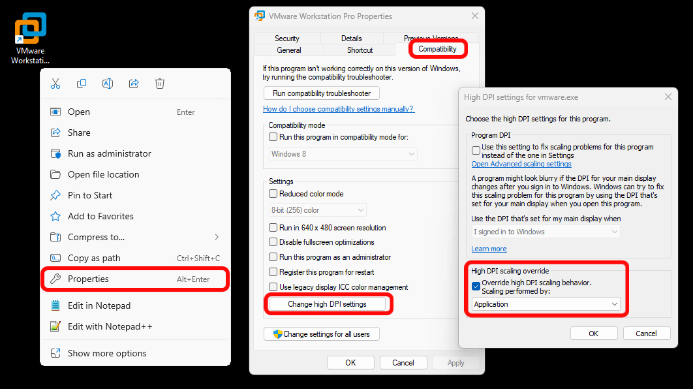
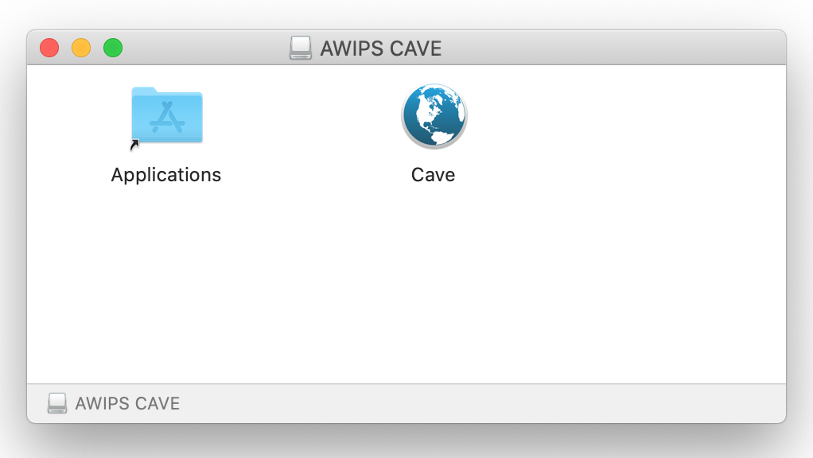
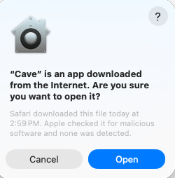
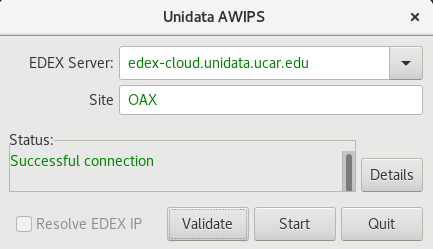

# Install CAVE

CAVE is the **C**ommon **A**WIPS **V**isualization **E**nvironment is a desktop application that is used for rendering and analyzing data for AWIPS.  The installer may require administrator priviledges to install and may require other system changes (environment variables, etc) as well.

---

## CAVE Installers
Below are the current installers for each operating system. For more information on each OS, click on the link in the left column.
**Version: 23.4.3-1**

| Operating System | Download |
|-----------------|-------------|
| [Linux](#linux) 64-bit Installer | [awips_install.sh](https://downloads.unidata.ucar.edu/awips2/23.4.3/linux/awips_install.sh) |
| [Windows](#method-1-direct-windows-install) 64-bit Installer | [awips-cave.msi](https://downloads.unidata.ucar.edu/awips2/23.4.3/windows/awips-cave-23.4.3-1.msi) |
| [Mac](#macos) Silicon Installer | [awips-cave-arm64](https://downloads.unidata.ucar.edu/awips2/23.4.3/mac/awips-cave-23.4.3-1-arm64.dmg) |
| [Mac](#macos) Intel Installer |  [awips-cave-x86_64.dmg](https://downloads.unidata.ucar.edu/awips2/23.4.3/mac/awips-cave-23.4.3-1-x86_64.dmg) |
| [Virtual Machine](#method-2-virtual-machine-running-rocky8) Installer | [Rocky8-NSFUnidata-CAVE-23.4.3-1.tgz](https://downloads.unidata.ucar.edu/awips2/23.4.3/windows/Rocky8-NSFUnidata-CAVE-23.4.3-1.tgz) |

[**View release notes**](https://www.unidata.ucar.edu/news/nsf-unidata-awips-23.4.3-1-release)

!!! note "Version 23.4.3-* of CAVE is compatible with Version 23.4.1-\* EDEX and vice versa, Version 20.\* of CAVE is not compatible with Version 23.\* EDEX."

---

## General System Requirements

**Minimum Requirements**
- Native 64-bit operating system
- 8GB RAM
- 2GB of available disk
- OpenGL 2.0 or later hardware-accelerated graphics
- Current graphics driver
- Network connectivity to an AWIPS EDEX Server

**Recommended Requirements**
- 16GB RAM or more
- 10GB of available disk space
- Display resolution of 1920X1080 or higher

---

## Functionality/Reporting

If you come across issues/bugs/missing functionality, we encourage you to <a href="https://docs.google.com/forms/d/e/1FAIpQLScqWZho98cI8ByYTe99YRidfiYK_VeHvjsAculZmiVdWGwUnw/viewform?usp=sf_link" target="_blank">report it using this short form</a> or emailing at support-awips@unidata.ucar.edu.


---

## Linux <i class="fa fa-linux"></i> 

**Latest Version: 23.4.3-1**

### System Requirements

- 64 bit Rocky/Red Hat 8
- Bash shell environment
- Run CAVE in an **X11 session** (Wayland sessions are not supported)

### Download and Installation Instructions

1. Download the following installer: [**awips_install.sh** <i class="fa fa-download"></i>](https://downloads.unidata.ucar.edu/awips2/23.4.3/linux/awips_install.sh)
2. In a terminal, go to the download directory 
3. Make the installer an executable by running: `chmod 755 awips_install.sh`
4. Run the installer: `sudo ./awips_install.sh --cave`
     - This will install the application in `/awips2/cave/` and set the local cache to `~/caveData/`

### Run CAVE

To run CAVE either:

- Use the terminal and type the command `cave`
- Find the application in the Linux Desktop menu: Applications > Internet > AWIPS CAVE
- Double click on the Desktop icon labeled "AWIPS CAVE"

Additionally users can choose to run a [virtual machine (VM)](#method-2-virtual-machine-running-rocky8) on Linux.

---

## Windows <i class="fa fa-windows"></i> 

**Latest Version: 23.4.3-1**

For Windows, we offer two installation options: a [**Direct Windows Installation**](#method-1-direct-windows-install), or a  [**Linux Virtual Machine**](#method-2-virtual-machine-running-rocky8).

### Method 1: Direct Windows Install

We offer CAVE installers at both the user-level (no administrative permissions needed), and the system-level (useful in a lab setting for instance).  If you need the system-level installer, please fill out [this brief access form](https://docs.google.com/forms/d/e/1FAIpQLSfQ0ZBf-zq-S50nXV1R3spa6nEnZ7VTEHO8r1iW604QF-vHbA/viewform?usp=sf_link) for the .msi.

#### Download and Installation Instructions

1. Download and install: [**awips-cave.msi** <i class="fa fa-download"></i>](https://downloads.unidata.ucar.edu/awips2/23.4.3/windows/awips-cave-23.4.3-1.msi)

Note: If you are having issues with Windows blocking your installation, follow [these](../appendix/common-problems.md#windows-install-error) instructions.

#### Run CAVE

To run CAVE, either:

- Double click on the CAVE icon on your desktop
- Type "cave" in the start bar and hit enter
- Find and run CAVE app in the file browser:  `C:\Users\%USER%\AppData\Roaming\UCAR Unidata\AWIPS CAVE\CAVE.bat`

#### Removing Old Versions

1. Remove CAVE by going to the **Installed Apps** settings dialog.  You can access this window by: Start bar > Settings > Apps > Installed Apps.
- *Typing "remove" in the start bar should bring you to this screen as well*

2. Find AWIPS CAVE, click on it, and click Uninstall.

---

### Method 2: Virtual Machine running Rocky8 

This virtual machine can be installed on Windows or Linux. 

#### System Requirements
- ~30 GB of disk space
- VMWare Workstation Pro (Free for personal use, but requires [creating an account](https://profile.broadcom.com/web/registration) with Broadcom) For more information on how to get access click [here](vmware.md).
- For high definition monitors (4k), you will want to enable the high DPI setting for VMWare Workstation Pro
     1. Create a desktop shortcut for VMWare Workstation Pro
     2. Right-click the shortcut and select Properties
     3. Open the Compatibility Tab
     4. Select the "Change high DPI settings" button
     5. Check the "High DPI scaling override" checkbox and choose "Application" in the enabled dropdown



#### Download and Installation Instructions

1. Download the zipped tar file containing the virtual machine: [**Rocky8-NSFUnidata-CAVE-23.4.3-1** <i class="fa fa-download"></i>](https://downloads.unidata.ucar.edu/awips2/23.4.3/windows/Rocky8-NSFUnidata-CAVE-23.4.3-1.tgz)
2. Untar the file
3. Open VMWare Workstation and go to **File...** > **Open** and locate the folder that was created from the downloaded untarred file.  Select the file called **Rocky8-NSFUnidata-CAVE-23.4.3-1.vmx"**.
4. This will open a new tab in VMWare Workstation, click "Power on this virtual machine".  If it asks if it's been moved or copied, select **"I Copied It"**.
5. There will be a user on the Linux machine named "awips" and the password is "awips" with sudo access

#### Run CAVE 

Once inside the VM, to run CAVE either:

- Use the desktop icon
- Use the terminal and type the command `cave`
- Find the application in the Linux Desktop menu: Applications > Internet > AWIPS CAVE


#### Remove/Upgrade Existing Installation

If you do not currently have CAVE installed, please go directly to the [Download and Installation Instructions](#download-and-installation-instructions).

If you already have CAVE installed you can either:

- Download a new Virtual Machine Image ([as described above](#download-and-installation-instructions_2))
  OR
- Upgrade the version of CAVE within the Virtual Machine by following the [Linux instructions](#download-and-installation-instructions)

---

## macOS <i class="fa fa-apple"></i> 

**Latest Version: 23.4.3-1**

### System Requirements

- macOS 12 Monterey or later
- Intel or Apple Silicon processor

### Download and Installation Instructions

1. Download and install CAVE for your processor:
   - [awips-cave-arm64.dmg](https://downloads.unidata.ucar.edu/awips2/23.4.3/mac/awips-cave-23.4.3-1-arm64.dmg) (silicon)
   - [awips-cave-x86_64.dmg](https://downloads.unidata.ucar.edu/awips2/23.4.3/mac/awips-cave-23.4.3-1-x86_64.dmg) (intel)
2. Double click on the downloaded dmg and a window will open 
   
3. Move the Cave application somehwere locally:
     - Applications Directory to install at the System Application level -- this may require Administrator Privileges
     - Any other location (Desktop, local user's Applications directory, etc) -- this will not require Administrator Privileges

### Run CAVE

To run CAVE either:

- Use the System Menu Go > Applications > CAVE
- Type &#8984; + Spacebar and then type "cave", the application should appear and you can hit **enter** to run it

!!! note "The first time CAVE is opened, it will ask you if you are sure you want to run it, because it was downloaded from the internet. This is normal, and hit Open."



### Remove/Upgrade Existing Installation

If you do not currently have CAVE installed, please go directly to the [Download and Installation Instructions](#download-and-installation-instructions_3).

If you already have CAVE installed:

1. Remove the existing installation by locating it (it maybe be in your **Applications** folder), and dragging it to the trash.
2. Clear CAVE's cache by removing caveData (<a href="/awips2/appendix/common-problems#mac" target="_blank">see these instructions for removal</a>).
3. Follow the [Download and Installation Instructions](#download-and-installation-instructions_3) from below to install the newest version of CAVE.
---

## EDEX Connection

Unidata and Jetstream2 have partnered to offer a EDEX data server in the cloud, open to the public.  Select the server in the Connectivity Preferences dialog, or enter **edex-cloud.unidata.ucar.edu**.

<center></center>

---

## Local Cache

After connecting to an EDEX server, you will have a local directory named **caveData** which contains files synced from EDEX as well as a client-side cache for data and map resources.

You can reset CAVE by removing the **caveData** directory and reconnecting to an EDEX server. Your local files have been removed, but if you are re-connecting to an EDEX server you have used before, the remote files will sync again to your local **~/caveData** (bundles, colormaps, etc.).

- Linux: `/home/<user>/caveData/`

---

## Uninstalling CAVE (Linux) 
These are instructions to manually uninstall CAVE manually. However, the [`awips_install.sh`](#download-and-installation-instructions) script will do these steps for you if you are installing a newer version of CAVE.

**1. Make sure you have exited out of any CAVE sessions**

!!! note "Check to make sure your `/etc/yum.repos.d/awips2.repo` file has `enabled=1`."

**2. Remove currently installed CAVE**
```
sudo yum clean all
sudo yum groupremove "AWIPS CAVE"
```

!!! note "If you are having trouble removing a group, see the [troubleshooting](../appendix/common-problems.md#troubleshooting-uninstalling-edex) section."

**3. Check to make sure all awips rpms have been removed**
```
rpm -qa | grep awips2
```

If you still have rpms installed, remove them

```
sudo yum remove awips2-*
```

**4. Remove the cave directory in /awips2 and caveData from your home directory**
```
rm -rf /awips2/cave
rm -rf ~/caveData
```