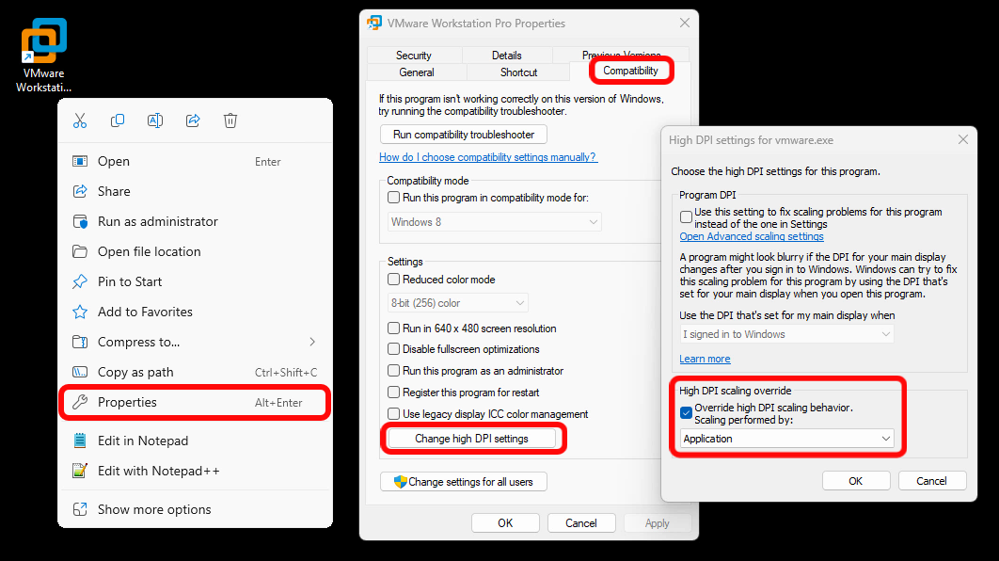
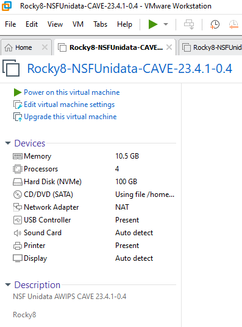
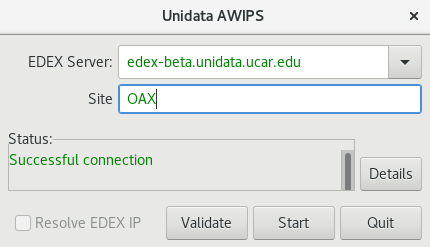

# Install CAVE - BETA Version

CAVE is the **C**ommon **A**WIPS **V**isualization **E**nvironment that is used for rendering and analyzing data for AWIPS.  The installer may require administrator priviledges to install and may require other system changes (environment variables, etc) as well.

>Note: This release is still in beta since the National Weather Service (NWS) is still working on their 23.4.1 release to operations. In the interim, we are waiting on final clearance from the NWS before releasing a production (non-beta) version and source code.

---

## Latest CAVE Versions

- [**Linux: 23.4.1-0.4**](#linux)
- [**Windows: 23.4.1-0.4**](#windows)
- [**Mac: 23.4.1-0.4**](#macos)
- [**20.3.2**](install-cave-v20.md) (Compatible with EOL CentOS/Redhat 7)

[**View release notes**](https://www.unidata.ucar.edu/blogs/news/tags/awips-release)

!!! note "Version 23.\* of CAVE is not compatible with Version 20.\* EDEX and vice versa, Version 20.\* of CAVE is not compatible with Version 23.\* EDEX."

---

## Functionality/Reporting

If you come across issues/bugs/missing functionality, we encourage you to <a href="https://docs.google.com/forms/d/e/1FAIpQLScqWZho98cI8ByYTe99YRidfiYK_VeHvjsAculZmiVdWGwUnw/viewform?usp=sf_link" target="_blank">report it using this short form</a> or emailing at support-awips@unidata.ucar.edu.

---

## General Requirements

Regardless of what Operating System CAVE is running on, these general requirements are recommended in order for CAVE to perform optimally:

- Local machine

    !!! error "Running CAVE via X11 forwarding or ssh tunneling is **not** supported. Using a [remote desktop connection like VNC is the only remote option(../appendix/common-problems.md#remotely-connecting-to-cave), but may result in worse performance than running locally."

- OpenGL 2.0 Compatible Devices
- At least 4GB RAM
- At least 2GB Disk Space for Caching
- NVIDIA Graphics Card
- [Latest NVIDIA Driver](http://www.nvidia.com/Download/index.aspx?lang=en-us)

    !!! warning "While other graphics cards *may* work, NVIDIA Quadro graphics card is recommended for full visualization capability"

---

## Linux <i class="fa fa-linux"></i> 

**Latest Version: 23.4.1-0.4**

### System Requirements

- 64 bit Rocky/Red Hat 8
- Bash shell environment

### Download and Installation Instructions

1. Download the following installer: [**awips_install-v23.sh** <i class="fa fa-download"></i>](https://downloads.unidata.ucar.edu/awips2/23.4.1/linux/awips_install-v23.sh)
2. In a terminal, go to the download directory 
3. Make the installer an executable by running: `chmod 755 awips_install-v23.sh`
4. Run the installer: `sudo ./awips_install-v23.sh --cave`
     - This will install the application in `/awips2/cave/` and set the local cache to `~/caveData/`

### Run CAVE

To run CAVE either:

- Use the terminal and type the command `cave`
- Find the application in the Linux Desktop menu: Applications > Internet > AWIPS CAVE
- Double click on the Desktop icon labeled "AWIPS CAVE"

Additionally users can choose to run a [virtual machine (VM)](#linux-virtual-machine) on Linux.

---

## Windows <i class="fa fa-windows"></i> 

**Latest Version: 23.4.1-0.4**

For Windows, we offer two installation options: a [**Direct Windows Installation**](#method-1-direct-windows-install), or a  [**Linux Virtual Machine**](#method-2-linux-virtual-machine).

!!! warning "The virtual machine option won't render RGB composites of satellite imagery."

### Method 1: Direct Windows Install

We offer CAVE installers at both the user-level (no administrative permissions needed), and the system-level (useful in a lab setting for instance).  If you need the system-level installer, please skip to the [System-Level Installation section](#system-level-installation), otherwise simply proceed with the next sections.

#### Upgrade Existing Installation

If you do not currently have CAVE installed, please go directly to the [Download and Installation Instructions](#download-and-installation-instructions_1).

If you already have CAVE installed:

1. First remove it by going to the **Installed Apps** settings dialog.  You can access this window by: Start bar > Settings > Apps > Installed Apps.
    - *Typing "remove" in the start bar should bring you to this screen as well*
2. Find AWIPS CAVE, click on it, and click Uninstall.
3. Once the uninstall is finished, simply [download and install the latest version](#download-and-installation-instructions_1) as instructed below.

#### Download and Installation Instructions

1. Download and install: [**awips-cave.msi** <i class="fa fa-download"></i>](https://downloads.unidata.ucar.edu/awips2/23.4.1/windows/awips-cave-23.4.1-0.4.msi)

#### Run CAVE

To run CAVE, either:

- Double click on the CAVE icon on your desktop
- Type "cave" in the start bar and hit enter
- Find and run CAVE app in the file browser:  `C:\Users\%USER%\AppData\Roaming\UCAR Unidata\AWIPS CAVE\CAVE.bat`

#### System-Level Installation

If you need a system-level installation of CAVE, please fill out [this brief access form](https://docs.google.com/forms/d/e/1FAIpQLSfQ0ZBf-zq-S50nXV1R3spa6nEnZ7VTEHO8r1iW604QF-vHbA/viewform?usp=sf_link) for the .msi, and then proceed with installation similar to that described above.

---

### Method 2: Virtual Machine running Rocky8 

This virtual machine can be installed on Windows or Linux. Please note, running CAVE in a Virtual Machine does have reduced functionality than running CAVE directly on hardware (ex: rendering RGB satellite images).

#### System Requirements

- VMWare Workstation Pro (Free for personal use, but requires [creating an account](https://profile.broadcom.com/web/registration) with Broadcom) For more information on how to download click [here](vmware.md).
    OR
- VMWare Workstation Player - [Version 17.5.2](https://downloads.unidata.ucar.edu/awips2/current/windows/VMware-player-17.5.2-23775571.exe) (this is an older version)
- For high definition monitors (4k), you will want to enable the high DPI setting for VMWare Workstation Player
     1. Create a desktop shortcut for VMWare Workstation Player
     1. Right-click the shortcut and select Properties
     1. Open the Compatibility Tab
     1. Select the "Change high DPI settings" button
     1. Check the "High DPI scaling override" checkbox and choose "Application" in the enabled dropdown
     


      
#### Upgrade Existing Installation

If you do not currently have CAVE installed, please go directly to the [Download and Installation Instructions](#download-and-installation-instructions_2).

If you already have CAVE installed you can either:

- Download a new Virtual Machine Image ([as described below](#download-and-installation-instructions_2))
  OR
- Upgrade the version of CAVE within the Virtual Machine by following the [Linux instructions](#upgrade-existing-installation)


#### Download and Installation Instructions

1. Download the zipped file containing the virtual machine: [**Rocky8-NSFUnidata-CAVE-23.4.1-0.4** <i class="fa fa-download"></i>](https://downloads.unidata.ucar.edu/awips2/23.4.1/windows/Rocky8-NSFUnidata-CAVE-23.4.1-0.4.zip)
2. Unzip the folder.
3. Open VMWare Workstation and go to **File...** > **Open** and locate the folder that was created from the downloaded unzipped file.  Select the file called **Rocky8-NSFUnidata-CAVE-23.4.1-0.4.vmx"**.
4. This will open a new tab in VMWare Workstation, click "Power on this virtual machine".  If it asks if it's been moved or copied, select **"I Copied It"**.

    

5. There will be a user on the Linux machine named "awips" and the password is "awips" with sudo access

#### Run CAVE 

Once inside the VM, to run CAVE either:

- Use the desktop icon
- Use the terminal and type the command `cave`
- Find the application in the Linux Desktop menu: Applications > Internet > AWIPS CAVE

---

## macOS <i class="fa fa-apple"></i> 

**Latest Version: 23.4.1-0.4**

### System Requirements

- Nvidia Graphics Card (Some Intel Graphics cards seem to work as well)

### Upgrade Existing Installation

If you do not currently have CAVE installed, please go directly to the [Download and Installation Instructions](#download-and-installation-instructions_3).

If you already have CAVE installed:

1. Remove the existing installation by locating it (it maybe be in your **Applications** folder), and dragging it to the trash.
2. Clear CAVE's cache by removing caveData (<a href="/awips2/appendix/common-problems#mac" target="_blank">see these instructions for removal</a>).
3. Follow the [Download and Installation Instructions](#download-and-installation-instructions_3) from below to install the newest version of CAVE.

### Download and Installation Instructions

1. Download and install CAVE: [awips-cave.dmg](https://downloads.unidata.ucar.edu/awips2/23.4.1/mac/awips-cave-23.4.1-0.4.dmg)
    
     - You can click and drag the CAVE icon into the Applications Directory to install at the System Application level -- this may require Administrator Privileges
     - You can drag that icon to any other location (Desktop, local user's Applications directory, etc) to install CAVE at that location -- this will not require Administrator Privileges

### Run CAVE

To run CAVE either:

- Use the System Menu Go > Applications > CAVE
- Type &#8984; + Spacebar and then type "cave", the application should appear and you can hit **enter** to run it

!!! note "The first time CAVE is opened, it will ask you if you are sure you want to run it, because it was downloaded from the internet and not the Apple Store.  This is normal, and hit Open.  Your message my differ slightly but should look like the image below:"


---

## EDEX Connection

Unidata and Jetstream2 have partnered to offer a EDEX data server in the cloud, open to the public.  Select the server in the Connectivity Preferences dialog, or enter **edex-beta.unidata.ucar.edu**.

<center></center>

---

## Local Cache

After connecting to an EDEX server, you will have a local directory named **caveData** which contains files synced from EDEX as well as a client-side cache for data and map resources.

You can reset CAVE by removing the **caveData** directory and reconnecting to an EDEX server. Your local files have been removed, but if you are re-connecting to an EDEX server you have used before, the remote files will sync again to your local **~/caveData** (bundles, colormaps, etc.).

- Linux: `/home/<user>/caveData/`

---

## Uninstalling CAVE (Linux) 
These are instructions to manually uninstall CAVE manually. However, the [`awips_install-v23.sh`](#download-and-installation-instructions) script will do these steps for you if you are installing a newer version of CAVE.

**1. Make sure you have exited out of any CAVE sessions**

!!! note "Check to make sure your `/etc/yum.repos.d/awips2.repo` file has `enabled=1`."

**2. Remove currently installed CAVE**
```
sudo yum clean all
sudo yum groupremove "AWIPS CAVE"
```

!!! note "If you are having trouble removing a group, see the [troubleshooting](../appendix/common-problems.md#troubleshooting-uninstalling-edex) section."

**3. Check to make sure all awips rpms have been removed**
```
rpm -qa | grep awips2
```

If you still have rpms installed, remove them

```
sudo yum remove awips2-*
```

**4. Remove the cave directory in /awips2 and caveData from your home directory**
```
rm -rf /awips2/cave
rm -rf ~/caveData
```