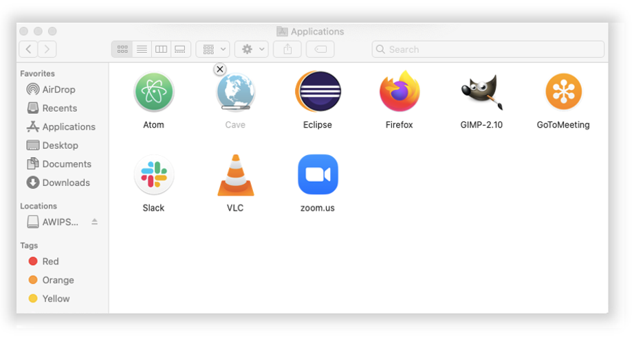

# Install CAVE

CAVE is the **C**ommon **A**WIPS **V**isualization **E**nvironment that is used for rendering and analyzing data for AWIPS.  Unidata supports CAVE to work on three platforms: [Centos (Redhat) Linux](#linux), [Windows](#windows), and [macOS](#macos).  The installer may require administrator privileges to install and may require other system changes (environment variables, etc) as well.

---

## Latest CAVE Versions

- [**Linux: 18.2.1-6**](#linux)
- [**Windows: 18.2.1-6**](#windows)
- [**Mac: 18.2.1-6**](#macos)
- [**BETA Version: 20.3.2-0.2**](install-cave-beta-v20.md)

[**View release notes**](https://www.unidata.ucar.edu/blogs/news/tags/awips-release)

---

## General Requirements

Regardless of what Operating System CAVE is running on, these general requirements are recommended in order for CAVE to perform optimally:

- Local machine

    !!! error "Running CAVE via X11 forwarding or ssh tunneling is **not** supported. Using a [VNC connection is the only remote option](../appendix/common-problems.md#remotely-connecting-to-cave), and may result in worse performance than running locally."
  
- Java 1.8
- OpenGL 2.0 Compatible Devices
- At least 4GB RAM
- At least 2GB Disk Space for Caching
- NVIDIA Graphics Card
- [Latest NVIDIA Driver](http://www.nvidia.com/Download/index.aspx?lang=en-us)

    !!! warning "While other graphics cards *may* work, NVIDIA Quadro graphics card is recommended for full visualization capability"

---

## Linux <i class="fa fa-linux"></i> 

**Latest Version: 18.2.1-6**

### System Requirements

- 64 bit CentOS/Red Hat 7
- Bash shell environment

!!! note "While CentOS8 has reach End of Life as of Dec. 31, 2021, CentOS7 End of Life isn't until June 30, 2024."

### Download and Installation Instructions

1. Download the following installer: [**awips_install.sh** <i class="fa fa-download"></i>](https://downloads.unidata.ucar.edu/awips2/current/linux/awips_install.sh)
2. In a terminal, go to the download directory 
3. Make the installer an executable by running: `chmod 755 awips_install.sh`
4. Run the installer: `sudo ./awips_install.sh --cave`
     - This will install the application in `/awips2/cave/` and set the local cache to `~/caveData/`

### Run CAVE

To run CAVE either:

- Use the terminal and type the command `cave`
- Find the application in the Linux Desktop menu: Applications > Internet > AWIPS CAVE

Additionally users can choose to run a [virtual machine (VM)](#method-2-linux-virtual-machine) on Linux.

---

## Windows <i class="fa fa-windows"></i> 

**Latest Version: 18.2.1-6**

For Windows, Unidata offers two installation options: a [**Direct Windows Installation**](#method-1-direct-windows-install), or a [**Linux Virtual Machine**](#method-2-linux-virtual-machine).

!!! note "As of 4/24/2023, the direct install method has been completely simplified! No admin privileges or extra software needed."

!!! warning "At the moment, the VM option may not render all products in CAVE (ex. RGB composites of satellite imagery)"

### Method 1: Direct Windows Install

This method has been simplified to include python and java packaged with CAVE so no other software installation is necessary. CAVE no longer needs changes to any environment variables in order to run.

#### Download and Installation Instructions

1. Download and install: [**awips-cave.msi** <i class="fa fa-download"></i>](https://downloads.unidata.ucar.edu/awips2/current/windows/awips-cave.msi)
    - This will install CAVE to the user level in `%HOMEPATH%\AppDir\Roaming\UCAR Unidata\AWIPS CAVE`.

#### Run CAVE

To run CAVE, either:

- Double click on the `CAVE` shortcut on the desktop
- Type "cave" in the start bar and hit enter

### Method 2: Linux Virtual Machine

This is an additional installation method, however at this time, some CAVE functionality may be missing (ex: rendering RGB satellite images).

#### System Requirements

- [VMWare Workstation Player](https://www.vmware.com/products/workstation-player/workstation-player-evaluation.html) must be installed (free software):
- For high definition monitors (4k), you will want to enable the high DPI setting for VMWare Workstation Player
     1. Create a desktop shortcut for VMWare Workstation Player
     1. Right-click the shortcut and select Properties
     1. Open the Compatability Tab
     1. Select the "Change high DPI settings" button
     1. Check the "High DPI scaling ovveride" checkbox and choose "Application" in the enabled dropdown
     
      


#### Download and Installation Instructions

1. Download the zipped file containing the virtual machine: [**unidata_cave.zip** <i class="fa fa-download"></i>](https://downloads.unidata.ucar.edu/awips2/current/windows/unidata_cave.zip)
2. Unzip the folder by right-clicking and selecting "Extract All".  All files will be extracted into a new folder.
3. Open VMWare Player and go to **Player** > **File...** > **Open** and locate the folder that was created from the downloaded zipped file.  Select the file called **"CentOS 7 - Unidata CAVE 18-2-1-6.vmx"**.
4. Run this new VM option.  If it asks if it's been moved or copied, select **"I Copied It"**.
     - There will be a user in the Linux machine named "awips" and the password is "awips"
     - The root password is "unidataAWIPS" if ever needed

#### Run CAVE 

Once inside the VM, to run CAVE either:

- Use the desktop icon 
- Use the terminal and type the command `cave`
- Find the application in the Linux Desktop menu: Applications > Internet > AWIPS CAVE

---

## macOS <i class="fa fa-apple"></i> 

**Latest Version: 18.2.1-6**

### System Requirements

!!! error "MacOS Monterey version 12.3 and above no longer supports Python2.  This will cause several visualization aspects to fail in CAVE.  If you update to MacOS 12.3 CAVE will not be fully functional.  Please [download and install our beta v20 of CAVE](install-cave-beta-v20.md#macos) for newer MacOS versions."

- Will need admin privileges to install `awips-python.pkg`
- NVIDIA Graphics card is recommended, however some Intel Graphics cards will support a majority of the functionality

    !!! warning "Most AMD graphics cards are not supported"

### Download and Installation Instructions

1. Download and install: [**awips-python.pkg** <i class="fa fa-download"></i>](https://downloads.unidata.ucar.edu/awips2/current/mac/awips-python.pkg)  *(This step requires administrative privileges)*
    - Once downloaded, double click and the installer will launch with the following screens, **please keep the default selections**:
    
    
    
    
    
    !!! warning "Between these steps it will prompt for an administrator's password"
    
    
        
    !!! note "The awips-python.pkg is not necessarily required, and CAVE will still run without it, but any derived data such as barbs, arrows, and various grid products will not render without having **jep** installed (it is assumed to be in /Library/Python/2.7/site-packages/jep/)"
        
1. Download and install: [**awips-cave.dmg** <i class="fa fa-download"></i>](https://downloads.unidata.ucar.edu/awips2/current/mac/awips-cave.dmg)
    - Either use the default location, which is in the system-wide "Applications" directory, by clicking and dragging the CAVE icon into the Applications folder, in the window that pops up when installing:
    
        
    
    - Or open a new Finder window to your \[user home\]/Applications/ directory (if it doesn't exist, simply create a new folder with the name "Applications"), and drag the CAVE icon into that folder:
    
    - This will install CAVE as an application and set the local cache to `~/Library/caveData`

### Run CAVE

To run CAVE either:

- Use the System Menu Go > Applications > CAVE
- Type &#8984; + Spacebar and then type "cave", the application should appear and you can hit **enter** to run it

!!! note "The first time CAVE is opened, it will ask you if you are sure you want to run it, because it was downloaded from the internet and not the Apple Store.  This is normal, and hit Open.  Your message my differ slightly but should look like the image below:"


### MacOS Monterey Warning

If you are running MacOS Monterey, you may see the following message when starting CAVE:


This message can be ignored, and will hopefully go away when we release version 20+ of AWIPS.

---

## EDEX Connection

Unidata and XSEDE Jetstream have partnered to offer a EDEX data server in the cloud, open to the Unidata university community.  Select the server in the Connectivity Preferences dialog, or enter **edex-cloud.unidata.ucar.edu** (without *http://* before, or *:9581/services* after).


---

## Local Cache

After connecting to an EDEX server, you will have a local directory named **caveData** which contains files synced from EDEX as well as a client-side cache for data and map resources.

You can reset CAVE by removing the **caveData** directory and reconnecting to an EDEX server. Your local files have been removed, but if you are re-connecting to an EDEX server you have used before, the remote files will sync again to your local **~/caveData** (bundles, colormaps, etc.).

- Linux: `/home/<user>/caveData/`
- macOS: `/Users/<user>/Library/caveData/`
- Windows: `C:\Users\<user>\caveData\`

---

## Uninstalling CAVE (Linux)
These are instructions to manually uninstall CAVE. However, the [`awips_install.sh`](#download-and-installation-instructions) script will do these steps for you if you are installing a newer version of CAVE.

**1. Make sure you have exited out of any CAVE sessions**

!!! note "Check to make sure your `/etc/yum.repos.d/awips2.repo` file has `enabled=1`."

**2. Remove currently installed CAVE**
```
sudo yum clean all
sudo yum groupremove "AWIPS CAVE"
```

!!! note "If you are having trouble removing a group, see the [troubleshooting](../appendix/common-problems.md#troubleshooting-uninstalling-edex) section."

**3. Check to make sure all awips rpms have been removed**
```
rpm -qa | grep awips2
```

If you still have rpms installed, remove them

```
sudo yum remove awips2-*
```

**4. Remove the cave directory in /awips2 and caveData from your home directory**
```
rm -rf /awips2/cave
rm -rf ~/caveData
```
