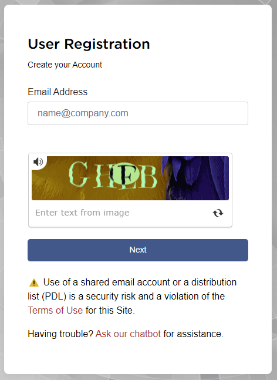
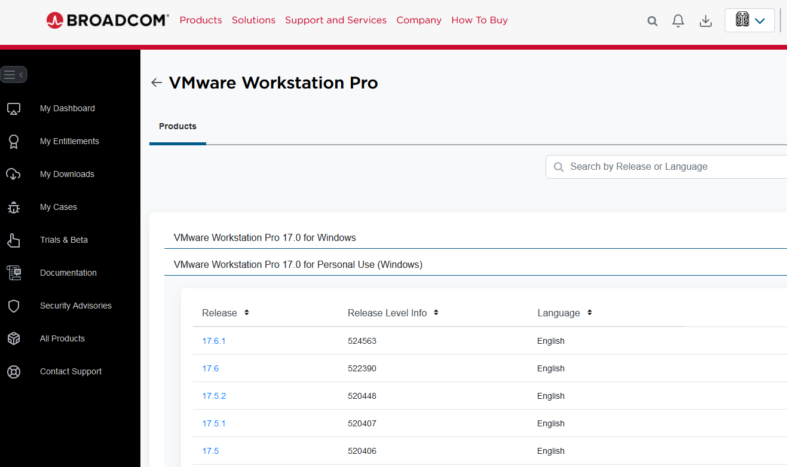
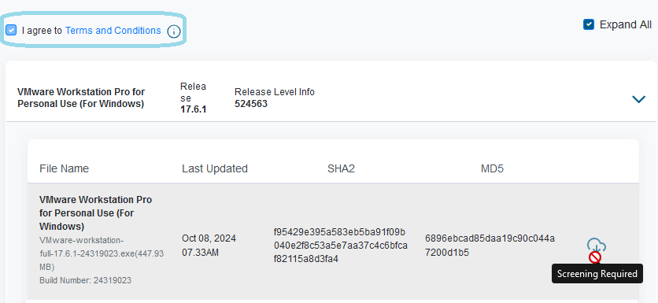

# VMWare Workstation Pro - Available 

In 2024, Broadcom bought VMware and since then the download process of the free VMWare Workstation application has changed and become slightly more difficult. **VMWare Workstation Player** is no longer available, but the **VMWare Workstation Pro** version is now avialable for free personal use. Below will describe how to register for an account and download the latest release.

1. First you must [register](https://profile.broadcom.com/web/registration) and create an account with broadcom.

2. After entering in your email, you will receive an email from Broadcom with a verification code to continue with the account creation.
3. Complete your registration by entering in your information, password, and accepting the terms of use.
4. Once registered, [login](https://support.broadcom.com/web/ecx/home) into Broadcom's webpage
5. Go to the [VMWare Workstation Pro Downloads page](https://support.broadcom.com/group/ecx/productdownloads?subfamily=VMware+Workstation+Pro)
6. Select the arrow next to the "VMware Workstation Pro for Personal Use" and select the version you want to download.

7. At this point, if this is your first time, you won't be able to actually download the product until you go through the very simple screening process. Start by checking the "I agree to Terms and Conditions" and then the Download button.

8. Complete the rest of the verification and then you'll be able to download the installer.